::: {.content-visible when-profile="id"}

[📊 Lihat Slide](../slides/tutorial-0.qmd){.btn .btn-outline-primary role="button"}

Pemrograman Berbasis Platform (CSGE602022) — diselenggarakan oleh Fakultas Ilmu Komputer Universitas Indonesia, Semester Ganjil 2025/2026

_Terakhir diperbarui: 27 Agustus, pukul 09.00 WIB_


***
### Tujuan Pembelajaran
Setelah menyelesaikan tutorial ini, mahasiswa diharapkan untuk dapat:

- Mengerti **perintah-perintah dasar Git** yang perlu diketahui untuk mengerjakan proyek aplikasi.
- Membuat **repositori Git lokal dan daring (GitHub)**.
- **Menambahkan _remote_** antara repositori Git lokal dan repositori daring pada GitHub.
- **Memahami _branching_ pada Git** dan mampu melakukan _merge request_/_pull request_.
- Memahami konsep dan implementasi ***environment variable***.
- **Men-deploy proyek** tutorial Django ke **PWS**.

## Tutorial: Pembuatan Akun GitHub (Lewati Jika Sudah Ada)

### Pengenalan Tentang Git dan GitHub

Pengenalan awal ini akan membantumu memahami dasar-dasar mengenai Git dan platform git hosting berbasis web yang dikenal sebagai GitHub.

#### Git: Sistem Kontrol Version untuk Codebase

- **Git** adalah sistem kontrol versi yang membantumu melacak perubahan pada kode sumber proyek.
- Dengan Git, kamu dapat memantau semua revisi yang telah dilakukan pada proyekmu seiring waktu.

#### GitHub: Platform Kolaborasi Menggunakan Git

- **GitHub** adalah platform berbasis web yang memungkinkanmu untuk menyimpan, mengelola, dan berkolaborasi pada proyek-proyek menggunakan Git.
- Ini memberikan wadah yang aman untuk meng-_host_ proyekmu dan berinteraksi dengan rekan tim melalui Git.

#### Mengapa Penting?

- Git dan GitHub memainkan peran penting dalam pengembangan perangkat lunak modern dan kolaborasi tim.
- Keduanya memungkinkan tim untuk melacak perubahan kode, menyimpan versi, dan bekerja bersama dalam proyek secara efisien.

Dengan pemahaman dasar mengenai Git dan GitHub, kamu siap untuk melangkah lebih jauh dalam dunia pengembangan perangkat lunak yang kolaboratif dan terstruktur.

### Langkah 1: Membuat Akun di GitHub

Langkah selanjutnya adalah membuat akun di GitHub, yang akan memungkinkanmu untuk mulai berkolaborasi pada proyek-proyek menggunakan Git.

1. Buka Situs Web GitHub
    - Buka peramban web dan akses [GitHub](https://github.com).

2. Membuat Akun
    - Di halaman beranda GitHub, cari tombol **`Sign up`** di pojok kanan atas halaman.
    - Klik tombol tersebut untuk memulai proses pendaftaran akun.

3. Isi Formulir Pendaftaran
    - Isi formulir pendaftaran dengan informasi yang diperlukan, seperti nama pengguna yang ingin digunakan, alamat _email_ yang valid, dan kata sandi yang aman.
    - Pastikan kamu menyimpan informasi ini dengan aman untuk masuk ke akunmu di masa mendatang.

4. Verifikasi Akun Melalui _Email_
    - Setelah mengisi formulir, GitHub akan mengirimkan _email_ verifikasi ke alamat _email_ yang kamu berikan.
    - Buka _email_ tersebut dan ikuti instruksi untuk verifikasi akunmu.

5. Akun GitHub Siap Digunakan
    - Setelah verifikasi selesai, kamu akan memiliki akun GitHub yang siap digunakan untuk berkolaborasi dalam proyek dan melacak perubahan menggunakan Git.

::: {.callout-note}

- Akun GitHub adalah pintu yang membantu kalian dalam kolaborasi proyek dan menyimpan proyekmu di platform ini.
- Pastikan informasi pendaftaran yang kamu berikan akurat dan aman.
- Jika kamu kebingungan, kamu bisa mengikuti tutorial di [link ini](https://www.youtube.com/watch?v=Gn3w1UvTx0A).

:::

### Selamat, Kamu Telah Membuat Akun GitHub

Kamu sekarang telah memiliki akun GitHub yang dapat digunakan untuk menyimpan proyek, berkolaborasi dengan orang lain, dan masih banyak lagi.

## Tutorial: Instalasi IDE

IDE (_Integrated Development Environment_) adalah perangkat lunak yang membantu para pengembang dalam menulis, mengedit, dan mengelola kode. Berikut adalah langkah-langkah untuk memasang IDE.

### Langkah 1: Pemilihan _Text Editor_ atau IDE

Pilihlah _text editor_ atau IDE yang sesuai dengan preferensimu. Beberapa pilihan populer yang dapat kamu pertimbangkan meliputi:

- [Visual Studio Code](https://code.visualstudio.com/)
- [Sublime Text](https://www.sublimetext.com/)
- [PyCharm](https://www.jetbrains.com/pycharm/)
- [Neovim](https://neovim.io/)

### Langkah 2: Proses Instalasi

1. Pergi ke situs web resmi IDE yang kamu pilih.
2. Ikuti petunjuk yang diberikan untuk mengunduh _installer_ IDE.
3. Jalankan _installer_ dan ikuti instruksi di layar untuk menyelesaikan proses instalasi.

### Langkah 3: Memulai Menggunakan IDE

1. Setelah proses instalasi selesai, buka IDE yang telah terinstal.
2. Eksplorasi antarmuka dan fitur yang disediakan oleh IDE untuk membantumu dalam pengembangan proyek.

::: {.callout-note}

- Pastikan kamu memilih IDE yang sesuai dengan jenis proyek yang akan dikerjakan.
- Jangan ragu untuk mengeksplorasi fitur-fitur IDE (contoh: _extensions_ atau _plugin_) dan memanfaatkan sumber daya pendukung, seperti dokumentasi dan tutorial, untuk meningkatkan produktivitas dalam pengembangan perangkat lunak.

:::

## Tutorial: Instalasi dan Konfigurasi Git

### Langkah 1: Instalasi Git

Jika Git belum terpasang pada sistem, kamu dapat mengikuti langkah-langkah berikut untuk menginstalnya.

1. Buka situs web resmi Git di [sini](https://git-scm.com/downloads).
2. Pilih sistem operasi yang sesuai (Windows, macOS, atau Linux) dan unduh _installer_ yang sesuai.
3. Jalankan _installer_ yang telah diunduh dan ikuti petunjuk di layar untuk menyelesaikan proses instalasi.
4. Sebagai tambahan, jangan lupa untuk mencentang "Git Credential Manager Core" untuk mempermudah integrasi Git dengan GitHub.

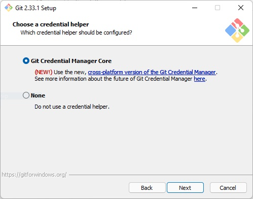

### Langkah 2: Konfigurasi Awal Git

Setelah Git terpasang, langkah-langkah berikut akan membantumu mengatur konfigurasi awal sebelum mulai menggunakan Git.

1. Buatlah sebuah _folder_/direktori baru untuk menyimpan proyek Git kamu, kemudian masuklah ke direktori tersebut.
2. Salinlah _path_ ke direktori yang sudah kamu buat.
3. Buka terminal atau _command prompt_ pada sistem, kemudian pindah ke direktori yang sudah kamu buat dengan menjalankan perintah `cd <path_direktori>`
4. Inisiasi repositori baru dengan perintah `git init`. Perintah ini akan membuat repositori Git kosong di dalam direktori yang kamu tentukan.

### Langkah 3: Konfigurasi Nama Pengguna dan _Email_

Sebelum mulai berkontribusi ke repositori, konfigurasikan nama pengguna dan alamat _email_ agar terhubung dengan _commit_-mu.

Atur _username_ dan _email_ yang akan diasosiasikan dengan pekerjaanmu ke repositori Git ini dengan menjalankan perintah di bawah ini. Sesuaikan dengan _username_ dan _email_ yang kamu gunakan pada [GitHub](https://github.com).

```bash
git config --global user.name "<NAME>"
git config --global user.email "<EMAIL>"
```

Contoh:

```bash
git config --global user.name "pakbepe"
git config --global user.email "pak.bepe@cs.ui.ac.id"
```

Perlu diketahui bahwa _flag_ `--global` akan mengubah konfigurasi global untuk seluruh sistem. Yang dimaksud konfigurasi global adalah kamu sedang bilang ke Git: "Kalau aku pakai Git di komputer ini, anggap saja namaku dan emailku selalu ini."

Jadi:
`--global` = berlaku untuk semua project Git yang kamu buka di komputer itu.


::: {.callout-warning}

- Pastikan untuk mengganti `<NAME>` dan `<EMAIL>` dengan informasi pribadimu
- Jika kalian **hanya membutuhkan konfigurasi internal** kalian hanya perlu cukup menggunakan kode ini

```bash
git config user.name "<NAME>"
git config user.email "<EMAIL>"
```

Contoh:

```bash
git config  user.name "pakbepe"
git config  user.email "pak.bepe@cs.ui.ac.id"
```
- Konfigurasi internal yaitu nama dan email yang kalian gunakan untuk login itu hanya berlaku untuk project Git yang sekarang kamu buka.Jadi cuma untuk folder Git yang kamu lagi aktif di dalamnya (misalnya: 1 project saja).

:::

### Langkah 4: Konfigurasi Autentikasi

Untuk nantinya menghubungkan akun Git kamu dengan akun GitHub, terdapat konfigurasi ekstra yang perlu kamu tambahkan. Kamu hanya perlu menjalankan kedua perintah dibawah ini:

**Windows**
```bash
git credential-manager configure
git config --global credential.credentialStore wincredman
```

**Unix (macOS, Linux)**
```bash
git credential-manager configure
git config --global credential.credentialStore keychain
```

::: {.callout-tip}

- Apabila perintah `git credential-manager` tidak bisa dijalankan, kamu bisa coba perintah `git-credential-manager` atau `git-credential-manager-core`.
- Pada macOS, jika kedua perintah tersebut tidak berhasil, kamu bisa mencoba mengunduh git credential manager menggunakan *Homebrew* dengan perintah `brew install git-credential-manager-core`.
- Jika macOS tidak memiliki *Homebrew*, kamu bisa mengunduhnya dengan mengikuti instruksi dari [web ini](https://brew.sh).

:::

### Langkah 5: Verifikasi Konfigurasi

Untuk memastikan konfigurasi telah diatur dengan benar pada repositori lokal, kamu dapat menjalankan perintah berikut.

```bash
git config --list
```

## Tutorial: Penggunaan Dasar Git

**Repositori** adalah tempat penyimpanan untuk proyek perangkat lunak, yang mencakup semua revisi dan perubahan yang telah dilakukan pada kode. Untuk mengeksekusi perintah-perintah Git, kamu dapat melakukannya pada repositori di GitHub, platform kolaboratif untuk mengelola proyek menggunakan Git.

::: {.callout-note}

Perlu kamu ketahui bahwa tutorial penggunaan dasar Git ini tidak akan dikumpulkan dan hanya bersifat latihan. Berkas yang akan kamu kumpulkan hanyalah proyek Django yang langkah pembuatannya juga terdapat di tutorial ini.

:::

### Langkah 1: Melakukan Inisiasi Repositori di GitHub

Langkah pertama dalam penggunaan Git adalah melakukan inisiasi repositori di GitHub untuk memulai pelacakan perubahan pada proyekmu.

1. Buka [GitHub](https://github.com) melalui peramban web.

2. Buat Repositori Baru
	- Pada halaman beranda GitHub, buat repositori baru dengan nama `my-first-repo`.
	- Buka halaman repositori yang baru kamu buat. Pastikan untuk mengatur visibilitas proyek sebagai "Public" dan biarkan pengaturan lainnya pada nilai _default_.

3. Tentukan Direktori Lokal
	- Pilih direktori lokal di komputermu yang telah diinisiasi dengan Git. Inilah tempat kamu akan menyimpan versi lokal dari proyek.

4. Tambahkan Berkas `README.md`
	- Buat berkas baru dengan nama `README.md` dalam direktori lokal proyekmu.
	- Isi berkas `README.md` dengan informasi seperti nama, NPM, dan kelas. Contoh:
		```md
								Nama : Pak Bepe
								NPM : 2401234567
								Kelas : PBP A
		```

5. Cek Status dan Lakukan _Tracking_
	- Buka _command prompt_ atau terminal, lalu jalankan `git status` pada direktori yang sudah kamu pilih. Perintah ini akan menampilkan berkas-berkas yang belum di-_track_ (_untracked_).
	- Gunakan perintah `git add README.md` untuk menandai berkas README.md sebagai berkas yang akan di-_commit_ (_tracked_).

6. _Commit_ Perubahan
	- Jalankan kembali `git status` dan pastikan berkas README.md sudah ditandai sebagai berkas yang akan di-_commit_.
	- Lanjutkan dengan menjalankan `git commit -m "<KOMENTAR KAMU>"` untuk membuat _commit_ dengan pesan komentar yang sesuai dengan perubahan yang kamu lakukan.


::: {.callout-warning}

Langkah ini akan membuat kamu siap untuk mulai melacak perubahan pada proyek menggunakan Git.

:::

::: {.callout-note}

- **_Good practice_** dalam memberikan komentar _commit_ adalah menjelaskan dengan singkat apa yang kamu lakukan. Pada umumnya, komentar _commit_ ditulis menggunakan bahasa Inggris. Salah satu contoh komentar _commit_ yang bisa kamu gunakan untuk contoh di atas adalah `Create README.md file` atau `Membuat berkas README.md`.
- Komentar _commit_ yang baik dapat membantu kamu dan rekan-rekan tim kamu dalam memahami tujuan perubahan tersebut.
- **Hindari** komentar yang terlalu umum atau ambigu, seperti `Perbaikan bug` (`Fix bugs`) atau `Update file`.

:::

### Langkah 2: Menghubungkan Repositori Lokal dengan Repositori di GitHub

Setelah melakukan inisiasi repositori lokal, langkah selanjutnya adalah menghubungkannya dengan repositori di GitHub agar kamu dapat berkolaborasi dan menyimpan perubahan di platform daring tersebut.

1. Buat **_Branch_ Utama** Baru
	- Di terminal atau _command prompt_, jalankan perintah `git branch -M main` untuk membuat _branch_ utama baru dengan nama "main".
	- Pastikan huruf "M" pada perintah `-M` ditulis dengan **huruf kapital**.

2. Hubungkan dengan Repositori di GitHub

- Gunakan perintah `git remote add <NAMA_REMOTE> <URL_REPO>` untuk menghubungkan repositori lokal dengan repositori di GitHub.
- `<NAMA_REMOTE>` adalah nama yang akan kamu gunakan untuk mereferensikan repositori remote tersebut. Secara konvensi, nama `origin` digunakan untuk repositori utama/primer.
- `<URL_REPO>` adalah URL HTTPS repositori yang telah kamu buat di GitHub.
- URL repositori ini bisa kamu dapatkan di halaman GitHub ketika kamu berhasil membuat repositori baru di GitHub.

    Contoh penggunaan:
    ```bash
    git remote add origin https://github.com/pakbepe/test.git
    ```

    Pada contoh di atas:
    - `origin` = nama remote (bisa diganti dengan nama lain jika diinginkan)
    - `https://github.com/pakbepe/test.git` = URL repositori GitHub

    Tips Tambahan:
    - Untuk melihat daftar remote yang sudah ditambahkan: `git remote -v`
    - Untuk menghapus remote: `git remote remove <NAMA_REMOTE>`
    - Untuk mengganti URL remote: `git remote set-url <NAMA_REMOTE> <URL_BARU>`

3. Lakukan Penyimpanan Pertama ke GitHub
	- Terakhir, lakukan penyimpanan pertama ke GitHub dengan menjalankan perintah `git push -u origin main`.
	- Perintah ini akan mengirimkan semua perubahan yang ada pada _branch_ saat ini (dalam hal ini adalah _branch_ utama) di repositori lokal ke _branch_ main di repositori GitHub.
	- Apabila ini pertama kalinya kamu melakukan push ke GitHub dan kamu menggunakan OS Windows, setelah melakukan instalasi, seharusnya akan muncul _window_ yang meminta kamu untuk _sign in_ ke GitHub. Klik "_Sign in with your browser_", kemudian ikuti instruksi yang terdapat pada _window_ tersebut.


4. Lakukan Pengecekan Kembali
	- Lakukan _refresh_ pada halaman repositori kamu, seharusnya berkas `README.md` kamu sudah dapat terlihat.

::: {.callout-note}

- Langkah ini penting untuk menjaga konsistensi antara repositori lokal dan repositori di GitHub.
- Proses ini memungkinkanmu untuk mulai berkolaborasi dan menyimpan perubahan proyek secara terstruktur di platform GitHub.
- `README.md` adalah file yang berisi penjelasan singkat tentang proyek, seperti tujuan, cara menjalankan, dan fitur utamanya, agar orang lain mudah memahami dan menggunakan proyek tersebut.
- Informasi lebih lanjut tentang **git master / main** serta branching nya bisa dilihat di [sini](https://docs.github.com/en/pull-requests/collaborating-with-pull-requests/proposing-changes-to-your-work-with-pull-requests/about-branches).

:::


### Langkah 3: Melakukan _Cloning_ terhadap Suatu Repositori

**_Cloning_ repositori** adalah proses menduplikasi seluruh konten dari repositori yang ada di platform GitHub ke komputer lokal agar bisa dilihat, diedit, dan dijalankan secara offline di komputer mu. Langkah-langkahnya adalah sebagai berikut.

1. Buka halaman repositori di [GitHub](https://github.com) yang telah kamu buat sebelumnya.

2. Salin URL _Clone_
	- Klik tombol **`Code`** di pojok kanan atas halaman repositori di GitHub.
	- Pilih opsi HTTPS untuk salin URL _clone_.

3. _Clone_ Repositori ke Komputer Lokal
	- Buka terminal atau _command prompt_ di direktori yang **berbeda** dari tempat repositori lokalmu sebelumnya.
	- Jalankan perintah `git clone <URL_CLONE>` (gantilah URL_CLONE dengan URL yang telah kamu salin).
	- Perintah ini akan menduplikasi seluruh repositori ke komputer lokalmu.

Saat ini, kamu memiliki tiga repositori:

1. **Repositori asli** di komputer lokal.
2. **Repositori daring** di GitHub yang terhubung dengan repositori lokal.
3. **Repositori baru hasil dari proses _cloning_** yang terhubung dengan repositori GitHub.

::: {.callout-note}

- Langkah ini memungkinkanmu untuk bekerja dengan repositori di berbagai tempat dengan mudah.

:::

### Langkah 4: Melakukan _Branching_ pada Suatu Repositori

Pada tahap ini kamu akan mempelajari tentang penggunaan _branch_ dalam Git. Penggunaan _branch_ memungkinkan kamu untuk mengembangkan fitur atau memperbaiki _bug_ di lingkungan terpisah sebelum menggabungkannya kembali ke _branch_ utama.

**Apa Itu _Branch_ di Git?**

- _Branch_ di Git adalah cabang terpisah dari _source code_ yang memungkinkan pengembangan independen dari fitur atau perubahan.
- Hal ini memungkinkan tim untuk bekerja pada fitur atau perbaikan _bug_ tanpa mengganggu kode yang ada di _branch_ utama.

1. Membuat dan Mengganti _Branch_ Baru
	- Pada direktori repositori lokal asli (bukan _clone_), jalankan perintah `git checkout -b <NAMA_BRANCH>` di terminal atau _command prompt_ untuk membuat dan beralih ke _branch_ baru. Contoh: `git checkout -b jurusan_branch`
	- Tambahkan atribut jurusan pada berkas `README.md`. Contoh:

		```md
								Nama : Pak Bepe
								NPM : 2401234567
								Kelas : PBP A
								Hobi : Tidur
								Jurusan : Ilmu Sistem Informasi Komputer
		```

2. Menyimpan Perubahan dan _Push_ ke GitHub
	- Setelah menambahkan atribut jurusan, simpan berkas tersebut.
	- Lakukan `add`, `commit`, dan `push` ke GitHub dengan menjalankan perintah yang sudah kamu kuasai sebelumnya.
	- Jalankan perintah `git push -u origin <NAMA_BRANCH>`. Pastikan untuk mengganti `<NAMA_BRANCH>` sesuai dengan nama branch baru yang telah dibuat.

3. Menggabungkan _Branch_ Menggunakan _Pull Request_

	- Buka kembali halaman repositori kamu pada GitHub.
	- Secara otomatis, pop-up dengan tombol **`Compare & pull request`** akan muncul. Jika tidak, alternatifnya adalah dengan menekan tombol **`Pull Request`** dan kemudian memilih opsi **`New pull request`**.
	- Setelah itu, GitHub akan membandingkan perubahan yang ada di kedua _branch_ yang ingin digabungkan.
	- Apabila tidak terdapat konflik, tekan tombol **`Merge pull request`** yang akan menggabungkan perubahan dari _branch_ yang ingin digabungkan ke dalam _branch_ utama (`main`).
	- **Jika terdapat konflik**, kamu harus melihat di file yang biasanya berwarna merah pada text editor mu dan selesaikan conflict nya bisa dengan memilih merge atau salah satunya sesuai kebutuhan baru menyetujui **`Merge pull request`** nya.
	- Dengan melakukan langkah di atas, semua perubahan dari kedua _branch_ akan diintegrasikan ke dalam _branch_ utama, menciptakan kesatuan antara perubahan tersebut.

::: {.callout-note}

- Jika kamu ingin berpindah antar _branch_ yang sudah ada, jalankan `git checkout <NAMA_BRANCH>` pada terminal. Flag `-b` pada perintah sebelum-sebelumnya digunakan untuk membuat _branch_ baru dan beralih ke _branch_ tersebut dalam satu langkah.
- **Konflik** terjadi ketika perubahan yang dilakukan pada satu _branch_ bertabrakan dengan perubahan yang dilakukan pada _branch_ lain. Misalnya, jika dua pengembang mengubah bagian yang sama dari berkas yang sama dalam waktu bersamaan, Git tidak dapat dengan otomatis memutuskan perubahan mana yang harus diterapkan.
- Jika terdapat konflik atau perubahan yang saling bertabrakan, platform ini akan meminta kamu untuk menentukan perubahan mana yang sebaiknya diambil.
- **Penting** untuk memahami konsep _branching_ dalam Git, karena ini memungkinkan **pengembangan yang terorganisir dan terpisah**, sebelum semua perubahan dikombinasikan kembali ke dalam kode utama.

:::

## Tutorial: Instalasi Django dan Inisiasi Proyek Django

**Django** adalah kerangka kerja (_framework_) yang populer untuk pengembangan aplikasi web dengan bahasa pemrograman Python. Dalam tutorial ini, kamu akan mempelajari langkah-langkah instalasi Django dan inisiasi proyek demo sebagai _starter_.

::: {.callout-warning}

Proyek Django ini harus kamu buat pada folder yang kedepannya akan disebut **direktori** yang berbeda dengan `my-first-repo` seperti yang diajarkan pada langkah-langkah sebelumnya. Pastikan kamu sudah berpindah direktori pada terminal dan sudah tidak berada di dalam `my-first-repo`.

Untuk berpindah direktori silakan gunakan kode ini
```bash
cd ~
mkdir <NAMA_FOLDER_BARU>
cd <NAMA_FOLDER_BARU>
```

Notes :
- `Mkdir` berfungsi untuk membuat suatu folder baru
- `cd` berfungsi untuk berpindah folder
- `cd ~` berfungsi untuk berpindah folder utama pada komputermu

:::

### Langkah 1: Membuat Direktori dan Mengaktifkan _Virtual Environment_

1. Buat direktori baru dengan nama `football-news` dan masuk ke dalamnya.
2. Di dalam direktori tersebut, buka _command prompt_ (Windows) atau _terminal shell_ (Unix).
3. Buat _virtual environment_ dengan menjalankan perintah berikut.

	Windows:

	```bash
				python -m venv env
	```

	Unix (macOS, Linux):
	```bash
				python3 -m venv env
	```

4. **_Virtual environment_** ini berguna untuk mengisolasi _package_ serta _dependencies_ dari aplikasi agar tidak bertabrakan dengan versi lain yang ada pada komputermu. Kamu dapat mengaktifkan _virtual environment_ dengan perintah berikut.

	- Windows :

		```bash
								env\Scripts\activate
		```

	- Unix (Mac/Linux):

		```bash
								source env/bin/activate
		```

::: {.callout-tip}

Bagi pengguna Windows, apabila kamu mengalami masalah dengan kata-kata `PSSecurityException`, `UnauthorizedAccess`, _running scripts is disabled on this system_,lakukan langkah berikut.
1. Buka PowerShell dengan akses _administrator_.
2. Jalankan perintah `Set-ExecutionPolicy Unrestricted -Force`.
3. Silakan coba lagi aktifkan _virtual environment_ di terminal kamu.

:::

5. _Virtual environment_ akan aktif dan ditandai dengan `(env)` di baris _input_ terminal.

### Langkah 2: Menyiapkan _Dependencies_ dan Membuat Proyek Django

**_Dependencies_** adalah komponen atau modul yang diperlukan oleh suatu perangkat lunak untuk berfungsi, termasuk _library_, _framework_, atau _package_. Hal tersebut memungkinkan pengembang memanfaatkan kode yang telah ada, mempercepat pengembangan, tetapi juga memerlukan manajemen yang hati-hati untuk memastikan kompatibilitas versi yang tepat. Penggunaan _virtual environment_ membantu mengisolasi _dependencies_ antara proyek-proyek yang berbeda.

1. Di dalam direktori yang sama, buat berkas `requirements.txt` dan tambahkan beberapa _dependencies_.

	```text
				django
				gunicorn
				whitenoise
				psycopg2-binary
				requests
				urllib3
    python-dotenv
	```

2. Lakukan instalasi terhadap _dependencies_ yang ada dengan perintah berikut. Jangan lupa jalankan _virtual environment_ terlebih dahulu sebelum menjalankan perintah berikut.

	```bash
				pip install -r requirements.txt
	```

3. Buat proyek Django bernama `football_news` dengan perintah berikut.

	```bash
				django-admin startproject football_news .
	```

::: {.callout-warning}

Pastikan karakter `.` tertulis di akhir perintah.

:::

### Langkah 3: Konfigurasi Environment Variables dan Proyek

1. Buat file `.env` di dalam direktori root proyek (di mana file `manage.py` berada).
<br/>
   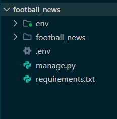


2. Buka file `.env` dan tambahkan konfigurasi berikut:
   ```env
   PRODUCTION=False
   ```

   **Environment variables** adalah variabel yang disimpan di luar kode program dan digunakan untuk menyimpan informasi konfigurasi seperti kredensial database, API keys, atau pengaturan environment. Ini memungkinkan kode yang sama berjalan di environment berbeda tanpa perlu mengubah kode.

3. Buat juga file `.env.prod` di direktori yang sama untuk konfigurasi production:
   ```env
   DB_NAME=<nama database>
   DB_HOST=<host database>
   DB_PORT=<port database>
   DB_USER=<username database>
   DB_PASSWORD=<password database>
   SCHEMA=tutorial
   PRODUCTION=True
   ```

   **Perbedaan .env dan .env.prod:**
   - **`.env`**: Digunakan untuk development lokal. Karena `PRODUCTION=False`, aplikasi akan menggunakan database SQLite yang lebih simple untuk testing dan development
   - **`.env.prod`**: Digunakan untuk production deployment. Karena `PRODUCTION=True`, aplikasi akan menggunakan database PostgreSQL dengan kredensial yang disediakan ITF Fasilkom UI

   **Kredensial database** untuk variabel `DB_NAME`, `DB_HOST`, `DB_PORT`, `DB_USER`, dan `DB_PASSWORD` dapat diperoleh dari email ITF Fasilkom UI (noreply@cs.ui.ac.id) yang dikirimkan kepadamu. Kredensial ini akan digunakan saat deployment di PWS.

::: {.callout-note}

**Penjelasan setiap variabel:**
- `DB_NAME`: Nama database PostgreSQL
- `DB_HOST`: Host/alamat server database
- `DB_PORT`: Port koneksi database
- `DB_USER`: Username untuk koneksi database
- `DB_PASSWORD`: Password untuk koneksi database
- `SCHEMA`: Nama schema database. ITF menyediakan 3 schema: `tutorial`, `tugas_individu`, dan `tugas_kelompok`. Untuk tutorial ini kita gunakan `tutorial`, untuk tugas lain sesuaikan dengan schema yang diperlukan
- `PRODUCTION`: Menentukan mode aplikasi (`False` = development dengan SQLite, `True` = production dengan PostgreSQL)

:::

   **Contoh konfigurasi .env.prod:**
   ```env
   DB_NAME=d1a2b3c4d5e6f7
   DB_HOST=192.168.1.100
   DB_PORT=5432
   DB_USER=postgres
   DB_PASSWORD=ABCdef123456
   SCHEMA=tutorial
   PRODUCTION=True
   ```

4. Modifikasi file `settings.py` untuk menggunakan environment variables. Tambahkan kode berikut di bagian atas file (setelah import `Path`):
   ```python
   import os
   from dotenv import load_dotenv
   # Load environment variables from .env file
   load_dotenv()
   ```

5. Tambahkan kedua string berikut pada `ALLOWED_HOSTS` di `settings.py` untuk keperluan *development*:
   ```python
   ...
   ALLOWED_HOSTS = ["localhost", "127.0.0.1"]
   ...
   ```

   Dalam konteks *deployment*, `ALLOWED_HOSTS` berfungsi sebagai daftar *host* yang diizinkan untuk mengakses aplikasi web. Dengan menetapkan nilai di atas, kamu mengizinkan akses dari *host* lokal, artinya hanya bisa diakses dari jaringan kamu saja. Namun, apabila kamu men-*deploy* aplikasi ke suatu *server*, pastikan bahwa kamu menambahkan *host* dari *server* tersebut pada `ALLOWED_HOSTS`.

6. Tambahkan konfigurasi `PRODUCTION` tepat di atas code `DEBUG` di `settings.py`.
   ```python
   PRODUCTION = os.getenv('PRODUCTION', 'False').lower() == 'true'
   ```

7. Ubah konfigurasi database di `settings.py`. Cari bagian `DATABASES` dan ganti dengan:
   ```python
   # Database configuration
   if PRODUCTION:
       # Production: gunakan PostgreSQL dengan kredensial dari environment variables
       DATABASES = {
           'default': {
               'ENGINE': 'django.db.backends.postgresql',
               'NAME': os.getenv('DB_NAME'),
               'USER': os.getenv('DB_USER'),
               'PASSWORD': os.getenv('DB_PASSWORD'),
               'HOST': os.getenv('DB_HOST'),
               'PORT': os.getenv('DB_PORT'),
               'OPTIONS': {
                   'options': f"-c search_path={os.getenv('SCHEMA', 'public')}"
               }
           }
       }
   else:
       # Development: gunakan SQLite
       DATABASES = {
           'default': {
               'ENGINE': 'django.db.backends.sqlite3',
               'NAME': BASE_DIR / 'db.sqlite3',
           }
       }
   ```

### Langkah 4: Menjalankan Server

1. Pastikan bahwa berkas `manage.py` ada pada direktori yang aktif pada terminal kamu saat ini. Jalankan migrasi database terlebih dahulu dengan perintah:
	- Windows:
		```bash
								python manage.py migrate
		```
	- Unix:
		```bash
								python3 manage.py migrate
		```

2. Setelah migrasi selesai, jalankan *server* Django dengan perintah:
	- Windows:
		```bash
								python manage.py runserver
		```
	- Unix:
		```bash
								python3 manage.py runserver
		```

3. Buka http://localhost:8000 pada peramban web untuk melihat animasi roket sebagai tanda aplikasi Django kamu berhasil dibuat.
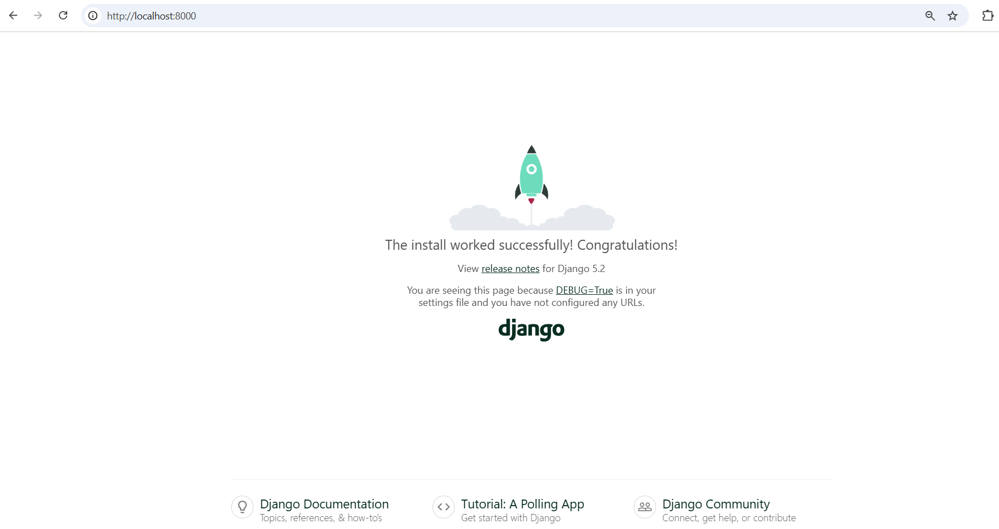

### Langkah 5: Menghentikan _Server_ dan Menonaktifkan _Virtual Environment_

1. Untuk menghentikan _server_, tekan `Ctrl+C` (Windows/Linux) atau `Control+C` (Mac) pada terminal.
2. Nonaktifkan _virtual environment_ dengan perintah:

	```bash
				deactivate
	```

   	**Selamat! Kamu telah berhasil membuat aplikasi Django dari awal.**

## Tutorial: Unggah Proyek ke Repositori GitHub
1. Buatlah repositori GitHub baru bernama `football-news` dengan visibilitas *public*.

2. Inisiasi direktori lokal `football-news` sebagai repositori Git.

::: {.callout-tip}

Ingat kembali tahap tutorial sebelumnya. Pastikan pula bahwa kamu menjalankan perintah `git init` pada direktori `football-news`, bukan di luarnya ataupun di direktori lain di dalam `football-news`.

:::

Jalankan perintah berikut di terminal:

```bash
git init
```

Perintah ini membuat folder .git yang digunakan untuk melacak perubahan file secara lokal.
3. Tambahkan berkas `.gitignore`
   	- Tambahkan berkas `.gitignore` dan isilah berkas tersebut dengan teks berikut.
		```yaml
								# Django
								*.log
								*.pot
								*.pyc
								**pycache**
								db.sqlite3
								media
								# Backup files
								*.bak
								# If you are using PyCharm
								# User-specific stuff
								.idea/**/workspace.xml
								.idea/**/tasks.xml
								.idea/**/usage.statistics.xml
								.idea/**/dictionaries
								.idea/**/shelf
								# AWS User-specific
								.idea/**/aws.xml
								# Generated files
								.idea/**/contentModel.xml
								.DS_Store
								# Sensitive or high-churn files
								.idea/**/dataSources/
								.idea/**/dataSources.ids
								.idea/**/dataSources.local.xml
								.idea/**/sqlDataSources.xml
								.idea/**/dynamic.xml
								.idea/**/uiDesigner.xml
								.idea/**/dbnavigator.xml
								# Gradle
								.idea/**/gradle.xml
								.idea/**/libraries
								# File-based project format
								*.iws
								# IntelliJ
								out/
								# JIRA plugin
								atlassian-ide-plugin.xml
								# Python
								*.py[cod]
								*$py.class
								# Distribution / packaging
								.Python build/
								develop-eggs/
								dist/
								downloads/
								eggs/
								.eggs/
								lib/
								lib64/
								parts/
								sdist/
								var/
								wheels/
								*.egg-info/
								.installed.cfg
								*.egg
								*.manifest
								*.spec
								# Installer logs
								pip-log.txt
								pip-delete-this-directory.txt
								# Unit test / coverage reports
								htmlcov/
								.tox/
								.coverage
								.coverage.*
								.cache
								.pytest_cache/
								nosetests.xml
								coverage.xml
								*.cover
								.hypothesis/
								# Jupyter Notebook
								.ipynb_checkpoints
								# pyenv
								.python-version
								# celery
								celerybeat-schedule.*
								# SageMath parsed files
								*.sage.py
								# Environments
								.env*
        !.env.example*
								.venv
								env/
								venv/
								ENV/
								env.bak/
								venv.bak/
								# mkdocs documentation
								/site
								# mypy
								.mypy_cache/
								# Sublime Text
								*.tmlanguage.cache
								*.tmPreferences.cache
								*.stTheme.cache
								*.sublime-workspace
								*.sublime-project
								# sftp configuration file
								sftp-config.json
								# Package control specific files Package
								Control.last-run
								Control.ca-list
								Control.ca-bundle
								Control.system-ca-bundle
								GitHub.sublime-settings
								# Visual Studio Code
								.vscode/*
								!.vscode/settings.json
								!.vscode/tasks.json
								!.vscode/launch.json
								!.vscode/extensions.json
								.history
		```
	- Berkas `.gitignore` adalah berkas konfigurasi yang digunakan dalam repositori Git untuk menentukan berkas-berkas dan direktori-direktori yang harus diabaikan oleh Git.
	- Berkas-berkas yang tercantum di dalam `.gitignore` **tidak** akan dimasukkan ke dalam versi kontrol Git (tidak di-*push* ke repositori GitHub).
	- Berkas ini perlu dibuat karena terkadang ada berkas-berkas yang tidak perlu dilacak oleh Git, seperti berkas-berkas yang dihasilkan oleh proses kompilasi, berkas sementara, atau berkas konfigurasi pribadi.

4. Hubungkan repositori lokal dengan repositori GitHub yang telah dibuat.
	```bash
				git remote add origin https://github.com/username/football-news.git
	```
	Ganti `username` dengan username GitHub kamu.

	Perintah ini menambahkan *remote* bernama `origin` yang menunjuk ke repositori GitHub kamu. Dengan menambahkan *remote* ini, Git akan tahu ke mana harus mengirim kode kamu saat melakukan *push*.

5. Buat branch utama bernama master.
	```bash
				git branch -M master
	```

6. Lakukan `add`, `commit`, dan `push` dari direktori repositori lokal.
	```bash
				git add .
				git commit -m "Tutorial 0"
				git push origin master
	```

::: {.callout-note}

- Repositori **`football-news`** yang baru saja kamu buat akan menjadi landasan untuk tutorial-tutorial berikutnya. **Repositori ini akan terus digunakan** dan berkembang seiring tutorial yang kamu ikuti.
- Pada akhir semester, kamu akan melihat bahwa repositori tutorial ini telah berkembang menjadi aplikasi yang utuh, buatan kamu sendiri. Sehingga, kamu bisa saja memasukkan ini ke dalam portofolio kamu!
- Oleh karena itu, pastikan kamu mengelola repositori ini dengan baik dan mengikuti tutorial-tutorial selanjutnya untuk mengembangkan kemampuan kamu dalam pemrograman berbasis platform.

:::

## Tutorial: Pembuatan Akun dan Deployment melalui PWS (Pacil _Web Service_)
1. Akses halaman PWS pada https://pbp.cs.ui.ac.id. Kamu akan diarahkan ke halaman login with SSO.
2. Login dengan akun SSO UI kamu.
3. Apabila proses _login_ berhasil, kamu akan diarahkan ke _home page_ dari PWS.

    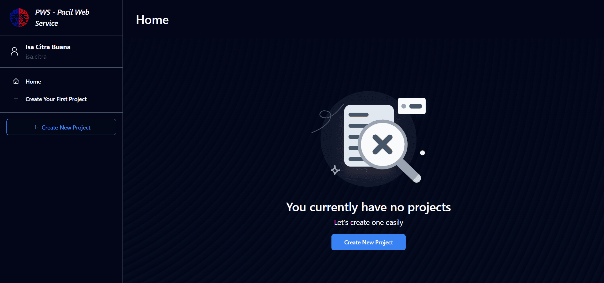

5. Buat proyek baru dengan menekan tombol `Create New Project`. Kamu akan diarahkan ke halaman untuk membuat proyek baru. Pada halaman ini, isi `Project Name` dengan `footballnews`. Setelah itu, tekan `Create New Project` di bawahnya.

	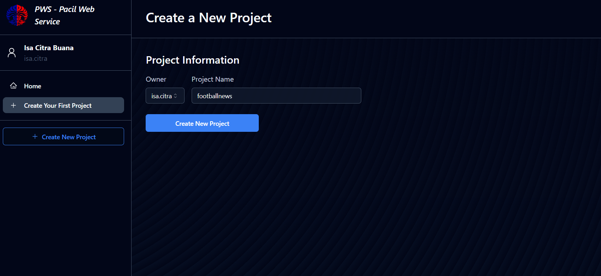


::: {.callout-note}

Dalam membuat proyek lain nantinya seperti tugas atau TK, kamu bisa mengisi `Project Name` dengan nama lain sesukamu. Akan tetapi, terdapat limitasi bahwa nama proyek harus terdiri dari karakter _alphanumeric_ saja.

:::

6. Akan muncul dua informasi baru, yaitu mengenai _Project Credentials_ dan _Project Command_. **Simpan _credentials_ yang kamu peroleh** di tempat yang aman, karena seterusnya _credentials_ ini **tidak akan bisa kamu lihat lagi**. **Jangan jalankan dulu instruksi _Project Command_**.

    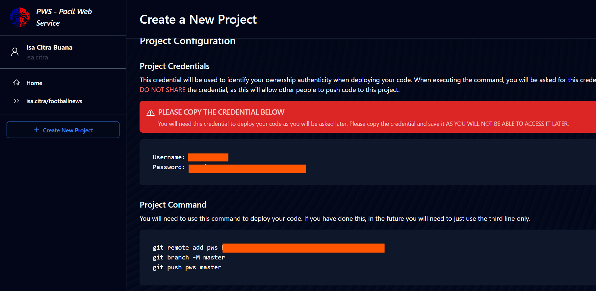


7. Kemudian, pada sidebar, klik proyek yang kamu buat. Pilih tab Environs.
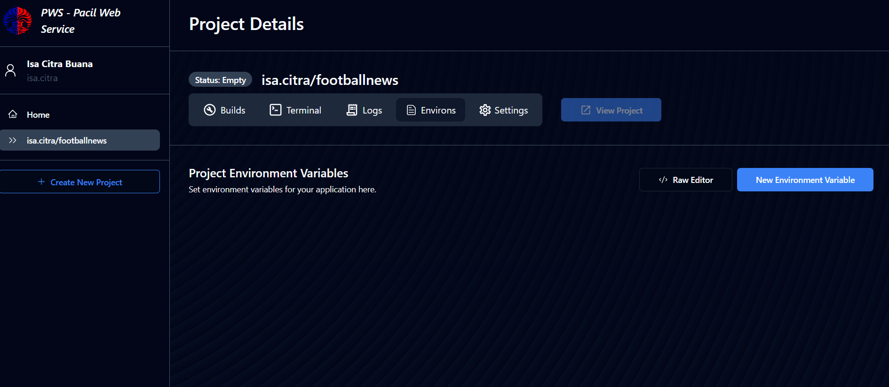
    Pada tab tersebut, klik Raw Editor dan copy paste isi file dari **.env.prod** yang sebelumnya kamu buat.
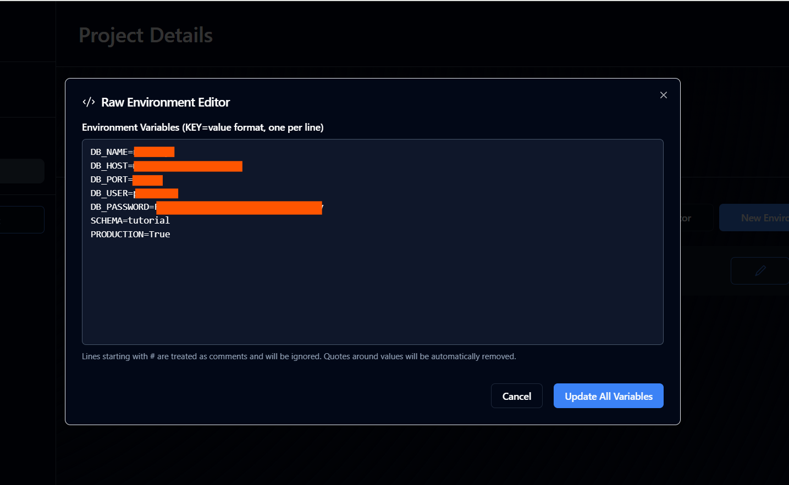
Jangan lupa pastikan bahwa ```SCHEMA=tutorial``` dan ```PRODUCTION=True```, selanjutnya klik Update All Variables. Selanjutnya pastikan bahwa environment variable di proyek PWS kamu sudah tersimpan dengan baik.
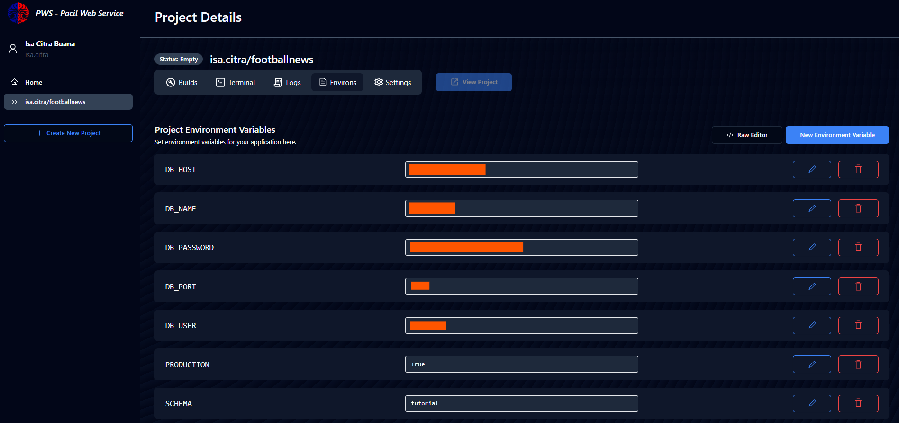


7. Pada `settings.py` di proyek Django yang sudah kamu buat tadi, tambahkan URL *deployment* PWS pada `ALLOWED_HOSTS`.

::: {.callout-note}

URL *deployment* PWS memiliki format `<username-sso>-<nama proyek>.pbp.cs.ui.ac.id`. Apabila pada username SSO kamu terdapat karakter titik (.), gantilah karakter tersebut menjadi *hyphen* (-). Sebagai contoh, apabila username SSO kamu adalah `pak.bepe25` dan nama proyek kamu adalah `footballnews`, URL *deployment* PWS kamu adalah `pak-bepe25-footballnews.pbp.cs.ui.ac.id`.

:::

```python
...
ALLOWED_HOSTS = ["localhost", "127.0.0.1", "<URL deployment PWS kamu>"]
...
```

Langkah ini perlu kamu lakukan agar proyek Django kamu dapat diakses melalui URL *deployment* PWS. Lakukan `git add`, `commit`, dan `push` perubahan ini ke repositori GitHub kamu.

::: {.callout-warning}

Sebelum kamu ke langkah selanjutnya, pastikan struktur repositorimu sama seperti 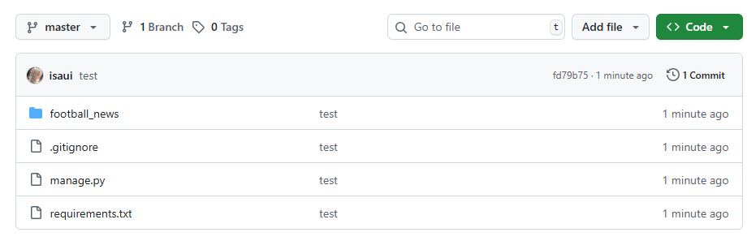

:::

8. Jalankan perintah yang terdapat pada informasi *Project Command* pada halaman PWS. Ketika kamu melakukan push ke PWS, akan ada *window* yang meminta `username` dan `password`. Gunakan *credentials* yang kamu terima dari proyek tutorial kamu di PWS, **bukan *credentials* SSO**.
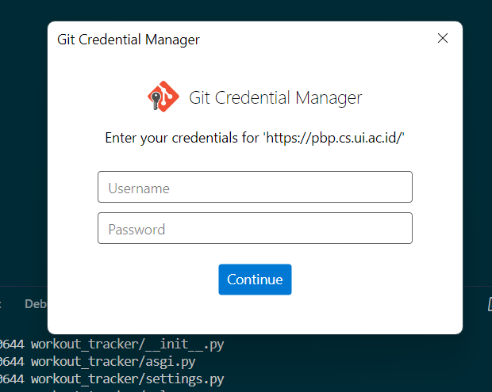

9. Pada *side bar* situs PWS, klik proyek yang telah kamu buat. Kamu dapat melihat status *deployment* kamu saat ini. Apabila statusnya `Building`, artinya proyek kamu masih dalam proses *deployment*. Apabila statusnya `Running`, maka proyek kamu sudah bisa diakses pada URL *deployment*. Kamu bisa menekan tombol `View Project` yang terdapat pada halaman proyek kamu.

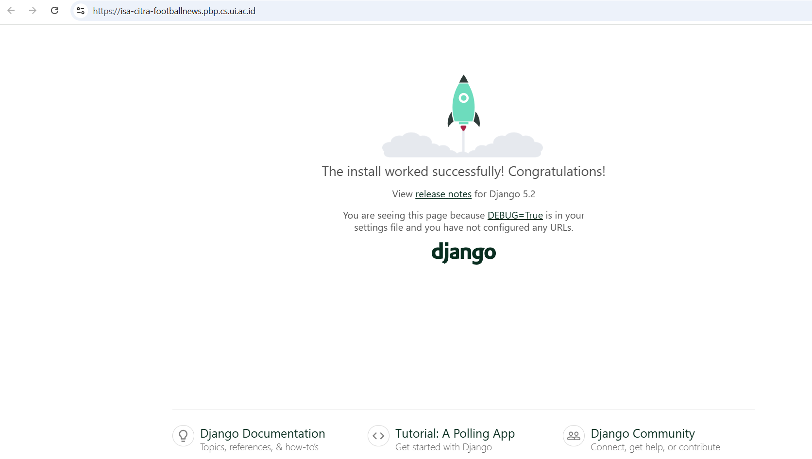


11. Apabila kedepannya ada perubahan pada proyek Django kamu yang ingin kamu *push* ke PWS, kamu hanya perlu menjalankan perintah:
	```bash
				git push pws master
	```
	**setelah melakukan `add` dan `commit`**. Kamu tidak perlu mengulang perintah yang ada di informasi *Project Command* lagi.

## Tambahan: _Troubleshooting_ PWS

### Build Gagal
Apabila ada kendala seperti build yang gagal, terdapat beberapa solusi yang dapat kamu coba.

- Coba untuk kembali perhatikan struktur _file_ proyek Djangomu. Biasanya menandakan bahwa _file_-_file_ pada proyek Djangomu kurang lengkap, sehingga proyek Djangomu tidak terdeteksi oleh PWS. Terdapat beberapa hal yang dapat kamu coba periksa:
	- Isi Repositori: Pastikan struktur repositorimu sudah sama dengan contoh tampilan repositori yang dilampirkan pada langkah 7 di bagian tutorial _deployment_ ke PWS.
	- Berkas `requirements.txt`: Pastikan nama berkas tersebut sama persis, bukan `requirement.txt` (kurang huruf 's') atau `requirements.txt.txt` (double extension)
	- Berkas `.gitignore`: Pastikan bahwa berkas `.gitignore` diawali dengan titik dan tidak memwliki ekstensi apa-apa di akhir. Pastikan pula bahwa berkas `.gitignore` terletak di _root folder_ bersama dengan berkas `manage.py`, direktori `env`, direktori `footballnews`, berkas `requirements.txt`, direktori tersembunyi `.git`, dan berkas basis data `db.sqlite3`.

::: {.callout-note}

Apabila kamu pengguna Windows, centang opsi `File name extensions` pada Windows Explorer untuk melihat ekstensi berkas-berkas yang kamu miliki. Dengan ini, kamu bisa melakukan _troubleshooting_ dengan lebih mudah.

    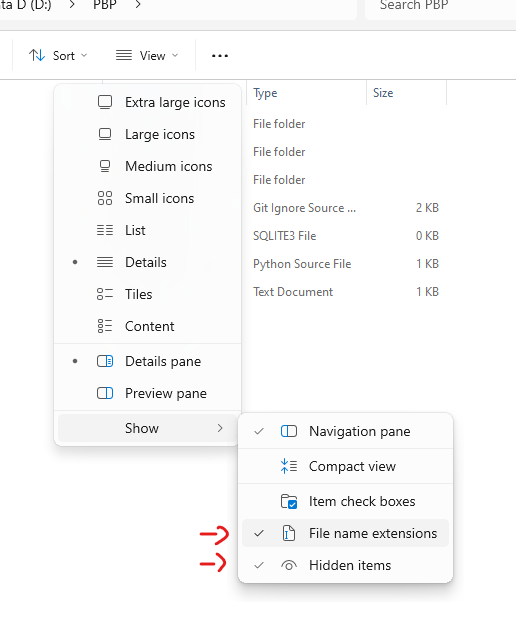

:::

	- Pastikan bahwa direktori `env` dan berkas basis data `db.sqlite3` tidak ikut dilacak/tidak ikut di-_push_ oleh Git. Apabila sudah telanjur terjadi, kamu bisa menambahkan berkas `.gitignore`, kemudian menjalankan perintah `git rm --cached -r env db.sqlite3` sebelum melakukan `add`, `commit`, dan `push`. Hal ini perlu dilakukan agar direktori `env` dan berkas `db.sqlite3` selanjutnya tidak ikut dilacak oleh Git.
    - Apabila kamu sudah yakin bahwa struktur _file_ proyek Djangomu sudah lengkap tetapi _deployment_ masih gagal, pastikan bahwa kamu melakukan _push_ ke PWS menggunakan branch `master`.

### Tidak Menyimpan _Credentials_

Apabila kamu lupa untuk menyimpan _credentials_ yang kamu dapatkan saat membuat proyek di PWS, yang bisa kamu lakukan adalah dengan me-regenerate credential pada tab Settings di proyek tersebut.
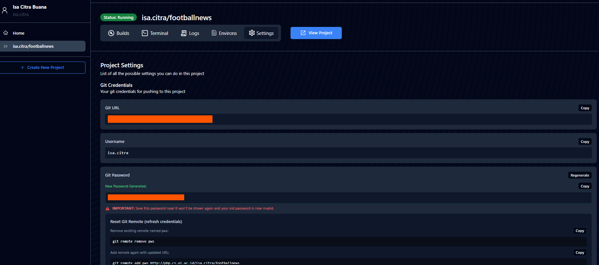

Jangan lupa ikuti langkah-langkah yang dijelaskan pada tab tersebut. Solusi lain adalah dengan membuat proyek baru.

### Mengganti _Remote_ URL PWS pada Repositori Lokal

Jika kamu membuat proyek baru di PWS untuk mengatasi masalah pada proyek sebelumnya, kamu perlu mengganti _remote_ URL di repositori lokalmu menjadi _remote_ URL dari proyek yang baru. Apabila tidak kamu ganti, maka perintah `git push pws master` yang nantinya akan kamu jalankan tidak akan melakukan push ke proyek barumu, melainkan akan tetap mencoba melakukan push ke proyekmu yang lama.

Untuk melakukan penggantian _remote_ URL, kamu hanya perlu mengganti perintah pertama yang terdapat pada tampilan proyek baru PWS. Ganti perintah `git remote add pws <link>` menjadi `git remote set-url pws <link>`, lalu jalankan perintah-perintah selanjutnya seperti biasa.

### Error 502 (Bad Gateway) pada web

Pada saat deployment pertama kali, kamu mungkin akan melihat error 502 (Bad Gateway) di browser. Ini normal terjadi karena PWS sedang menjalankan proses migrasi database sebelum server aplikasi (gunicorn) siap menerima request.


Kamu bisa cek progress di tab Logs pada dashboard proyek PWS. Tunggu hingga muncul log Listening at (biasanya 15-20 detik). Karena log tidak update secara streaming, refresh halaman log jika diperlukan.

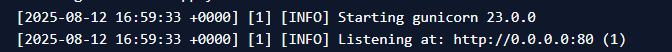


## Akhir Kata

**Selamat!** Kamu sudah menyelesaikan tutorial tentang penggunaan Git, GitHub, instalasi IDE, pengembangan proyek dengan Django, serta _deployment_ ke PWS!

Pesan tambahan, pastikan kamu memahami setiap kode yang kamu tulis, ya. **Jangan sampai hanya asal _copy-paste_ tanpa memahaminya terlebih dahulu.** Apabila nanti kamu mengalami kesulitan, jangan ragu untuk bertanya ke asisten dosen ataupun teman. Semangat terus dalam menjalani perkuliahan PBP selama satu semester ke depan, dan jangan lupa untuk menikmati setiap prosesnya. _Good luck_!

## Referensi Tambahan

- [About pull request merges](https://docs.github.com/en/pull-requests/collaborating-with-pull-requests/incorporating-changes-from-a-pull-request/about-pull-request-merges)
- [Resolving a merge conflict on GitHub](https://docs.github.com/en/pull-requests/collaborating-with-pull-requests/addressing-merge-conflicts/resolving-a-merge-conflict-on-github)
- [Git Guides Full Version](https://github.com/git-guides/git-pull)
- [Github Issue Tracker](https://docs.github.com/en/issues/tracking-your-work-with-issues)

## Kontributor

- Marla Marlena
- Isa Citra Buana
- Regina Meilani Aruan (English Translator)

## Credits

Tutorial ini dikembangkan berdasarkan [PBP Ganjil 2025](https://github.com/pbp-fasilkom-ui/ganjil-2025) dan [PBP Ganjil 2024](https://github.com/pbp-fasilkom-ui/ganjil-2024) yang ditulis oleh Tim Pengajar dan Asisten Dosen Pemrograman Berbasis Platform 2025 dan 2024. Segala tutorial serta instruksi yang dicantumkan pada repositori ini dirancang sedemikian rupa sehingga mahasiswa yang sedang mengambil mata kuliah Pemrograman Berbasis Platform dapat menyelesaikan tutorial saat sesi lab berlangsung.

:::

::: {.content-visible when-profile="en"}

[📊 View Slides](../slides/tutorial-0.qmd){.btn .btn-outline-primary role="button"}

Platform-Based Programming (CSGE602022) — organized by the Faculty of Computer Science, Universitas Indonesia, Odd Semester 2025/2026

_Last updated: August 27, 09:00 WIB_


***
### Learning Objectives
After completing this tutorial, students are expected to be able to:

- Understand the **basic Git commands** needed to work on application projects.
- Create a **local and online (GitHub) Git repository**.
- **Add a _remote_** between a local Git repository and an online repository on GitHub.
- **Understand Git _branching_** and be able to perform a _merge request_/_pull request_.
- Understand the concept and implementation of ***environment variables***.
- **Deploy** the Django tutorial project to **PWS**.

## Tutorial: Creating a GitHub Account (Skip if You Already Have One)

### Introduction to Git and GitHub

This initial introduction will help you understand the basics of Git and the web-based git hosting platform known as GitHub.

#### Git: Version Control System for a Codebase

- **Git** is a version control system that helps you track changes to your project's source code.
- With Git, you can monitor all the revisions that have been made to your project over time.

#### GitHub: A Collaboration Platform Using Git

- **GitHub** is a web-based platform that lets you store, manage, and collaborate on projects using Git.
- It provides a secure space to _host_ your project and interact with teammates through Git.

#### Why Does It Matter?

- Git and GitHub play an important role in modern software development and team collaboration.
- Both allow teams to track code changes, save versions, and work together on projects efficiently.

With a basic understanding of Git and GitHub, you are ready to go further into the world of collaborative and structured software development.

### Step 1: Creating a GitHub Account

The next step is to create a GitHub account, which will allow you to start collaborating on projects using Git.

1. Open the GitHub Website
    - Open your web browser and go to [GitHub](https://github.com).

2. Create an Account
    - On the GitHub homepage, look for the **`Sign up`** button in the top-right corner of the page.
    - Click the button to start the account registration process.

3. Fill in the Registration Form
    - Fill in the registration form with the required information, such as the username you want to use, a valid _email_ address, and a secure password.
    - Make sure you keep this information safe so you can log in to your account later.

4. Verify Your Account via _Email_
    - After filling in the form, GitHub will send a verification _email_ to the _email_ address you provided.
    - Open that _email_ and follow the instructions to verify your account.

5. Your GitHub Account Is Ready to Use
    - Once verification is complete, you will have a GitHub account ready to use for collaborating on projects and tracking changes with Git.

::: {.callout-note}

- A GitHub account is the door that helps you collaborate on projects and store your projects on this platform.
- Make sure the registration information you provide is accurate and secure.
- If you're confused, you can follow the tutorial at [this link](https://www.youtube.com/watch?v=Gn3w1UvTx0A).

:::

### Congratulations, You Have Created a GitHub Account

You now have a GitHub account that can be used to store projects, collaborate with others, and much more.

## Tutorial: Installing an IDE

An IDE (_Integrated Development Environment_) is software that helps developers write, edit, and manage code. Below are the steps to install an IDE.

### Step 1: Choosing a _Text Editor_ or IDE

Choose a _text editor_ or IDE that suits your preference. Some popular options you can consider include:

- [Visual Studio Code](https://code.visualstudio.com/)
- [Sublime Text](https://www.sublimetext.com/)
- [PyCharm](https://www.jetbrains.com/pycharm/)
- [Neovim](https://neovim.io/)

### Step 2: Installation Process

1. Go to the official website of the IDE you chose.
2. Follow the instructions given to download the IDE _installer_.
3. Run the _installer_ and follow the on-screen instructions to complete the installation process.

### Step 3: Getting Started with the IDE

1. Once the installation process is complete, open the installed IDE.
2. Explore the interface and features provided by the IDE to help you in project development.

::: {.callout-note}

- Make sure you choose an IDE that suits the type of project you will be working on.
- Don't hesitate to explore the IDE's features (e.g., _extensions_ or _plugins_) and take advantage of supporting resources, such as documentation and tutorials, to improve your productivity in software development.

:::

## Tutorial: Installing and Configuring Git

### Step 1: Installing Git

If Git is not yet installed on your system, you can follow the steps below to install it.

1. Open the official Git website at [here](https://git-scm.com/downloads).
2. Choose the appropriate operating system (Windows, macOS, or Linux) and download the corresponding _installer_.
3. Run the downloaded _installer_ and follow the on-screen instructions to complete the installation process.
4. Additionally, don't forget to check "Git Credential Manager Core" to make it easier to integrate Git with GitHub.


### Step 2: Initial Git Configuration

Once Git is installed, the following steps will help you set up the initial configuration before you start using Git.

1. Create a new _folder_/directory to store your Git project, then enter that directory.
2. Copy the _path_ to the directory you just created.
3. Open a terminal or _command prompt_ on your system, then move to the directory you created by running the command `cd <path_direktori>`
4. Initialize a new repository with the command `git init`. This command creates an empty Git repository inside the directory you specified.

### Step 3: Configuring Username and _Email_

Before you start contributing to the repository, configure your username and _email_ address so they are linked to your _commits_.

Set the _username_ and _email_ that will be associated with your work in this Git repository by running the command below. Adjust it to the _username_ and _email_ you use on [GitHub](https://github.com).

```bash
git config --global user.name "<NAME>"
git config --global user.email "<EMAIL>"
```

Example:

```bash
git config --global user.name "pakbepe"
git config --global user.email "pak.bepe@cs.ui.ac.id"
```

Note that the `--global` _flag_ changes the global configuration for the entire system. What "global configuration" means is that you're telling Git: "Whenever I use Git on this computer, assume my name and email are always this."

So:
`--global` = applies to every Git project you open on that computer.


::: {.callout-warning}

- Make sure to replace `<NAME>` and `<EMAIL>` with your own personal information
- If you **only need a local (internal) configuration**, you just need to use this code instead

```bash
git config user.name "<NAME>"
git config user.email "<EMAIL>"
```

Example:

```bash
git config  user.name "pakbepe"
git config  user.email "pak.bepe@cs.ui.ac.id"
```
- A local (internal) configuration, meaning the name and email you use to log in, only applies to the Git project you currently have open. So it's only for the Git folder you're currently active in (e.g., just 1 project).

:::

### Step 4: Authentication Configuration

To later connect your Git account with your GitHub account, there is an extra configuration you need to add. You only need to run the two commands below:

**Windows**
```bash
git credential-manager configure
git config --global credential.credentialStore wincredman
```

**Unix (macOS, Linux)**
```bash
git credential-manager configure
git config --global credential.credentialStore keychain
```

::: {.callout-tip}

- If the `git credential-manager` command cannot be run, you can try the `git-credential-manager` or `git-credential-manager-core` command instead.
- On macOS, if neither of those commands works, you can try downloading git credential manager using *Homebrew* with the command `brew install git-credential-manager-core`.
- If your macOS doesn't have *Homebrew*, you can download it by following the instructions on [this website](https://brew.sh).

:::

### Step 5: Verifying the Configuration

To make sure the configuration has been set up correctly in the local repository, you can run the following command.

```bash
git config --list
```

## Tutorial: Basic Git Usage

A **repository** is a storage location for a software project, which includes all the revisions and changes made to the code. To execute Git commands, you can do so on a repository on GitHub, a collaborative platform for managing projects with Git.

::: {.callout-note}

Note that this basic Git usage tutorial will not be submitted and is for practice only. The only thing you will submit is the Django project, whose creation steps are also covered in this tutorial.

:::

### Step 1: Initializing a Repository on GitHub

The first step in using Git is to initialize a repository on GitHub to start tracking changes to your project.

1. Open [GitHub](https://github.com) through your web browser.

2. Create a New Repository
	- On the GitHub homepage, create a new repository named `my-first-repo`.
	- Open the page of the repository you just created. Make sure to set the project visibility to "Public" and leave the other settings at their _default_ value.

3. Choose a Local Directory
	- Choose a local directory on your computer that has been initialized with Git. This is where you will store the local version of the project.

4. Add a `README.md` File
	- Create a new file named `README.md` in your project's local directory.
	- Fill in the `README.md` file with information such as your name, student ID (NPM), and class. Example:
		```md
								Name : Pak Bepe
								Student ID : 2401234567
								Class : PBP A
		```

5. Check the Status and Start _Tracking_
	- Open a _command prompt_ or terminal, then run `git status` in the directory you chose. This command will show the files that have not yet been _tracked_ (_untracked_).
	- Use the command `git add README.md` to mark the README.md file as a file that will be _committed_ (_tracked_).

6. _Commit_ the Changes
	- Run `git status` again and make sure the README.md file is now marked as a file to be _committed_.
	- Continue by running `git commit -m "<YOUR_COMMENT>"` to create a _commit_ with a comment message that matches the change you made.


::: {.callout-warning}

This step will get you ready to start tracking changes to your project using Git.

:::

::: {.callout-note}

- **_Good practice_** when writing a _commit_ comment is to briefly explain what you did. Commit comments are generally written in English. One example of a _commit_ comment you could use for the example above is `Create README.md file` or `Membuat berkas README.md`.
- A good _commit_ comment helps you and your teammates understand the purpose of that change.
- **Avoid** comments that are too generic or ambiguous, such as `Perbaikan bug` (`Fix bugs`) or `Update file`.

:::

### Step 2: Connecting the Local Repository with the Repository on GitHub

After initializing the local repository, the next step is to connect it to the repository on GitHub so that you can collaborate and save changes on that online platform.

1. Create a New **Main _Branch_**
	- In the terminal or _command prompt_, run the command `git branch -M main` to create a new main _branch_ named "main".
	- Make sure the letter "M" in the `-M` command is written in **uppercase**.

2. Connect to the Repository on GitHub

- Use the command `git remote add <NAMA_REMOTE> <URL_REPO>` to connect the local repository to the repository on GitHub.
- `<NAMA_REMOTE>` is the name you will use to reference that remote repository. By convention, the name `origin` is used for the main/primary repository.
- `<URL_REPO>` is the HTTPS URL of the repository you created on GitHub.
- You can get this repository URL on the GitHub page once you successfully create a new repository on GitHub.

    Example usage:
    ```bash
    git remote add origin https://github.com/pakbepe/test.git
    ```

    In the example above:
    - `origin` = the remote name (can be replaced with a different name if desired)
    - `https://github.com/pakbepe/test.git` = the GitHub repository URL

    Additional Tips:
    - To see the list of remotes that have been added: `git remote -v`
    - To remove a remote: `git remote remove <NAMA_REMOTE>`
    - To change a remote's URL: `git remote set-url <NAMA_REMOTE> <URL_BARU>`

3. Push for the First Time to GitHub
	- Finally, save your work to GitHub for the first time by running the command `git push -u origin main`.
	- This command sends all the changes on the current _branch_ (in this case, the main _branch_) in the local repository to the main _branch_ on the GitHub repository.
	- If this is the first time you're pushing to GitHub and you're using Windows, after the installation you should see a _window_ asking you to _sign in_ to GitHub. Click "_Sign in with your browser_", then follow the instructions shown in that _window_.


4. Double-Check
	- Refresh your repository page; your `README.md` file should now be visible.

::: {.callout-note}

- This step is important to keep the local repository and the repository on GitHub consistent.
- This process allows you to start collaborating and saving project changes in a structured way on the GitHub platform.
- `README.md` is a file containing a brief explanation of the project, such as its purpose, how to run it, and its main features, so that other people can easily understand and use the project.
- More information about **git master / main** and its branching can be found [here](https://docs.github.com/en/pull-requests/collaborating-with-pull-requests/proposing-changes-to-your-work-with-pull-requests/about-branches).

:::


### Step 3: _Cloning_ a Repository

**_Cloning_ a repository** is the process of duplicating the entire contents of a repository on GitHub to your local computer so it can be viewed, edited, and run offline on your computer. The steps are as follows.

1. Open the page of the GitHub repository you created earlier on [GitHub](https://github.com).

2. Copy the _Clone_ URL
	- Click the **`Code`** button in the top-right corner of the repository page on GitHub.
	- Choose the HTTPS option to copy the _clone_ URL.

3. _Clone_ the Repository to Your Local Computer
	- Open a terminal or _command prompt_ in a directory **different** from where your previous local repository is.
	- Run the command `git clone <URL_CLONE>` (replace URL_CLONE with the URL you copied).
	- This command will duplicate the entire repository to your local computer.

At this point, you have three repositories:

1. The **original repository** on your local computer.
2. The **online repository** on GitHub connected to the local repository.
3. The **new repository resulting from the _cloning_ process**, connected to the GitHub repository.

::: {.callout-note}

- This step allows you to work with the repository from multiple locations easily.

:::

### Step 4: _Branching_ in a Repository

At this stage you will learn about using _branches_ in Git. Using _branches_ allows you to develop features or fix _bugs_ in a separate environment before merging them back into the main _branch_.

**What Is a _Branch_ in Git?**

- A _branch_ in Git is a separate line of _source code_ that allows for independent development of a feature or change.
- This allows teams to work on features or _bug_ fixes without disrupting the code on the main _branch_.

1. Creating and Switching to a New _Branch_
	- In the original local repository directory (not the _clone_), run the command `git checkout -b <NAMA_BRANCH>` in the terminal or _command prompt_ to create and switch to a new _branch_. Example: `git checkout -b jurusan_branch`
	- Add a major/department attribute to the `README.md` file. Example:

		```md
								Name : Pak Bepe
								Student ID : 2401234567
								Class : PBP A
								Hobby : Sleeping
								Major : Computer Information Systems
		```

2. Saving Changes and _Pushing_ to GitHub
	- After adding the major/department attribute, save the file.
	- Perform `add`, `commit`, and `push` to GitHub by running the commands you already learned earlier.
	- Run the command `git push -u origin <NAMA_BRANCH>`. Make sure to replace `<NAMA_BRANCH>` with the name of the new branch you created.

3. Merging a _Branch_ Using a _Pull Request_

	- Open your repository page on GitHub again.
	- A pop-up with a **`Compare & pull request`** button will usually appear automatically. If not, an alternative is to click the **`Pull Request`** button and then choose the **`New pull request`** option.
	- After that, GitHub will compare the changes in the two _branches_ you want to merge.
	- If there are no conflicts, click the **`Merge pull request`** button, which will merge the changes from the _branch_ you want to merge into the main _branch_ (`main`).
	- **If there is a conflict**, you need to look at the file that is usually shown in red in your text editor and resolve the conflict, either by choosing to merge both or keeping one of them depending on what's needed, before approving the **`Merge pull request`**.
	- By doing the steps above, all changes from both _branches_ will be integrated into the main _branch_, unifying those changes.

::: {.callout-note}

- If you want to switch between existing _branches_, run `git checkout <NAMA_BRANCH>` in the terminal. The `-b` flag used in the previous commands is used to create a new _branch_ and switch to it in a single step.
- A **conflict** occurs when changes made on one _branch_ collide with changes made on another _branch_. For example, if two developers change the same part of the same file at the same time, Git cannot automatically decide which change should be applied.
- If there is a conflict or colliding changes, the platform will ask you to decide which change should be kept.
- **It's important** to understand the concept of _branching_ in Git, because it allows for **organized and separate development**, before all changes are combined back into the main codebase.

:::

## Tutorial: Installing Django and Initializing a Django Project

**Django** is a popular _framework_ for developing web applications with the Python programming language. In this tutorial, you will learn the steps to install Django and initialize a demo project as a _starter_.

::: {.callout-warning}

This Django project must be created in a folder that will from now on be referred to as the **directory**, different from `my-first-repo` as taught in the previous steps. Make sure you have changed directories in the terminal and are no longer inside `my-first-repo`.

To change directories, please use this code
```bash
cd ~
mkdir <NAMA_FOLDER_BARU>
cd <NAMA_FOLDER_BARU>
```

Notes:
- `Mkdir` is used to create a new folder
- `cd` is used to change directories
- `cd ~` is used to go to your computer's home directory

:::

### Step 1: Creating a Directory and Activating a _Virtual Environment_

1. Create a new directory named `football-news` and enter it.
2. Inside that directory, open a _command prompt_ (Windows) or _terminal shell_ (Unix).
3. Create a _virtual environment_ by running the following command.

	Windows:

	```bash
				python -m venv env
	```

	Unix (macOS, Linux):
	```bash
				python3 -m venv env
	```

4. A **_virtual environment_** is useful for isolating an application's _packages_ and _dependencies_ so they don't clash with other versions on your computer. You can activate the _virtual environment_ with the following command.

	- Windows:

		```bash
								env\Scripts\activate
		```

	- Unix (Mac/Linux):

		```bash
								source env/bin/activate
		```

::: {.callout-tip}

For Windows users, if you encounter the words `PSSecurityException`, `UnauthorizedAccess`, _running scripts is disabled on this system_, do the following.
1. Open PowerShell with _administrator_ access.
2. Run the command `Set-ExecutionPolicy Unrestricted -Force`.
3. Try activating the _virtual environment_ in your terminal again.

:::

5. The _virtual environment_ will become active, marked by `(env)` at the start of the terminal input line.

### Step 2: Setting Up _Dependencies_ and Creating a Django Project

**_Dependencies_** are components or modules required by a piece of software to function, including _libraries_, _frameworks_, or _packages_. They allow developers to make use of existing code, speeding up development, but they also require careful management to ensure the correct version compatibility. Using a _virtual environment_ helps isolate _dependencies_ between different projects.

1. Inside the same directory, create a `requirements.txt` file and add a few _dependencies_.

	```text
				django
				gunicorn
				whitenoise
				psycopg2-binary
				requests
				urllib3
    python-dotenv
	```

2. Install the existing _dependencies_ with the following command. Don't forget to activate the _virtual environment_ first before running the following command.

	```bash
				pip install -r requirements.txt
	```

3. Create a Django project named `football_news` with the following command.

	```bash
				django-admin startproject football_news .
	```

::: {.callout-warning}

Make sure the `.` character is written at the end of the command.

:::

### Step 3: Configuring Environment Variables and the Project

1. Create a `.env` file inside the project's root directory (where the `manage.py` file is located).
<br/>
   


2. Open the `.env` file and add the following configuration:
   ```env
   PRODUCTION=False
   ```

   **Environment variables** are variables stored outside the program code and used to store configuration information such as database credentials, API keys, or environment settings. This allows the same code to run in different environments without needing to change the code.

3. Also create a `.env.prod` file in the same directory for the production configuration:
   ```env
   DB_NAME=<nama database>
   DB_HOST=<host database>
   DB_PORT=<port database>
   DB_USER=<username database>
   DB_PASSWORD=<password database>
   SCHEMA=tutorial
   PRODUCTION=True
   ```

   **Difference between .env and .env.prod:**
   - **`.env`**: Used for local development. Since `PRODUCTION=False`, the application will use the simpler SQLite database for testing and development
   - **`.env.prod`**: Used for production deployment. Since `PRODUCTION=True`, the application will use the PostgreSQL database with credentials provided by ITF Fasilkom UI

   **Database credentials** for the `DB_NAME`, `DB_HOST`, `DB_PORT`, `DB_USER`, and `DB_PASSWORD` variables can be obtained from the ITF Fasilkom UI email (noreply@cs.ui.ac.id) sent to you. These credentials will be used during deployment on PWS.

::: {.callout-note}

**Explanation of each variable:**
- `DB_NAME`: PostgreSQL database name
- `DB_HOST`: Database server host/address
- `DB_PORT`: Database connection port
- `DB_USER`: Username for the database connection
- `DB_PASSWORD`: Password for the database connection
- `SCHEMA`: Database schema name. ITF provides 3 schemas: `tutorial`, `tugas_individu`, and `tugas_kelompok`. For this tutorial we use `tutorial`; for other assignments, adjust to the schema required
- `PRODUCTION`: Determines the application mode (`False` = development with SQLite, `True` = production with PostgreSQL)

:::

   **Example .env.prod configuration:**
   ```env
   DB_NAME=d1a2b3c4d5e6f7
   DB_HOST=192.168.1.100
   DB_PORT=5432
   DB_USER=postgres
   DB_PASSWORD=ABCdef123456
   SCHEMA=tutorial
   PRODUCTION=True
   ```

4. Modify the `settings.py` file to use environment variables. Add the following code near the top of the file (after the `Path` import):
   ```python
   import os
   from dotenv import load_dotenv
   # Load environment variables from .env file
   load_dotenv()
   ```

5. Add the following two strings to `ALLOWED_HOSTS` in `settings.py` for *development* purposes:
   ```python
   ...
   ALLOWED_HOSTS = ["localhost", "127.0.0.1"]
   ...
   ```

   In the context of *deployment*, `ALLOWED_HOSTS` acts as a list of *hosts* allowed to access the web application. By setting the value above, you allow access from the local *host*, meaning it can only be accessed from your own network. However, if you *deploy* the application to a *server*, make sure you add that *server*'s *host* to `ALLOWED_HOSTS`.

6. Add the `PRODUCTION` configuration right above the `DEBUG` code in `settings.py`.
   ```python
   PRODUCTION = os.getenv('PRODUCTION', 'False').lower() == 'true'
   ```

7. Change the database configuration in `settings.py`. Find the `DATABASES` section and replace it with:
   ```python
   # Database configuration
   if PRODUCTION:
       # Production: gunakan PostgreSQL dengan kredensial dari environment variables
       DATABASES = {
           'default': {
               'ENGINE': 'django.db.backends.postgresql',
               'NAME': os.getenv('DB_NAME'),
               'USER': os.getenv('DB_USER'),
               'PASSWORD': os.getenv('DB_PASSWORD'),
               'HOST': os.getenv('DB_HOST'),
               'PORT': os.getenv('DB_PORT'),
               'OPTIONS': {
                   'options': f"-c search_path={os.getenv('SCHEMA', 'public')}"
               }
           }
       }
   else:
       # Development: gunakan SQLite
       DATABASES = {
           'default': {
               'ENGINE': 'django.db.backends.sqlite3',
               'NAME': BASE_DIR / 'db.sqlite3',
           }
       }
   ```

### Step 4: Running the Server

1. Make sure the `manage.py` file is in the directory currently active in your terminal. Run the database migration first with the command:
	- Windows:
		```bash
								python manage.py migrate
		```
	- Unix:
		```bash
								python3 manage.py migrate
		```

2. Once the migration is complete, run the Django *server* with the command:
	- Windows:
		```bash
								python manage.py runserver
		```
	- Unix:
		```bash
								python3 manage.py runserver
		```

3. Open http://localhost:8000 in your web browser to see the rocket animation, a sign that your Django application was successfully created.


### Step 5: Stopping the _Server_ and Deactivating the _Virtual Environment_

1. To stop the _server_, press `Ctrl+C` (Windows/Linux) or `Control+C` (Mac) in the terminal.
2. Deactivate the _virtual environment_ with the command:

	```bash
				deactivate
	```

   	**Congratulations! You have successfully built a Django application from scratch.**

## Tutorial: Uploading the Project to a GitHub Repository
1. Create a new GitHub repository named `football-news` with *public* visibility.

2. Initialize the local `football-news` directory as a Git repository.

::: {.callout-tip}

Recall the previous tutorial steps. Also make sure you run the `git init` command inside the `football-news` directory, not outside it or in another directory within `football-news`.

:::

Run the following command in the terminal:

```bash
git init
```

This command creates a .git folder used to track file changes locally.
3. Add a `.gitignore` File
   	- Add a `.gitignore` file and fill it with the following text.
		```yaml
								# Django
								*.log
								*.pot
								*.pyc
								**pycache**
								db.sqlite3
								media
								# Backup files
								*.bak
								# If you are using PyCharm
								# User-specific stuff
								.idea/**/workspace.xml
								.idea/**/tasks.xml
								.idea/**/usage.statistics.xml
								.idea/**/dictionaries
								.idea/**/shelf
								# AWS User-specific
								.idea/**/aws.xml
								# Generated files
								.idea/**/contentModel.xml
								.DS_Store
								# Sensitive or high-churn files
								.idea/**/dataSources/
								.idea/**/dataSources.ids
								.idea/**/dataSources.local.xml
								.idea/**/sqlDataSources.xml
								.idea/**/dynamic.xml
								.idea/**/uiDesigner.xml
								.idea/**/dbnavigator.xml
								# Gradle
								.idea/**/gradle.xml
								.idea/**/libraries
								# File-based project format
								*.iws
								# IntelliJ
								out/
								# JIRA plugin
								atlassian-ide-plugin.xml
								# Python
								*.py[cod]
								*$py.class
								# Distribution / packaging
								.Python build/
								develop-eggs/
								dist/
								downloads/
								eggs/
								.eggs/
								lib/
								lib64/
								parts/
								sdist/
								var/
								wheels/
								*.egg-info/
								.installed.cfg
								*.egg
								*.manifest
								*.spec
								# Installer logs
								pip-log.txt
								pip-delete-this-directory.txt
								# Unit test / coverage reports
								htmlcov/
								.tox/
								.coverage
								.coverage.*
								.cache
								.pytest_cache/
								nosetests.xml
								coverage.xml
								*.cover
								.hypothesis/
								# Jupyter Notebook
								.ipynb_checkpoints
								# pyenv
								.python-version
								# celery
								celerybeat-schedule.*
								# SageMath parsed files
								*.sage.py
								# Environments
								.env*
        !.env.example*
								.venv
								env/
								venv/
								ENV/
								env.bak/
								venv.bak/
								# mkdocs documentation
								/site
								# mypy
								.mypy_cache/
								# Sublime Text
								*.tmlanguage.cache
								*.tmPreferences.cache
								*.stTheme.cache
								*.sublime-workspace
								*.sublime-project
								# sftp configuration file
								sftp-config.json
								# Package control specific files Package
								Control.last-run
								Control.ca-list
								Control.ca-bundle
								Control.system-ca-bundle
								GitHub.sublime-settings
								# Visual Studio Code
								.vscode/*
								!.vscode/settings.json
								!.vscode/tasks.json
								!.vscode/launch.json
								!.vscode/extensions.json
								.history
		```
	- The `.gitignore` file is a configuration file used in a Git repository to specify which files and directories Git should ignore.
	- Files listed inside `.gitignore` will **not** be included in Git version control (not *pushed* to the GitHub repository).
	- This file needs to be created because sometimes there are files that don't need to be tracked by Git, such as files generated by the build process, temporary files, or personal configuration files.

4. Connect the local repository to the GitHub repository you created.
	```bash
				git remote add origin https://github.com/username/football-news.git
	```
	Replace `username` with your GitHub username.

	This command adds a *remote* named `origin` pointing to your GitHub repository. By adding this *remote*, Git will know where to send your code when you *push*.

5. Create a main branch named master.
	```bash
				git branch -M master
	```

6. Run `add`, `commit`, and `push` from the local repository directory.
	```bash
				git add .
				git commit -m "Tutorial 0"
				git push origin master
	```

::: {.callout-note}

- The **`football-news`** repository you just created will be the foundation for the following tutorials. **This repository will continue to be used** and will grow as you progress through the tutorials.
- By the end of the semester, you'll see that this tutorial repository has grown into a complete application built by you. So, you might even be able to include it in your portfolio!
- Therefore, make sure you manage this repository well and follow the subsequent tutorials to develop your platform-based programming skills.

:::

## Tutorial: Creating an Account and Deploying via PWS (Pacil _Web Service_)
1. Go to the PWS page at https://pbp.cs.ui.ac.id. You will be redirected to the login with SSO page.
2. Log in with your UI SSO account.
3. If the _login_ process succeeds, you will be redirected to the PWS _home page_.

    

5. Create a new project by clicking the `Create New Project` button. You will be taken to a page for creating a new project. On this page, fill in `Project Name` with `footballnews`. After that, click `Create New Project` below it.

	


::: {.callout-note}

When creating other projects later, such as for assignments or the final project (TK), you can fill in `Project Name` with any name you like. However, there is a limitation that the project name must consist of _alphanumeric_ characters only.

:::

6. Two new pieces of information will appear: _Project Credentials_ and _Project Command_. **Save the _credentials_ you receive** somewhere safe, because after this you **will not be able to see these _credentials_ again**. **Do not run the _Project Command_ instructions yet**.

    


7. Then, in the sidebar, click the project you created. Select the Environs tab.

    On that tab, click Raw Editor and copy-paste the contents of the **.env.prod** file you created earlier.

Don't forget to make sure that ```SCHEMA=tutorial``` and ```PRODUCTION=True```, then click Update All Variables. Next, make sure the environment variables in your PWS project have been saved correctly.


7. In `settings.py` in the Django project you created earlier, add the PWS *deployment* URL to `ALLOWED_HOSTS`.

::: {.callout-note}

The PWS *deployment* URL has the format `<username-sso>-<nama proyek>.pbp.cs.ui.ac.id`. If your SSO username contains a dot character (.), replace it with a *hyphen* (-). For example, if your SSO username is `pak.bepe25` and your project name is `footballnews`, your PWS *deployment* URL is `pak-bepe25-footballnews.pbp.cs.ui.ac.id`.

:::

```python
...
ALLOWED_HOSTS = ["localhost", "127.0.0.1", "<URL deployment PWS kamu>"]
...
```

You need to do this step so your Django project can be accessed via the PWS *deployment* URL. Perform `git add`, `commit`, and `push` this change to your GitHub repository.

::: {.callout-warning}

Before moving to the next step, make sure your repository structure matches this: 

:::

8. Run the command found in the *Project Command* information on the PWS page. When you push to PWS, a *window* will ask for a `username` and `password`. Use the *credentials* you received from your tutorial project on PWS, **not your SSO credentials**.


9. In the PWS site's *side bar*, click the project you created. You can see your current *deployment* status. If the status is `Building`, it means your project is still in the *deployment* process. If the status is `Running`, then your project is now accessible at the *deployment* URL. You can click the `View Project` button on your project page.


11. If in the future there are changes to your Django project that you want to *push* to PWS, you only need to run the command:
	```bash
				git push pws master
	```
	**after doing `add` and `commit`**. You don't need to repeat the command from the *Project Command* information again.

## Additional: PWS _Troubleshooting_

### Build Failed
If you run into issues such as a failed build, there are several solutions you can try.

- Try double-checking your Django project's _file_ structure again. This usually indicates that some _files_ in your Django project are missing, causing your Django project not to be detected by PWS. Here are a few things you can check:
	- Repository Contents: Make sure your repository structure matches the example repository view attached in step 7 of the PWS _deployment_ tutorial section.
	- The `requirements.txt` File: Make sure the file name is exactly right, not `requirement.txt` (missing the letter 's') or `requirements.txt.txt` (double extension)
	- The `.gitignore` File: Make sure the `.gitignore` file starts with a dot and has no extension at the end. Also make sure the `.gitignore` file is located in the _root folder_ together with the `manage.py` file, the `env` directory, the `footballnews` directory, the `requirements.txt` file, the hidden `.git` directory, and the `db.sqlite3` database file.

::: {.callout-note}

If you are a Windows user, check the `File name extensions` option in Windows Explorer to see the extensions of your files. This makes _troubleshooting_ easier.

    

:::

	- Make sure the `env` directory and the `db.sqlite3` database file are not tracked/not *pushed* by Git. If this has already happened, you can add a `.gitignore` file, then run the command `git rm --cached -r env db.sqlite3` before doing `add`, `commit`, and `push`. This needs to be done so that the `env` directory and the `db.sqlite3` file are no longer tracked by Git going forward.
    - If you're sure your Django project's _file_ structure is complete but the _deployment_ still fails, make sure you're pushing to PWS using the `master` branch.

### Didn't Save the _Credentials_

If you forgot to save the _credentials_ you received when creating your project on PWS, what you can do is regenerate the credentials on the Settings tab of that project.


Don't forget to follow the steps described on that tab. Another solution is to create a new project.

### Changing the PWS _Remote_ URL on the Local Repository

If you create a new project on PWS to resolve an issue with a previous project, you need to change the _remote_ URL in your local repository to the _remote_ URL of the new project. If you don't change it, the `git push pws master` command you run later will not push to your new project, but will instead keep trying to push to your old project.

To change the _remote_ URL, you just need to change the first command shown on the new PWS project page. Change the command `git remote add pws <link>` to `git remote set-url pws <link>`, then run the following commands as usual.

### Error 502 (Bad Gateway) on the website

The first time you deploy, you might see a 502 (Bad Gateway) error in your browser. This is normal because PWS is running the database migration process before the application server (gunicorn) is ready to accept requests.


You can check the progress on the Logs tab of the PWS project dashboard. Wait until a "Listening at" log appears (usually 15-20 seconds). Since the log doesn't update via streaming, refresh the log page if needed.


## Final Words

**Congratulations!** You have completed the tutorial on using Git, GitHub, installing an IDE, developing a project with Django, and _deployment_ to PWS!

One more note: make sure you understand every piece of code you write. **Don't just _copy-paste_ without understanding it first.** If you run into difficulties later, don't hesitate to ask a teaching assistant or a friend. Keep up your spirit throughout the PBP course this semester, and don't forget to enjoy the process. _Good luck_!

## Additional References

- [About pull request merges](https://docs.github.com/en/pull-requests/collaborating-with-pull-requests/incorporating-changes-from-a-pull-request/about-pull-request-merges)
- [Resolving a merge conflict on GitHub](https://docs.github.com/en/pull-requests/collaborating-with-pull-requests/addressing-merge-conflicts/resolving-a-merge-conflict-on-github)
- [Git Guides Full Version](https://github.com/git-guides/git-pull)
- [Github Issue Tracker](https://docs.github.com/en/issues/tracking-your-work-with-issues)

## Contributors

- Marla Marlena
- Isa Citra Buana
- Regina Meilani Aruan (English Translator)

## Credits

This tutorial was developed based on [PBP Ganjil 2025](https://github.com/pbp-fasilkom-ui/ganjil-2025) and [PBP Ganjil 2024](https://github.com/pbp-fasilkom-ui/ganjil-2024), written by the Platform-Based Programming Teaching Team and Teaching Assistants for 2025 and 2024. All tutorials and instructions listed in this repository are designed so that students taking the Platform-Based Programming course can complete the tutorial during the lab session.

:::
