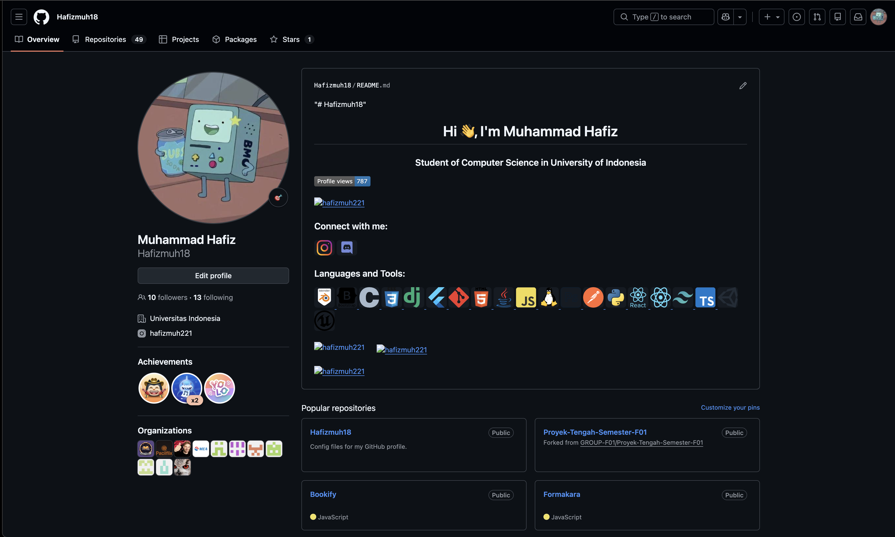
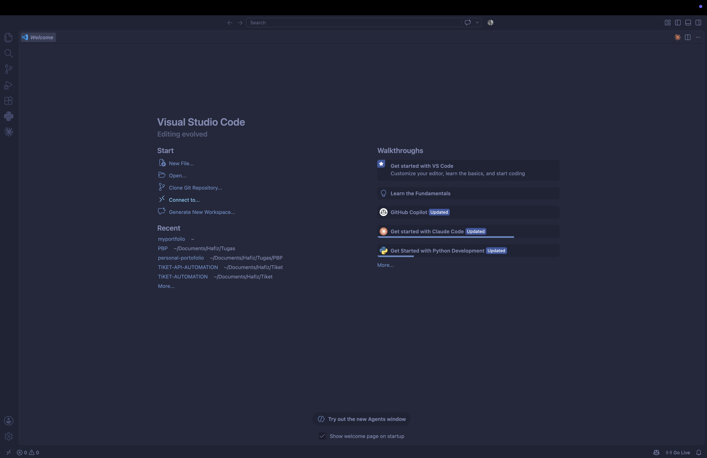
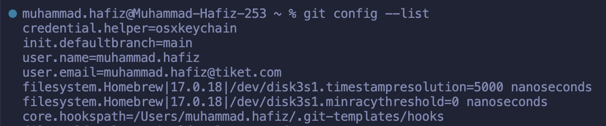
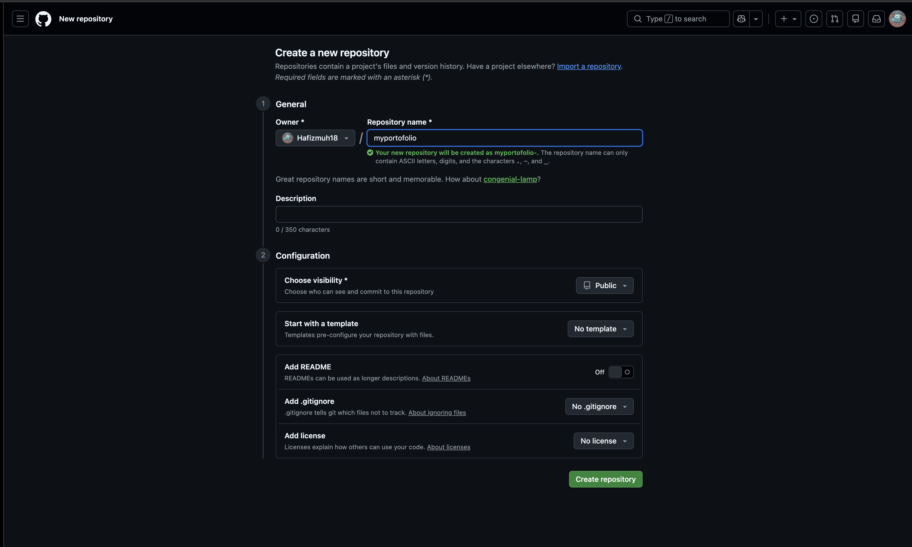
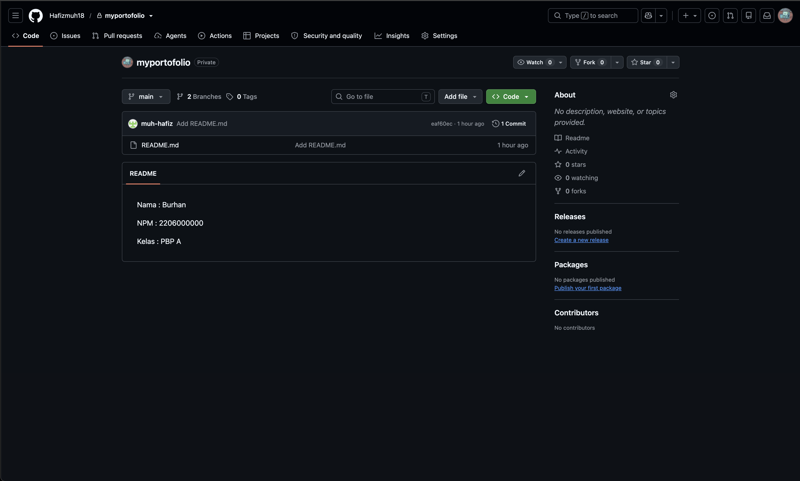

::: {.content-visible when-profile="id"}

# Tutorial 0: Setup Git Repository, Django Installation {.pbp-page-title}

Pemrograman Berbasis Platform (CSGE602022) - diselenggarakan oleh Fakultas Ilmu Komputer Universitas Indonesia, Semester Gasal 2026/2027

**Kontributor:** MUH - Hafiz

***

### Tujuan Pembelajaran

Setelah menyelesaikan tutorial ini, mahasiswa diharapkan untuk dapat:

- Mengerti perintah-perintah dasar Git yang perlu diketahui untuk mengerjakan proyek aplikasi.
- Membuat repositori Git lokal dan daring (GitHub), lalu menghubungkan keduanya.
- Memahami *branching* pada Git dan mampu melakukan *pull request*/*merge*.
- Menginstall Django dan membuat proyek Django pertamamu.

::: {.callout-tip}
Tutorial ini adalah tutorial pertama dari proyek yang akan kamu bangun berkelanjutan sepanjang semester: sebuah **website portofolio pribadi**. Pastikan langkah-langkah di bawah selesai sebelum Tutorial 01 minggu depan, karena Tutorial 01 melanjutkan langsung dari proyek Django yang kamu buat di sini.
:::

## Pembuatan Akun GitHub (Lewati Jika Sudah Ada)

### Pengenalan Git dan GitHub

Pengenalan awal ini akan membantumu memahami dasar-dasar Git dan platform *git hosting* berbasis web yang dikenal sebagai GitHub.

**Git: Sistem Kontrol Versi untuk Codebase**

- **Git** adalah sistem kontrol versi yang membantumu melacak perubahan pada kode sumber proyek.
- Dengan Git, kamu dapat memantau semua revisi yang telah dilakukan pada proyekmu seiring waktu.

**GitHub: Platform Kolaborasi Menggunakan Git**

- **GitHub** adalah platform berbasis web yang memungkinkanmu menyimpan, mengelola, dan berkolaborasi pada proyek menggunakan Git.
- Ini memberikan wadah yang aman untuk meng-*host* proyekmu dan berinteraksi dengan rekan tim melalui Git.

**Mengapa Penting?**

- Git dan GitHub memainkan peran penting dalam pengembangan perangkat lunak modern dan kolaborasi tim.
- Keduanya memungkinkan tim untuk melacak perubahan kode, menyimpan versi, dan bekerja bersama dalam proyek secara efisien.

### Langkah 1: Membuat Akun di GitHub

1. Buka [GitHub](https://github.com) di peramban web.
2. Cari tombol **Sign up** di pojok kanan atas, lalu klik.
3. Isi formulir pendaftaran (nama pengguna, email, kata sandi).
4. Verifikasi akunmu lewat email yang dikirimkan GitHub.
5. Akun GitHub kamu siap digunakan.



Selamat, kamu telah membuat akun GitHub yang dapat digunakan untuk menyimpan proyek, berkolaborasi dengan orang lain, dan masih banyak lagi.

## Instalasi IDE

*IDE* (*Integrated Development Environment*) adalah perangkat lunak yang membantu menulis, mengedit, dan mengelola kode.

### Langkah 1: Pilih Text Editor atau IDE

Beberapa pilihan populer:

- [Visual Studio Code](https://code.visualstudio.com/)
- [Sublime Text](https://www.sublimetext.com/)
- [PyCharm](https://www.jetbrains.com/pycharm/)
- [Neovim](https://neovim.io/)

### Langkah 2: Proses Instalasi

1. Buka situs resmi IDE pilihanmu.
2. Ikuti petunjuk yang diberikan untuk mengunduh *installer*-nya.
3. Jalankan *installer* dan ikuti instruksi di layar untuk menyelesaikan proses instalasi.

### Langkah 3: Mulai Menggunakan IDE

1. Setelah instalasi selesai, buka IDE yang sudah terinstall.
2. Eksplorasi antarmuka dan fitur yang disediakan untuk membantumu dalam pengembangan proyek.



## Instalasi dan Konfigurasi Git

### Langkah 1: Instalasi Git

1. Buka [situs resmi Git](https://git-scm.com/downloads).
2. Pilih sistem operasimu (Windows, macOS, atau Linux), unduh *installer*-nya.
3. Jalankan *installer* dan ikuti instruksi di layar. Untuk pengguna Windows, centang opsi "Git Credential Manager Core" supaya integrasi dengan GitHub lebih mudah.

### Langkah 2: Konfigurasi Nama Pengguna dan Email

Sebelum mulai berkontribusi ke repositori, konfigurasikan nama pengguna dan alamat email agar terhubung dengan *commit*-mu. Atur *username* dan *email* yang akan diasosiasikan dengan pekerjaanmu, sesuaikan dengan akun [GitHub](https://github.com) yang kamu pakai.

```bash
git config --global user.name "<NAMA>"
git config --global user.email "<EMAIL>"
```

Contoh:

```bash
git config --global user.name "Burhan"
git config --global user.email "burhan@example.com"
```

Perlu diketahui bahwa *flag* `--global` akan mengubah konfigurasi global untuk seluruh sistem. Yang dimaksud konfigurasi global adalah kamu sedang bilang ke Git: "Kalau aku pakai Git di komputer ini, anggap saja namaku dan emailku selalu ini." Jadi, `--global` berlaku untuk semua proyek Git yang kamu buka di komputer itu.

::: {.callout-warning}
Kalau kamu **hanya butuh konfigurasi internal** (khusus satu proyek saja), kamu cukup menjalankan perintah yang sama tanpa `--global`, di dalam folder proyek tersebut:

```bash
git config user.name "<NAMA>"
git config user.email "<EMAIL>"
```

Contoh:

```bash
git config user.name "Burhan"
git config user.email "burhan@example.com"
```

Konfigurasi internal (nama dan email yang kamu gunakan untuk *login*) hanya berlaku untuk proyek Git yang sedang kamu buka - jadi cuma untuk folder Git yang sedang aktif.
:::

::: {.callout-important}
Pastikan kamu menggunakan nama (`user.name`) dan email (`user.email`) yang konsisten di seluruh pekerjaan terkait kuliah PBP.
Tim pengajar (dosen dan asisten dosen) memeriksa proses pengerjaan dan kepemilikan kode berdasarkan riwayat *commit* Git.
*Commit* dengan identitas yang tidak konsisten akan mempersulit pemeriksaan dan berpotensi dianulir saat penilaian,
atau pada kasus terburuk dianggap sebagai indikasi plagiarisme.
:::

### Langkah 3: Konfigurasi Autentikasi

**Windows:**
```bash
git credential-manager configure
git config --global credential.credentialStore wincredman
```

**Unix (macOS, Linux):**
```bash
git credential-manager configure
git config --global credential.credentialStore keychain
```

::: {.callout-tip}
Kalau perintah `git credential-manager` tidak dikenali, coba `git-credential-manager` atau `git-credential-manager-core`. Di macOS, kamu bisa install lewat Homebrew: `brew install git-credential-manager-core`.
:::

### Langkah 4: Verifikasi Konfigurasi

```bash
git config --list
```



## Menyiapkan Repository myportofolio

**Repositori** adalah tempat penyimpanan untuk proyek perangkat lunak, yang mencakup semua revisi dan perubahan yang telah dilakukan pada kode. Untuk mengeksekusi perintah-perintah Git, kamu bisa melakukannya pada repositori di GitHub, platform kolaboratif untuk mengelola proyek menggunakan Git.

### Langkah 1: Inisiasi Repositori Lokal

1. Buat folder proyek baru dan masuk ke dalamnya.

   ```bash
   mkdir myportofolio && cd myportofolio
   ```

2. Inisiasi repositori Git.

   ```bash
   git init
   ```

3. Buat berkas `README.md` berisi identitasmu.

   ```md
   Nama : Burhan

   NPM : 2206000000

   Kelas : PBP A
   ```

4. Cek status repositori, lalu tandai `README.md` sebagai berkas yang akan di-*commit*.

   ```bash
   git status
   git add README.md
   ```

5. Jalankan `git status` sekali lagi untuk memastikan `README.md` sudah ditandai untuk di-*commit*, lalu commit dengan pesan yang sesuai.

   ```bash
   git status
   git commit -m "Add README.md"
   ```

::: {.callout-note}
Kebiasaan baik menulis pesan *commit*: jelaskan singkat apa yang kamu lakukan, biasanya dalam bahasa Inggris (mis. `Add README.md`), hindari pesan umum seperti `update file`.
:::

### Langkah 2: Menghubungkan ke Repositori GitHub

1. Buat *branch* utama bernama `main`.

   ```bash
   git branch -M main
   ```

2. Buka [GitHub](https://github.com), klik tombol **+** di pojok kanan atas lalu pilih **New repository**. Isi `Repository name` dengan `myportofolio`, pilih visibilitas **Public**, biarkan opsi lain (README, .gitignore, license) tetap kosong/default, lalu klik **Create repository**.

   

3. Hubungkan repositori lokal ke repositori GitHub yang baru dibuat dengan perintah `git remote add <NAMA_REMOTE> <URL_REPO>`.

   ```bash
   git remote add origin https://github.com/<username>/myportofolio.git
   ```

   `<NAMA_REMOTE>` adalah nama yang akan kamu gunakan untuk mereferensikan repositori remote tersebut - secara konvensi, nama **origin** dipakai untuk repositori utama/primer. `<URL_REPO>` adalah URL HTTPS repositori yang kamu dapat dari halaman GitHub setelah repositorinya dibuat.

   ::: {.callout-tip}
   Beberapa perintah tambahan yang berguna seputar *remote*:

   - Melihat daftar remote yang sudah ditambahkan: `git remote -v`
   - Menghapus remote: `git remote remove <NAMA_REMOTE>`
   - Mengganti URL remote: `git remote set-url <NAMA_REMOTE> <URL_BARU>`
   :::

4. Push ke GitHub untuk pertama kalinya.

   ```bash
   git push -u origin main
   ```

   Perintah ini mengirimkan semua perubahan yang ada pada *branch* saat ini (`main`) di repositori lokal ke *branch* `main` di repositori GitHub. Kalau ini pertama kalinya kamu push dari komputer ini, biasanya akan muncul jendela yang minta kamu *sign in* ke GitHub lewat *browser* - ikuti saja instruksinya.

5. *Refresh* halaman repositorimu di GitHub - `README.md` seharusnya sudah terlihat.



### Langkah 3: Melakukan Cloning terhadap Suatu Repositori

***Cloning* repositori** adalah proses menduplikasi seluruh konten dari repositori yang ada di GitHub ke komputer lokal, supaya bisa dilihat, diedit, dan dijalankan secara *offline*.

1. Buka halaman repositori `myportofolio` yang sudah kamu buat di [GitHub](https://github.com).
2. Klik tombol **Code** di pojok kanan atas halaman repositori, lalu pilih opsi HTTPS untuk salin URL *clone*-nya.
3. Buka terminal di direktori yang **berbeda** dari tempat repositori lokalmu sebelumnya, lalu jalankan:

   ```bash
   git clone <URL_CLONE>
   ```

Setelah ini kamu punya tiga repositori: repositori asli di komputer lokal, repositori daring di GitHub, dan repositori baru hasil *cloning* yang terhubung ke repositori GitHub yang sama.
Ini memungkinkanmu bekerja dengan repositori yang sama dari beberapa tempat/komputer dengan mudah.

Sebelum lanjut ke langkah selanjutnya, harap kembali ke repositori asli `myportofolio` yang kamu buat di Langkah 1 menggunakan terminal.

### Langkah 4: Latihan Branching dan Pull Request

Pada tahap ini kamu akan mempelajari penggunaan *branch* di Git. Penggunaan *branch* memungkinkanmu mengembangkan fitur atau memperbaiki *bug* di lingkungan terpisah sebelum menggabungkannya kembali ke *branch* utama.

**Apa Itu Branch di Git?**

- *Branch* di Git adalah cabang terpisah dari *source code* yang memungkinkan pengembangan independen dari fitur atau perubahan.
- Hal ini memungkinkan kamu untuk bekerja pada fitur atau perbaikan *bug* tanpa mengganggu kode yang ada di *branch* utama (`main`).

1. Cek *branch* yang sedang aktif dengan perintah `git branch`:

   ```shell
   git branch
   ```

   Perintah tersebut akan menampilkan daftar nama *branch* yang ada di repositori Git.
   *Branch* yang sedang aktif akan memiliki awalan berupa tanda *asterisk* (`\*`).
   Pastikan nama *branch* yang sedang aktif adalah *branch* `main`.

2. Buat dan pindah ke *branch* baru dengan perintah `git switch -c <NAMA_BRANCH>`.

   ```bash
   git switch -c latihan-branch
   ```

   ::: {.callout-tip}
   Kalau kamu ingin berpindah ke *branch* yang **sudah ada** (bukan membuat baru),
   jalankan `git switch <NAMA_BRANCH>` saja tanpa flag apapun.
   Flag `-c` khusus dipakai untuk membuat *branch* baru sekaligus langsung berpindah ke sana.

   Beberapa contoh pemanggilan perintah Git di Internet juga menyarankan perintah `git checkout -b` untuk membuat *branch* baru sekaligus pindah ke *branch* tersebut.
   Secara fungsionalitas mirip dengan `git switch` yang disebutkan di tutorial ini.
   Hanya saja, perintah `checkout` tumpang tindih dengan fitur Git lainnya yang tidak berkaitan dengan navigasi antar *branch*.
   Oleh karena itu, muncullah perintah `git switch` yang lebih fokus untuk berpindah *branch*.
   :::

3. Ubah sedikit isi `README.md`, lalu simpan, `add`, `commit`, dan push *branch* tersebut.

   ```bash
   git add README.md
   git commit -m "Update README.md"
   git push -u origin latihan-branch
   ```

4. Buka repositorimu di GitHub. Secara otomatis akan muncul *pop-up* dengan tombol **Compare & pull request**. Kalau tidak muncul, alternatifnya tekan tombol **Pull Request**, lalu pilih **New pull request**. GitHub akan membandingkan perubahan di kedua *branch* yang ingin digabungkan.
5. Apabila tidak ada konflik, klik **Merge pull request** untuk menggabungkan perubahan dari `latihan-branch` ke `main`.
6. Setelah *pull request* berhasil digabungkan di GitHub, buka kembali terminal dan repositori Git tutorial ini di komputermu.
   Lalu pindah *branch* aktif ke `main` dan ambil versi terkini dari *branch* tersebut:

   ```shell
   git switch main
   git pull origin main
   ```

   Riwayat *commit* terbaru dari *branch* `main` akan ditarik dari GitHub dan digabungkan dengan *branch* `main` milikmu di repositori Git lokal.

::: {.callout-note}
**Konflik** terjadi ketika perubahan pada satu *branch* bertabrakan dengan perubahan di *branch* lain - misalnya kalau dua bagian berbeda mengubah baris yang sama dalam waktu bersamaan, Git tidak bisa otomatis memutuskan perubahan mana yang harus dipakai. Kalau ini terjadi, GitHub akan minta kamu menentukan sendiri perubahan mana yang dipakai sebelum bisa merge - ini normal terjadi kalau kamu bekerja di banyak *branch* sekaligus. Memahami konsep *branching* ini penting karena memungkinkan pengembangan yang terorganisir dan terpisah, sebelum semua perubahan digabungkan kembali ke kode utama.
:::

## Instalasi Django dan Inisiasi Proyek Django

**Django** adalah kerangka kerja (*framework*) yang populer untuk pengembangan aplikasi web dengan bahasa pemrograman Python. Di section ini kamu akan menginstall Django dan menginisiasi proyek portofoliomu.

### Langkah 1: Virtual Environment

Di dalam folder `myportofolio`, buat *virtual environment*.

**Windows:**
```bash
python -m venv env
```

**Unix (macOS, Linux):**
```bash
python3 -m venv env
```

*Virtual environment* berguna untuk mengisolasi *package* dan *dependencies* aplikasi supaya tidak bertabrakan dengan versi lain di komputermu. Aktifkan dengan perintah berikut.

**Windows:**
```bash
env\Scripts\activate
```

**Unix (macOS, Linux):**
```bash
source env/bin/activate
```

::: {.callout-tip}
Pengguna Windows yang mengalami error `PSSecurityException`, `UnauthorizedAccess`, atau "running scripts is disabled on this system" bisa mengatasinya dengan: buka PowerShell dengan akses *administrator*, jalankan `Set-ExecutionPolicy Unrestricted -Force`, lalu coba aktifkan *virtual environment* lagi.
:::

Kamu akan lihat `(env)` muncul di depan prompt terminal kalau berhasil.

### Langkah 2: Menyiapkan Dependencies dan Membuat Proyek Django

**Dependencies** adalah *library*/*package* yang dibutuhkan aplikasimu untuk berjalan.
Buat berkas `requirements.txt` berisi daftar *dependencies* berikut:

```text
django~=6.0
gunicorn
psycopg2-binary
python-dotenv
whitenoise
```

::: {.callout-note}
Perhatikan bahwa *dependency* Django mencantumkan rentang versi menggunakan simbol `~=`.
Rentang versi tersebut membatasi `pip` (*package manager* Python) agar memasang Django versi 6 ke atas dan di bawah versi 7 (`6.0 <= x < 7.0`).
Hal ini bertujuan untuk memastikan versi Django yang dipakai selama perkuliahan PBP tetap konsisten di versi 6,
terutama ketika mulai mengembangkan proyek Django secara berkelompok.
:::

Install semua *dependencies* tersebut:

```bash
pip install -r requirements.txt
```

Lalu buat proyek Django bernama `myportofolio`:

```bash
django-admin startproject myportofolio .
```

::: {.callout-important}
Pastikan karakter `.` tertulis di akhir perintah - ini membuat Django meletakkan `manage.py` langsung di folder `myportofolio`, bukan di dalam subfolder baru.
:::

3. Buat berkas `.gitignore` di root proyek (sejajar dengan `manage.py`) untuk memastikan berkas sensitif (`.env*`),
   database lokal (`db.sqlite3`), dan folder *virtual environment* (`env/`) tidak pernah masuk sebagai *commit* ke repositori Git:

   ```text
   # Environments & Credentials
   env/
   venv/
   .env*

   # Django Database & Cache
   db.sqlite3
   __pycache__/
   *.pyc

   # OS & IDE Files
   .DS_Store
   .vscode/*
   !.vscode/settings.json
   .idea/
   ```

   ::: {.callout-important}
   Pastikan berkas `.gitignore` di atas sudah dibuat sebelum kamu membuat berkas `.env` atau menjalankan `git add`,
   agar kredensial dan berkas lokal tidak terlanjur masuk ke riwayat *commit* Git.
   :::

### Langkah 3: Konfigurasi Environment Variables

**Environment variables** adalah variabel yang disimpan di luar kode program, dipakai untuk menyimpan informasi konfigurasi (kredensial database, API key, dst) supaya kode yang sama bisa jalan di environment yang berbeda tanpa diubah.

1. Buat berkas `.env` di root proyek, isi dengan:

   ```env
   PRODUCTION=False
   ```

2. Buat juga berkas `.env.prod` di folder yang sama, untuk konfigurasi production nanti:

   ```env
   DB_NAME=<nama database>
   DB_HOST=<host database>
   DB_PORT=<port database>
   DB_USER=<username database>
   DB_PASSWORD=<password database>
   SCHEMA=tutorial
   PRODUCTION=True
   ```

   ::: {.callout-note}
   - `.env`: dipakai untuk development lokal. Karena `PRODUCTION=False`, aplikasi memakai database SQLite yang sederhana untuk testing.
   - `.env.prod`: dipakai saat *deployment* ke PWS di [Tutorial 01](tutorial-1.qmd). Karena `PRODUCTION=True`, aplikasi memakai database PostgreSQL dengan kredensial yang akan diberikan menyusul.
   - `SCHEMA`: nama schema database, disesuaikan lagi dengan kebutuhan tiap tutorial/tugas.
   :::

3. Buka berkas `settings.py` yang ada di dalam subfolder `myportofolio`. Di bagian paling atas berkas (setelah `from pathlib import Path`), tambahkan kode untuk mengimpor *package* `os` dan membaca berkas `.env`:

   ```python
   import os
   from dotenv import load_dotenv

   # Load environment variables from .env file
   load_dotenv()
   ```

4. Cari variabel `ALLOWED_HOSTS` yang sudah ada di dalam `settings.py` (secara default berisi `ALLOWED_HOSTS = []`), lalu ubah nilainya agar mengizinkan akses dari `localhost` dan `127.0.0.1`:

   ```python
   ALLOWED_HOSTS = ["localhost", "127.0.0.1"]
   ```

   ::: {.callout-important}
   Pastikan kamu mengubah baris `ALLOWED_HOSTS = []` yang sudah ada, bukannya menambahkan baris baru di bagian atas file.
   :::

5. Di bawah `ALLOWED_HOSTS`, tambahkan variabel `PRODUCTION` untuk membaca status *environment* dari berkas `.env`:

   ```python
   PRODUCTION = os.getenv('PRODUCTION', 'False').lower() == 'true'
   ```

6. Cari bagian `DATABASES` di `settings.py`, lalu ganti dengan konfigurasi dinamis berikut yang otomatis memilih SQLite (development) atau PostgreSQL (production):

   ```python
   # Database configuration
   if PRODUCTION:
       DATABASES = {
           'default': {
               'ENGINE': 'django.db.backends.postgresql',
               'NAME': os.getenv('DB_NAME'),
               'USER': os.getenv('DB_USER'),
               'PASSWORD': os.getenv('DB_PASSWORD'),
               'HOST': os.getenv('DB_HOST'),
               'PORT': os.getenv('DB_PORT'),
               'OPTIONS': {
                   'options': f"-c search_path={os.getenv('SCHEMA', 'public')}"
               }
           }
       }
   else:
       DATABASES = {
           'default': {
               'ENGINE': 'django.db.backends.sqlite3',
               'NAME': BASE_DIR / 'db.sqlite3',
           }
       }
   ```

### Langkah 4: Menjalankan Server

Jalankan migrasi database, lalu jalankan servernya.

```bash
python manage.py migrate
python manage.py runserver
```

Perintah `migrate` menerapkan migration bawaan Django untuk *app* default (`admin`, `auth`, `contenttypes`, `sessions`). Buka `http://localhost:8000/` di browser - kamu akan melihat animasi roket bawaan Django sebagai tanda proyekmu berhasil dibuat.


### Langkah 5: Menghentikan Server dan Menonaktifkan Virtual Environment

1. Untuk menghentikan server, tekan `Ctrl+C` (Windows/Linux) atau `Control+C` (Mac) di terminal.
2. Nonaktifkan *virtual environment*:

   ```bash
   deactivate
   ```

Selamat, kamu sudah berhasil membuat aplikasi Django dari awal!

### Langkah 6: Simpan Perubahan ke GitHub

Aktifkan lagi *virtual environment* kalau perlu, lalu commit dan push proyek Django yang baru dibuat.

```bash
git add .
git commit -m "Initial Django project setup"
git push origin main
```

::: {.callout-important}
**Menghubungkan ke Proyek Kamu** - repositori `myportofolio` yang baru kamu buat ini **adalah** website portofolio pribadimu untuk sepanjang semester, bukan latihan sekali pakai. Struktur, riwayat commit, dan branch yang kamu buat di sini akan terus berkembang di tutorial-tutorial berikutnya.
:::

## Akhir Kata

Selamat! Kamu sudah menyiapkan akun GitHub, IDE, Git, dan proyek Django pertamamu. Di Tutorial 01 minggu depan, kamu akan melanjutkan langsung dari proyek Django ini untuk membangun halaman "About Me" pertama di portofoliomu.

## Referensi Tambahan

- [About pull request merges](https://docs.github.com/en/pull-requests/collaborating-with-pull-requests/incorporating-changes-from-a-pull-request/about-pull-request-merges)
- [Resolving a merge conflict on GitHub](https://docs.github.com/en/pull-requests/collaborating-with-pull-requests/addressing-merge-conflicts/resolving-a-merge-conflict-on-github)
- [Git - Getting Started](https://git-scm.com/book/en/v2/Getting-Started-Git-Basics)
- [Django - Installation](https://docs.djangoproject.com/en/6.1/intro/install/)

:::

::: {.content-visible when-profile="en"}

# Tutorial 0: Set Up Git Repository, Django Installation {.pbp-page-title}

Platform-Based Programming (CSGE602022) - organized by the Faculty of Computer Science, Universitas Indonesia, Odd Semester 2026/2027

**Contributor:** MUH - Hafiz

***

### Learning Objectives

After completing this tutorial, students are expected to be able to:

- Understand the basic Git commands needed to work on an application project.
- Create a local and remote (GitHub) Git repository, and connect them.
- Understand Git *branching* and be able to do a *pull request*/*merge*.
- Install Django and create your first Django project.

::: {.callout-tip}
This is the first tutorial of the project you'll build continuously throughout the semester: a **personal portfolio website**. Make sure the steps below are done before Tutorial 01 next week, since Tutorial 01 continues directly from the Django project you create here.
:::

## Creating a GitHub Account (Skip If You Already Have One)

### Introduction to Git and GitHub

This introduction will help you understand the basics of Git and the web-based *git hosting* platform known as GitHub.

**Git: Version Control System for Codebases**

- **Git** is a version control system that helps you track changes to your project's source code.
- With Git, you can monitor every revision made to your project over time.

**GitHub: Collaboration Platform Using Git**

- **GitHub** is a web-based platform that lets you store, manage, and collaborate on projects using Git.
- It provides a secure place to *host* your project and interact with teammates through Git.

**Why Does It Matter?**

- Git and GitHub play a key role in modern software development and team collaboration.
- Both let teams track code changes, store versions, and work together on projects efficiently.

### Step 1: Create a GitHub Account

1. Open [GitHub](https://github.com) in your browser.
2. Find the **Sign up** button in the top right corner and click it.
3. Fill in the registration form (username, email, password).
4. Verify your account through the email GitHub sends you.
5. Your GitHub account is ready to use.


Congratulations, you've created a GitHub account you can use to store projects, collaborate with others, and much more.

## Installing an IDE

An *IDE* (*Integrated Development Environment*) is software that helps you write, edit, and manage code.

### Step 1: Choose a Text Editor or IDE

Some popular choices:

- [Visual Studio Code](https://code.visualstudio.com/)
- [Sublime Text](https://www.sublimetext.com/)
- [PyCharm](https://www.jetbrains.com/pycharm/)
- [Neovim](https://neovim.io/)

### Step 2: Installation Process

1. Go to your chosen IDE's official website.
2. Follow the instructions provided to download the installer.
3. Run the installer and follow the on-screen instructions to complete the installation.

### Step 3: Start Using the IDE

1. Once installation is complete, open the installed IDE.
2. Explore the interface and features it provides to help with your project development.


## Installing and Configuring Git

### Step 1: Install Git

1. Open the [official Git website](https://git-scm.com/downloads).
2. Choose your operating system (Windows, macOS, or Linux) and download the installer.
3. Run the installer and follow the on-screen instructions. Windows users should check "Git Credential Manager Core" for easier GitHub integration.

### Step 2: Configure Your Username and Email

Before contributing to a repository, configure your username and email address so they're attached to your *commits*. Set the *username* and *email* that will be associated with your work, matching the [GitHub](https://github.com) account you're using.

```bash
git config --global user.name "<NAME>"
git config --global user.email "<EMAIL>"
```

Example:

```bash
git config --global user.name "Burhan"
git config --global user.email "burhan@example.com"
```

Keep in mind that the `--global` flag changes the configuration for your entire system. A global configuration means you're telling Git: "Whenever I use Git on this machine, assume my name and email are always these." So `--global` applies to every Git project you open on that machine.

::: {.callout-warning}
If you only need **internal configuration** (specific to one project), you can run the same command without `--global`, inside that project's folder:

```bash
git config user.name "<NAME>"
git config user.email "<EMAIL>"
```

Example:

```bash
git config user.name "Burhan"
git config user.email "burhan@example.com"
```

Internal configuration (the name and email used for *login*) only applies to the Git project you currently have open - so only for the Git folder that's currently active.
:::

::: {.callout-important}
Please make sure you use a consistent Git identity (`user.name` and `user.email`) across all PBP coursework.
The teaching team (TAs and lecturers) evaluates your work by inspecting your development process and verifying code authorship via Git commit history.
Git commits with inconsistent identity make verification difficult, thus increasing the risk of grade penalties or,
in the worst case, being flagged as a plagiarism attempt.
:::

### Step 3: Configure Authentication

**Windows:**
```bash
git credential-manager configure
git config --global credential.credentialStore wincredman
```

**Unix (macOS, Linux):**
```bash
git credential-manager configure
git config --global credential.credentialStore keychain
```

::: {.callout-tip}
If `git credential-manager` isn't recognized, try `git-credential-manager` or `git-credential-manager-core`. On macOS, you can install it via Homebrew: `brew install git-credential-manager-core`.
:::

### Step 4: Verify the Configuration

```bash
git config --list
```


## Setting Up the myportofolio Repository

A **repository** is a storage location for a software project, holding every revision and change ever made to the code. To run Git commands, you can do so against a repository on GitHub, the collaborative platform for managing projects with Git.

### Step 1: Initialize the Local Repository

1. Create a new project folder and enter it.

   ```bash
   mkdir myportofolio && cd myportofolio
   ```

2. Initialize the Git repository.

   ```bash
   git init
   ```

3. Create a `README.md` file with your identity.

   ```md
   Name : Burhan

   NPM : 2206000000

   Class : PBP A
   ```

4. Check the repository status, then stage `README.md` for commit.

   ```bash
   git status
   git add README.md
   ```

5. Run `git status` again to confirm `README.md` is staged for commit, then commit it with a suitable message.

   ```bash
   git status
   git commit -m "Add README.md"
   ```

::: {.callout-note}
Good commit message habit: briefly explain what you did, usually in English (e.g. `Add README.md`), and avoid vague messages like `update file`.
:::

### Step 2: Connect to a GitHub Repository

1. Create a main branch named `main`.

   ```bash
   git branch -M main
   ```

2. Open [GitHub](https://github.com), click the **+** button in the top right corner and choose **New repository**. Fill in `Repository name` with `myportofolio`, choose **Public** visibility, leave the other options (README, .gitignore, license) empty/default, then click **Create repository**.

   

3. Connect your local repository to the new GitHub repository using `git remote add <REMOTE_NAME> <REPO_URL>`.

   ```bash
   git remote add origin https://github.com/<username>/myportofolio.git
   ```

   `<REMOTE_NAME>` is the name you'll use to refer to that remote repository - by convention, **origin** is used for the main/primary repository. `<REPO_URL>` is the HTTPS URL of the repository, which you get from the GitHub page after the repository is created.

   ::: {.callout-tip}
   A few more useful *remote*-related commands:

   - List the remotes you've added: `git remote -v`
   - Remove a remote: `git remote remove <REMOTE_NAME>`
   - Change a remote's URL: `git remote set-url <REMOTE_NAME> <NEW_URL>`
   :::

4. Push to GitHub for the first time.

   ```bash
   git push -u origin main
   ```

   This sends every change on the current branch (`main`) in your local repository to the `main` branch on GitHub. If this is the first time you're pushing from this machine, a window may pop up asking you to *sign in* to GitHub through your *browser* - just follow the instructions.

5. Refresh your repository page on GitHub - `README.md` should now be visible.


### Step 3: Cloning a Repository

**Cloning** a repository duplicates its entire contents from GitHub onto your local computer, so you can view, edit, and run it *offline*.

1. Open your `myportofolio` repository page on [GitHub](https://github.com).
2. Click the **Code** button in the top right of the repository page, then choose the HTTPS option to copy the *clone* URL.
3. Open a terminal in a **different** directory from your existing local repository, then run:

   ```bash
   git clone <CLONE_URL>
   ```

At this stage, you have three Git repositories:

1. The original, local Git repository you initially created in the first step.
2. The online Git repository on GitHub that was pushed from the local Git repository.
3. The cloned, local Git repository that is sourced from GitHub to a different location from the original Git repository locally.

These examples show you that we can have multiple Git repositories either in our own local computer or on a remote location.

Before moving on to the next step, please return to your original `myportofolio` repository created in Step 1 using your terminal.

### Step 4: Practice Branching and Pull Requests

At this stage you'll learn how to use *branches* in Git. Branching lets you develop a feature or fix a bug in an isolated environment before merging it back into the main branch.

**What Is a Branch in Git?**

- A *branch* in Git is a separate line of *source code* that allows independent development of a feature or change.
- This lets you work on a feature or bug fix without disturbing the code on the main branch (`main`).

1. Check the currently active branch using `git branch`:

   ```shell
   git branch
   ```

   This command lists all existing branches in your Git repository.
   The currently active branch will be marked with an asterisk symbol (`*`).
   Make sure the active branch is `main`.

2. Create and switch to a new branch with `git switch -c <BRANCH_NAME>`.

   ```bash
   git switch -c branching-practice
   ```

   ::: {.callout-tip}
   If you want to switch to an existing branch, run `git switch <BRANCH_NAME>` without any flags.
   The `-c` flag is specifically used to create a new branch and switch to it.

   Many Git examples on the Internet still suggest `git checkout -b` to create and switch to a branch.
   Functionally, it is similar to `git switch` used in this tutorial.
   However, `git checkout` overloads multiple Git features unrelated to branch navigation.
   Hence, Git developers introduced `git switch` to provide a more focused command for branch switching.
   :::

3. Make a small change to `README.md`, save it, then `add`, `commit`, and push that branch.

   ```bash
   git add README.md
   git commit -m "Update README.md"
   git push -u origin branching-practice
   ```

4. Open your repository on GitHub. A **Compare & pull request** *pop-up* will appear automatically. If it doesn't, click the **Pull Request** button instead, then choose **New pull request**. GitHub will compare the changes between the two branches you want to merge.
5. If there's no conflict, click **Merge pull request** to merge the changes from `branching-practice` into `main`.
6. After you successfully merge the pull request on GitHub, reopen your terminal and navigate to the local Git repository of this tutorial in your computer.
   Then, switch the active branch to `main` and pull the latest version of `main` branch:

   ```shell
   git switch main
   git pull origin main
   ```

   The latest commit history from `main` branch on GitHub will be fetched and merged into your local `main` branch.

::: {.callout-note}
A **conflict** happens when changes on one branch collide with changes on another - for example, if two different changes touch the same line at the same time, Git can't automatically decide which change should be kept. When this happens, GitHub will ask you to decide which change to keep before you can merge - this is normal when working across multiple branches. Understanding this branching concept matters because it enables organized, isolated development before everything gets merged back into the main code.
:::

## Installing Django and Initializing the Django Project

**Django** is a popular *framework* for building web applications with Python. In this section you'll install Django and initialize your portfolio project.

### Step 1: Virtual Environment

Inside the `myportofolio` folder, create a *virtual environment*.

**Windows:**
```bash
python -m venv env
```

**Unix (macOS, Linux):**
```bash
python3 -m venv env
```

A *virtual environment* isolates your app's packages and dependencies so they don't clash with other versions on your machine. Activate it with:

**Windows:**
```bash
env\Scripts\activate
```

**Unix (macOS, Linux):**
```bash
source env/bin/activate
```

::: {.callout-tip}
Windows users hitting a `PSSecurityException`, `UnauthorizedAccess`, or "running scripts is disabled on this system" error can fix it by: opening PowerShell as *administrator*, running `Set-ExecutionPolicy Unrestricted -Force`, then trying to activate the virtual environment again.
:::

You'll see `(env)` appear in front of your terminal prompt once it's active.

### Step 2: Set Up Dependencies and Create the Django Project

**Dependencies** are the libraries/packages your app needs to run.
Create a `requirements.txt` file with the following dependencies:

```text
django~=6.0
gunicorn
psycopg2-binary
python-dotenv
whitenoise
```

::: {.callout-note}
Notice that the Django version is pinned to a specific version range using the `~=` symbol.
This version range tells `pip` (Python's package manager) to install the latest Django release from version 6.0 up to, but excluding, version 7.0 (`6.0 <= x < 7.0`).
Version pinning ensures the Django version used throughout PBP coursework stays consistent at version 6,
especially when developing a Django project in the group assignments.
:::

Install all of them:

```bash
pip install -r requirements.txt
```

Then create the Django project named `myportofolio`:

```bash
django-admin startproject myportofolio .
```

::: {.callout-important}
Make sure the `.` character is at the end of the command - this makes Django place `manage.py` directly in the `myportofolio` folder instead of inside a new subfolder.
:::

3. Create a `.gitignore` file at the project root (next to `manage.py`) to ensure sensitive credentials (`.env*`),
   local databases (`db.sqlite3`), and virtual environment folders (`env/`) are never committed to GitHub:

   ```text
   # Environments & Credentials
   env/
   venv/
   .env*

   # Django Database & Cache
   db.sqlite3
   __pycache__/
   *.pyc

   # OS & IDE Files
   .DS_Store
   .vscode/*
   !.vscode/settings.json
   .idea/
   ```

   ::: {.callout-important}
   Make sure the `.gitignore` file above is created before you create `.env` files or run `git add`,
   so sensitive credentials and local files are never tracked in your Git history.
   :::

### Step 3: Configure Environment Variables

**Environment variables** are variables stored outside your program's code, used to hold configuration info (database credentials, API keys, etc.) so the same code can run in different environments without being changed.

1. Create a `.env` file at the project root with:

   ```env
   PRODUCTION=False
   ```

2. Also create a `.env.prod` file in the same folder, for later production configuration:

   ```env
   DB_NAME=<database name>
   DB_HOST=<database host>
   DB_PORT=<database port>
   DB_USER=<database username>
   DB_PASSWORD=<database password>
   SCHEMA=tutorial
   PRODUCTION=True
   ```

   ::: {.callout-note}
   - `.env`: used for local development. Since `PRODUCTION=False`, the app uses a simple SQLite database for testing.
   - `.env.prod`: used when you deploy to PWS in [Tutorial 01](tutorial-1.qmd). Since `PRODUCTION=True`, the app uses PostgreSQL with credentials you'll be given at that point.
   - `SCHEMA`: the database schema name, adjust it to whatever each tutorial/assignment needs.
   :::

3. Open the `settings.py` file located inside the `myportofolio` subfolder. Near the top of the file (after `from pathlib import Path`), add the code to import `os` package and load environment variables from `.env`:

   ```python
   import os
   from dotenv import load_dotenv

   # Load environment variables from .env file
   load_dotenv()
   ```

4. Find the existing `ALLOWED_HOSTS` variable in `settings.py` (default is `ALLOWED_HOSTS = []`) and change its value to allow access from `localhost` and `127.0.0.1`:

   ```python
   ALLOWED_HOSTS = ["localhost", "127.0.0.1"]
   ```

   ::: {.callout-important}
   Make sure to modify the existing `ALLOWED_HOSTS = []` line rather than adding a new line at the top of the file.
   :::

5. Below `ALLOWED_HOSTS`, add the `PRODUCTION` variable to read the environment status from `.env`:

   ```python
   PRODUCTION = os.getenv('PRODUCTION', 'False').lower() == 'true'
   ```

6. Find the `DATABASES` section in `settings.py` and replace it with dynamic configuration that automatically picks SQLite (development) or PostgreSQL (production):

   ```python
   # Database configuration
   if PRODUCTION:
       DATABASES = {
           'default': {
               'ENGINE': 'django.db.backends.postgresql',
               'NAME': os.getenv('DB_NAME'),
               'USER': os.getenv('DB_USER'),
               'PASSWORD': os.getenv('DB_PASSWORD'),
               'HOST': os.getenv('DB_HOST'),
               'PORT': os.getenv('DB_PORT'),
               'OPTIONS': {
                   'options': f"-c search_path={os.getenv('SCHEMA', 'public')}"
               }
           }
       }
   else:
       DATABASES = {
           'default': {
               'ENGINE': 'django.db.backends.sqlite3',
               'NAME': BASE_DIR / 'db.sqlite3',
           }
       }
   ```

### Step 4: Run the Server

Run the database migration, then start the server.

```bash
python manage.py migrate
python manage.py runserver
```

The `migrate` command applies Django's built-in migrations for its default apps (`admin`, `auth`, `contenttypes`, `sessions`). Open `http://localhost:8000/` in your browser - you should see Django's default rocket animation, a sign your project was created successfully.


### Step 5: Stop the Server and Deactivate the Virtual Environment

1. To stop the server, press `Ctrl+C` (Windows/Linux) or `Control+C` (Mac) in the terminal.
2. Deactivate the virtual environment:

   ```bash
   deactivate
   ```

Congratulations, you've successfully built a Django app from scratch!

### Step 6: Save Your Progress to GitHub

Reactivate the virtual environment if needed, then commit and push the newly created Django project.

```bash
git add .
git commit -m "Initial Django project setup"
git push origin main
```

::: {.callout-important}
**Connecting to Your Project** - the `myportofolio` repository you just created **is** your personal portfolio website for the whole semester, not a one-off exercise. The structure, commit history, and branches you build here will keep growing in the following tutorials.
:::

## Closing Notes

Congratulations! You've set up a GitHub account, an IDE, Git, and your first Django project. In Tutorial 01 next week, you'll continue directly from this Django project to build the first "About Me" page of your portfolio.

## Additional References

- [About pull request merges](https://docs.github.com/en/pull-requests/collaborating-with-pull-requests/incorporating-changes-from-a-pull-request/about-pull-request-merges)
- [Resolving a merge conflict on GitHub](https://docs.github.com/en/pull-requests/collaborating-with-pull-requests/addressing-merge-conflicts/resolving-a-merge-conflict-on-github)
- [Git - Getting Started](https://git-scm.com/book/en/v2/Getting-Started-Git-Basics)
- [Django - Installation](https://docs.djangoproject.com/en/6.1/intro/install/)

:::
