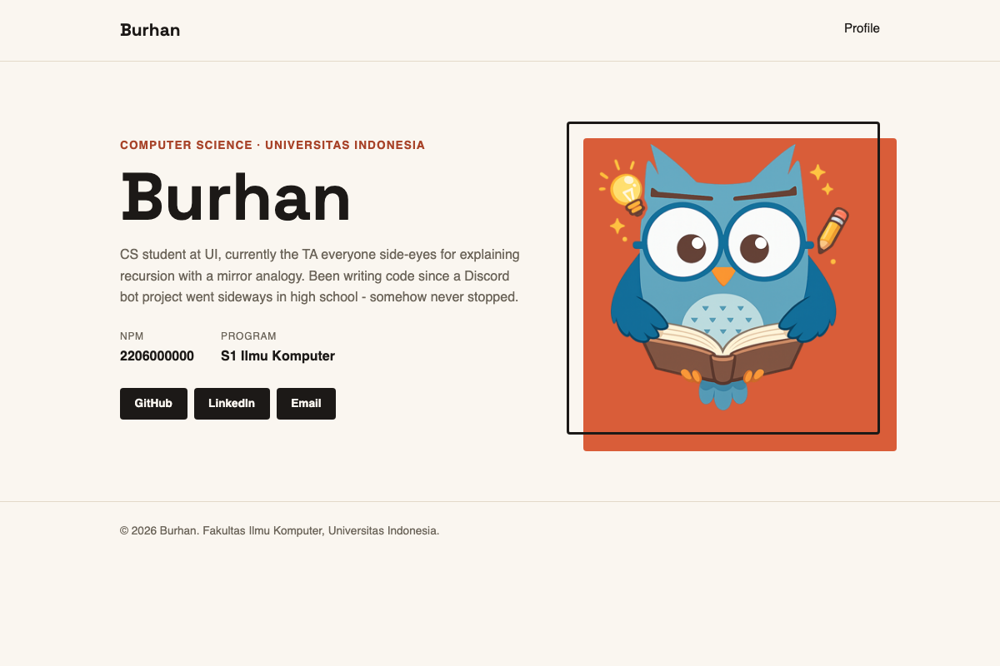
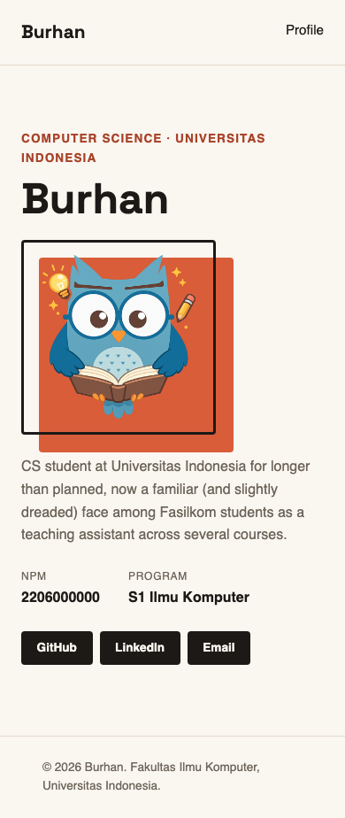
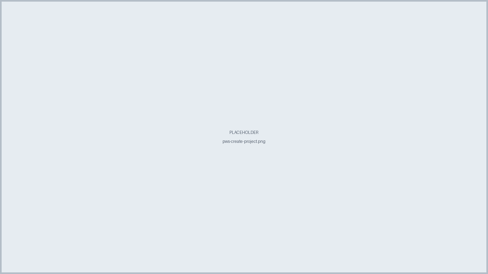
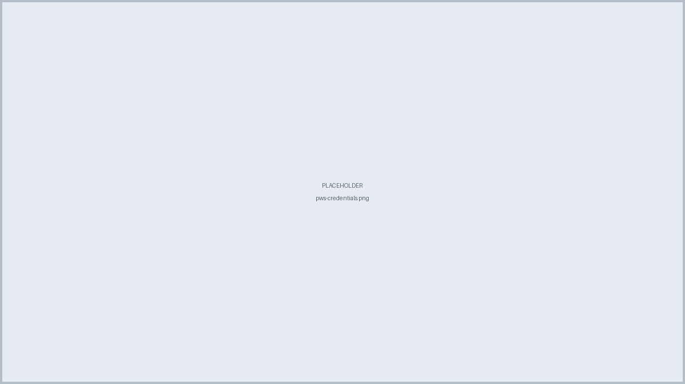
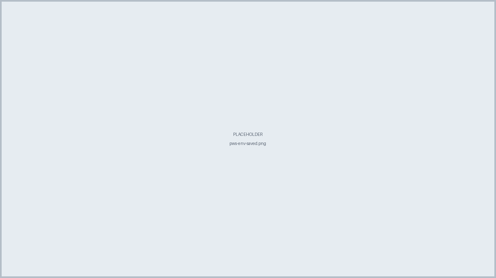
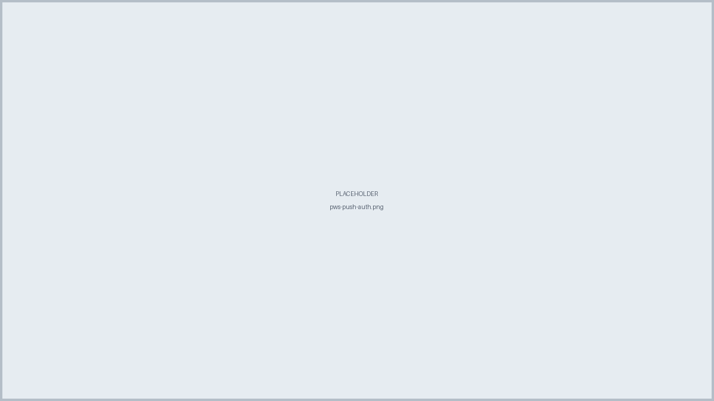
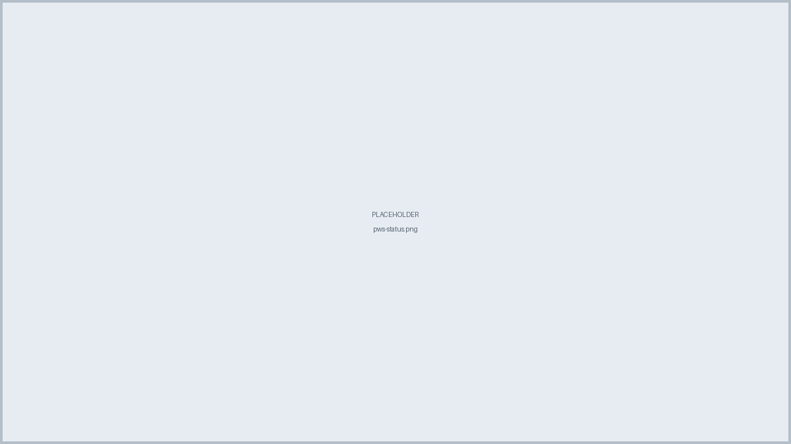
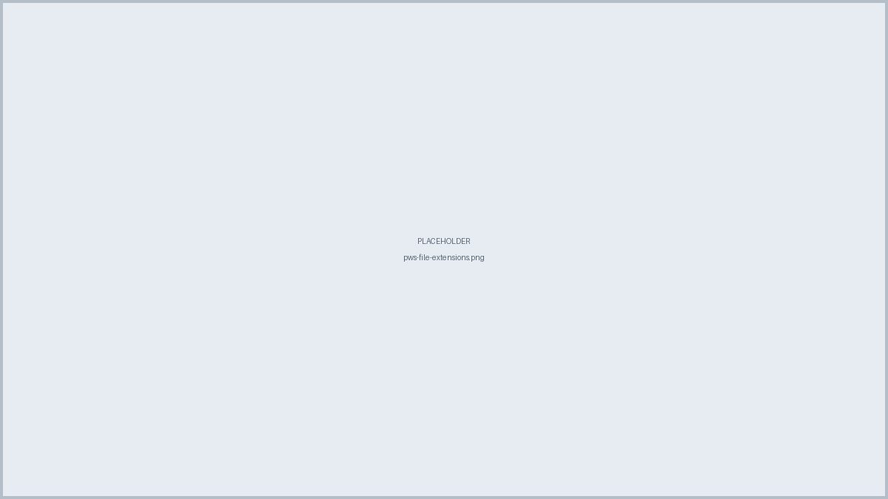
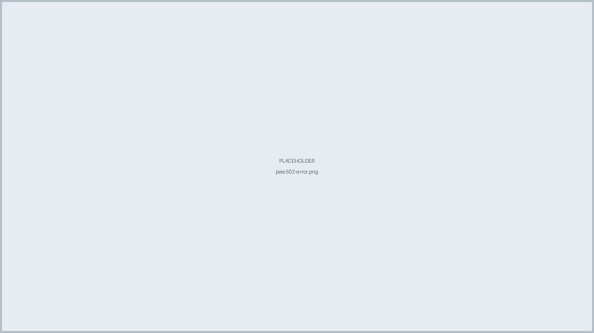
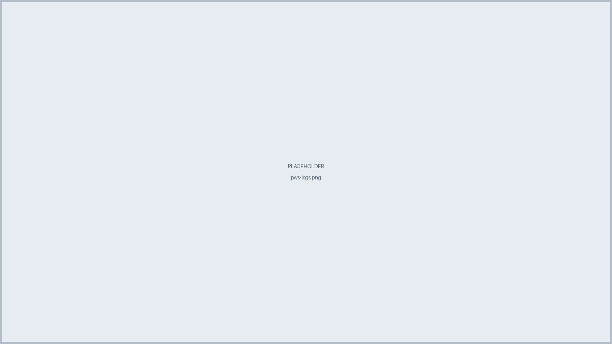

::: {.content-visible when-profile="id"}

# Tutorial 01: Django Initial Project, HTML5 dan CSS3 {.pbp-page-title}

Pemrograman Berbasis Platform (CSGE602022) - diselenggarakan oleh Fakultas Ilmu Komputer Universitas Indonesia, Semester Gasal 2026/2027

**Kontributor:** MUH - Hafiz

***

::: {.callout-warning}
**Tutorial ini adalah prasyarat wajib untuk [Individual Assignment 1](../assignments/individual/tugas-1.qmd)** - kalau belum diselesaikan, Individual Assignment 1 tidak akan dinilai. Deadline Tutorial 01 adalah **Rabu, 2 September 2026**; deadline Individual Assignment 1 adalah **Senin, 7 September 2026**. Lihat [halaman Jadwal](../index.qmd#jadwal-semester) untuk tanggal lengkap.
:::

### Tujuan Pembelajaran

Di ujung tutorial ini, kamu bakal bisa:

- Memahami struktur folder sebuah proyek Django dan fungsi tiap bagiannya.
- Menghubungkan sebuah *view* Django ke sebuah *template* HTML statis.
- Membangun struktur halaman dengan elemen semantik HTML5 (`header`, `main`, `section`, `footer`, dst).
- Mempercantik halaman tersebut dengan CSS3 (custom properties, Flexbox, CSS Grid, media query dasar).
- Men-*deploy* proyek Django ke **PWS (Pacil Web Service)** supaya bisa diakses lewat internet.

Tutorial ini adalah **Tutorial 01**, lanjutan langsung dari [Tutorial 0](tutorial-0.qmd) - tutorial kedua dari proyek yang akan kamu bangun berkelanjutan sepanjang semester: sebuah **website portofolio pribadi**. Semua tutorial berikutnya akan melanjutkan langsung dari hasil tutorial ini, jadi pastikan proyekmu berjalan dengan baik sebelum lanjut ke tutorial berikutnya.

Sepanjang tutorial ini, contoh yang dipakai adalah portofolio milik **Burhan**, maskot mata kuliah PBP. Setiap kali ada bagian yang berisi data pribadi Burhan (nama, NPM, bio, foto), akan ada catatan eksplisit yang bilang "ganti ini dengan data kamu sendiri" - jangan sampai kelewat.

::: {.callout-tip}
Kalau kamu masih ingat, di [Tutorial 0](tutorial-0.qmd) kita berhenti persis setelah lihat halaman selamat datang Django - Git repository jalan, `env` aktif, Django terinstall, `startproject` udah dijalankan. Sekarang kita ganti halaman default itu dengan halaman "About Me" pertamamu.
:::

::: {.callout-tip}
Sebelum melangkah ke instruksi di bawah, pastikan kondisi lingkungan lokalmu dari [Tutorial 0](tutorial-0.qmd) sudah siap:

- [ ] Virtual environment (`env`) sudah aktif di terminal.
- [ ] Django sudah terinstall (`python -m django --version`).
- [ ] Perintah `python manage.py runserver` berhasil menampilkan halaman selamat datang bawaan Django di `http://localhost:8000/`.
- [ ] Repositori Git lokal `myportofolio` sudah diinisiasi dan statusnya bersih (`git status` menampilkan *nothing to commit*).
:::

Struktur folder proyekmu saat ini (hasil akhir Tutorial 0):

```
myportofolio/
├── env/
├── .git/
├── .gitignore
├── requirements.txt
├── db.sqlite3
├── manage.py
└── myportofolio/          # folder konfigurasi utama proyek
    ├── __init__.py
    ├── asgi.py
    ├── settings.py       # semua konfigurasi proyek ada di sini
    ├── urls.py           # daftar routing URL
    └── wsgi.py
```

::: {.callout-important}
### Ganti Nama Folder Konfigurasi Django

Ada **dua** folder bernama `myportofolio` di atas - folder terluar adalah root proyekmu (tempat `manage.py` berada), folder di dalamnya adalah *package* konfigurasi Django (tempat `settings.py` dan `urls.py` berada). Supaya keduanya tidak tertukar saat disebut di tutorial-tutorial berikutnya, ganti nama folder konfigurasi Django yang di dalam menjadi `portofolio` (folder terluar tetap `myportofolio`, sesuai nama repositori GitHub-mu):

```shell
# macOS / Linux-based OS
mv myportofolio portofolio

# Windows (CMD)
move myportofolio portofolio

# Windows (PowerShell)
Move-Item myportofolio portofolio
```

Lalu ganti setiap `myportofolio.settings`, `myportofolio.urls`, dan `myportofolio.wsgi.application` menjadi `portofolio.settings`, `portofolio.urls`, `portofolio.wsgi.application` di 4 berkas berikut:

- `manage.py`
- `portofolio/settings.py` (baris `ROOT_URLCONF` dan `WSGI_APPLICATION`)
- `portofolio/wsgi.py`
- `portofolio/asgi.py`

Pastikan proyekmu masih berjalan normal setelah ini:

```bash
python manage.py check
```
:::

## Menyiapkan Views, URL, Templates, dan Static Files

Buat sebuah *view* sederhana yang mengembalikan sebuah *template* HTML. Buat berkas `portofolio/views.py`:

```python
from django.shortcuts import render


def landing_page(request):
    return render(request, "index.html")
```

Hubungkan *view* ini ke URL kosong (`""`) di `portofolio/urls.py`:

```python
from django.contrib import admin
from django.urls import path

from portofolio.views import landing_page

urlpatterns = [
    path('admin/', admin.site.urls),
    path('', landing_page, name='landing_page'),
]
```

Buat folder `templates/`, `static/css/`, dan `static/img/` di root proyek (sejajar dengan `manage.py`), lalu daftarkan `templates/` dan `static/` di `portofolio/settings.py` supaya Django tahu harus mencari berkas HTML dan aset statis di sana:

```python
TEMPLATES = [
    {
        'BACKEND': 'django.template.backends.django.DjangoTemplates',
        'DIRS': [BASE_DIR / 'templates'],
        ...
    },
]

STATIC_URL = 'static/'
STATICFILES_DIRS = [BASE_DIR / 'static']
```

`TEMPLATES.DIRS` memberitahu Django folder tambahan tempat mencari berkas `.html` yang dipanggil lewat `render()`. `STATICFILES_DIRS` melakukan hal yang sama untuk CSS/gambar/JS - tanpa baris ini, berkas di `static/` tidak akan bisa diakses lewat URL `/static/...`.

Struktur folder kamu sekarang:

```
myportofolio/
├── env/
├── manage.py
├── templates/
├── static/
│   ├── css/
│   └── img/
└── portofolio/
    ├── settings.py       # sudah ditambah TEMPLATES.DIRS & STATICFILES_DIRS
    ├── urls.py           # sudah ditambah routing ke landing_page
    ├── views.py          # baru dibuat
    └── ...
```

::: {.callout-important}
Ingat baik-baik langkah wiring views/urls/templates/static di atas - polanya persis sama yang bakal kamu pakai ulang di SETIAP tutorial berikutnya. Dan `myportofolio` ini bukan proyek latihan yang dibuang setelah tutorial selesai - ini website portofolio pribadimu yang beneran, terus berkembang sepanjang semester.
:::

## Struktur Halaman dengan HTML5

Sekarang kita bangun halaman utama: sebuah section "About Me" yang menampilkan foto, nama, dan bio singkat. Contoh di bawah pakai data Burhan - buat berkas `templates/index.html` persis seperti ini dulu, jalankan, baru nanti kamu ganti bagian yang ditandai dengan data kamu sendiri.

```html
<!DOCTYPE html>
<html lang="en">
<head>
    <meta charset="UTF-8">
    <meta name="viewport" content="width=device-width, initial-scale=1.0">
    <title>Burhan - Portfolio</title>
    <link rel="preconnect" href="https://fonts.googleapis.com">
    <link rel="preconnect" href="https://fonts.gstatic.com" crossorigin>
    <link href="https://fonts.googleapis.com/css2?family=Space+Grotesk:wght@500;700&display=swap" rel="stylesheet">
    <link rel="stylesheet" href="/static/css/style.css">
</head>
<body>
    <header class="site-header">
        <div class="container">
            <a href="#profile" class="brand">Burhan</a>
            <nav>
                <a href="#profile">Profile</a>
            </nav>
        </div>
    </header>

    <main>
        <section class="hero" id="profile">
            <div class="container hero-grid">
                <div class="hero-identity">
                    <p class="hero-kicker">Computer Science &middot; Universitas Indonesia</p>
                    <h1>Burhan</h1>
                </div>
                <div class="hero-photo">
                    <div class="photo-block"></div>
                    
                </div>
                <div class="hero-details">
                    <p class="bio">CS student at Universitas Indonesia for longer than planned, now a familiar (and slightly dreaded) face among Fasilkom students as a teaching assistant across several courses.</p>
                    <dl class="meta-list">
                        <div class="meta-row">
                            <dt>NPM</dt>
                            <dd>2206000000</dd>
                        </div>
                        <div class="meta-row">
                            <dt>Program</dt>
                            <dd>S1 Ilmu Komputer</dd>
                        </div>
                    </dl>
                    <div class="social-links">
                        <a href="https://github.com/" class="social-link">GitHub</a>
                        <a href="https://linkedin.com/" class="social-link">LinkedIn</a>
                        <a href="mailto:burhan@example.com" class="social-link">Email</a>
                    </div>
                </div>
            </div>
        </section>
    </main>

    <footer class="site-footer">
        <div class="container">
            <p>&copy; 2026 Burhan. Fakultas Ilmu Komputer, Universitas Indonesia.</p>
        </div>
    </footer>
</body>
</html>
```

::: {.callout-important}
**Bagian yang harus kamu ganti dengan data sendiri:**

| Bagian | Contoh punya Burhan | Ganti dengan |
|---|---|---|
| `<title>` | `Burhan - Portfolio` | `<Nama Kamu> - Portfolio` |
| `.brand` (header) | `Burhan` | Nama kamu |
| `.hero-kicker` | `Computer Science · Universitas Indonesia` | Program studi & universitasmu |
| `<h1>` | `Burhan` | Nama lengkap kamu |
| `.bio` | bio contoh Burhan | 2-3 kalimat tentang dirimu sendiri |
| Baris NPM (`.meta-list`) | `2206000000` | NPM asli kamu |
| Baris Program (`.meta-list`) | `S1 Ilmu Komputer` | Program studimu |
| Link GitHub/LinkedIn | `https://github.com/`, `https://linkedin.com/` | tautan profil kamu yang sebenarnya |
| Email | `burhan@example.com` | email kamu |
| `src` avatar | `/static/img/burhan.png` | nama berkas foto kamu sendiri di `static/img/` |
| `alt` avatar | `Photo of Burhan` | `Photo of <Nama Kamu>` |
| Footer | `Burhan` | Nama kamu |

Jangan lupa taruh foto kamu sendiri (format `.jpg` atau `.png`) di folder `static/img/`.
:::

::: {.callout-note}
### Referensi Elemen Semantik HTML5

Elemen semantik memberi *makna* pada struktur halamanmu - lebih baik untuk aksesibilitas (mis. pembaca layar tahu mana bagian navigasi vs. konten utama) dan SEO dibanding menumpuk `<div>` di mana-mana:

| Elemen HTML5 | Peran & Makna Semantik | Contoh Penggunaan | Mengapa Lebih Baik dari `<div>`? |
|---|---|---|---|
| `<header>` | Kop/banner halaman atau section | Logo `.brand`, link navigasi utama | Membantu screen reader dan pencari web mengenali area navigasi atas |
| `<nav>` | Blok link navigasi utama | Link menu (`Profile`) | Memungkinkan alat aksesibilitas langsung melompat ke navigasi |
| `<main>` | Konten utama halaman | Section hero / profile | Menandai area konten unik utama; memisahkan header dan footer |
| `<section>` | Bagian konten mandiri | Section "About Me" | Mengelompokkan elemen yang memiliki satu topik pembahasan |
| `<footer>` | Kaki halaman | Teks hak cipta, informasi footer | Menandai bagian penutup halaman secara terstruktur |
| `<dl>`, `<dt>`, `<dd>` | Daftar deskripsi (pasangan label-nilai) | Label NPM (`<dt>`) & angka NPM (`<dd>`) | Khusus untuk data berpasangan, lebih tepat dibanding `<div>` polos |

*Catatan Aksesibilitas:* Atribut `alt` pada `` juga sangat penting — selalu isi dengan deskripsi gambar, jangan dikosongkan.
:::

Struktur folder kamu sekarang:

```
templates/
└── index.html         # baru dibuat, section "About Me"
```

## Mempercantik Halaman dengan CSS3

Buat berkas `static/css/style.css`. Kita bangun bertahap per bagian supaya lebih mudah dipahami - tapi hasil akhirnya harus jadi satu berkas `style.css` yang utuh, gabungan dari semua potongan kode di bawah, sesuai urutannya.

::: {.callout-tip}
Desain visual di tutorial ini (warna, font, tata letak, dsb.) cuma salah satu contoh untuk mendemonstrasikan teknik HTML5 dan CSS3 - kamu **tidak wajib** meniru tampilannya persis. Selama halamanmu tetap memakai HTML5 dan CSS3 murni (belum database/MVT) dan strukturnya rapi, kamu bebas berkreasi dengan skema warna, font, atau tata letak versimu sendiri, baik di tutorial ini maupun nanti di Individual Assignment 1.
:::

### Reset Dasar & Custom Properties

```css
* {
    margin: 0;
    padding: 0;
    box-sizing: border-box;
}

:root {
    --ink: #1c1917;
    --paper: #faf6f0;
    --accent: #d95d39;
    --accent-dark: #a8442a;
    --line: #e3d9c9;
    --text-muted: #6b6459;
    --radius: 4px;
}

body {
    font-family: -apple-system, "Segoe UI", Roboto, Helvetica, Arial, sans-serif;
    color: var(--ink);
    background-color: var(--paper);
    line-height: 1.6;
}

h1, .brand {
    font-family: "Space Grotesk", -apple-system, sans-serif;
}

.container {
    max-width: 960px;
    margin: 0 auto;
    padding: 0 1.5rem;
}
```

`* { margin: 0; padding: 0; box-sizing: border-box; }` adalah *reset* dasar - browser punya `margin`/`padding` bawaan yang beda-beda untuk tiap elemen, jadi kita nolkan dulu supaya kita yang mengatur semuanya dari nol. `box-sizing: border-box` membuat `padding` dan `border` dihitung *di dalam* lebar elemen (bukan menambah lebar), lebih intuitif saat mengatur layout.

CSS *custom properties* (variabel yang ditulis `--nama-variabel`) memudahkan kamu mengganti satu warna aksen di satu tempat (`:root`) dan otomatis berlaku di seluruh halaman lewat `var(--accent)`. Kalau nanti kamu mau ganti warna tema portofoliomu, cukup ubah nilai di `:root`, tidak perlu cari-cari satu per satu di seluruh berkas. Contoh di atas pakai palet warm cream (`--paper`) dan terracotta (`--accent`) - sengaja bukan biru korporat standar, supaya terlihat lebih personal dan bukan template generik.

`h1, .brand { font-family: "Space Grotesk", ... }` mengganti *hanya* judul dan logo ke *Space Grotesk*, sebuah *display font* dari Google Fonts (link-nya ditambahkan di `<head>` pada bagian HTML) - teks body tetap pakai *system font* untuk keterbacaan. Kombinasi *display font* yang berbeda dari *body font* ini yang bikin tipografi halaman terasa lebih dirancang, bukan cuma huruf bawaan browser di semua tempat.

`.container` dipakai berulang di banyak section untuk membatasi lebar maksimum konten (`max-width: 960px`) dan menengahkannya (`margin: 0 auto`), supaya teks tidak melebar penuh mengikuti layar lebar.

### Header dengan Flexbox

```css
.site-header {
    border-bottom: 1px solid var(--line);
}

.site-header .container {
    display: flex;
    justify-content: space-between;
    align-items: center;
    padding: 1.25rem 1.5rem;
}

.brand {
    font-size: 1.3rem;
    font-weight: 700;
    color: var(--ink);
    text-decoration: none;
}

.site-header nav {
    display: flex;
    gap: 2rem;
}

.site-header nav a {
    color: var(--ink);
    text-decoration: none;
    font-size: 0.95rem;
}
```

`display: flex` membuat elemen `.brand` dan `<nav>` di dalamnya sejajar secara horizontal secara otomatis. `justify-content: space-between` mendorong keduanya ke ujung kiri dan kanan, `align-items: center` menengahkan secara vertikal. `gap: 2rem` memberi jarak antar link navigasi tanpa perlu `margin` manual di tiap link.

`.brand` di sini sengaja dibiarkan sebagai teks polos - namamu sendiri, di-*style* dengan `font-family` Space Grotesk yang sudah kita atur lewat `h1, .brand` sebelumnya, plus `text-decoration: none` supaya tidak digarisbawahi seperti link biasa. Tidak perlu logo lingkaran atau ikon buatan - teks nama dengan tipografi yang sedikit lebih tegas sudah cukup untuk jadi identitas header, dan jauh lebih mudah kamu tiru dan sesuaikan sendiri.

### Section Hero dengan CSS Grid

```css
.hero {
    padding: 4.5rem 0 5rem;
}

.hero-grid {
    display: grid;
    grid-template-columns: 1.3fr 1fr;
    grid-template-areas:
        "identity photo"
        "details  photo";
    gap: 1.5rem 3rem;
}

.hero-identity {
    grid-area: identity;
}

.hero-details {
    grid-area: details;
}

.hero-kicker {
    font-size: 0.85rem;
    letter-spacing: 0.08em;
    text-transform: uppercase;
    color: var(--accent-dark);
    font-weight: 700;
    margin-bottom: 0.75rem;
}

.hero-identity h1 {
    font-size: clamp(3rem, 7vw, 5rem);
    line-height: 0.95;
}

.bio {
    color: var(--text-muted);
    max-width: 480px;
    margin-bottom: 1.5rem;
}

.meta-list {
    display: flex;
    gap: 2rem;
    margin-bottom: 1.5rem;
}

.meta-row dt {
    font-size: 0.75rem;
    text-transform: uppercase;
    letter-spacing: 0.06em;
    color: var(--text-muted);
    margin-bottom: 0.15rem;
}

.meta-row dd {
    font-weight: 600;
}

.social-links {
    display: flex;
    gap: 0.5rem;
    flex-wrap: wrap;
}

.social-link {
    display: inline-block;
    font-size: 0.85rem;
    font-weight: 600;
    text-decoration: none;
    color: var(--paper);
    background-color: var(--ink);
    border-radius: var(--radius);
    padding: 0.5rem 1.1rem;
    transition: background-color 0.2s ease;
}

.social-link:hover {
    background-color: var(--accent);
}

.hero-photo {
    grid-area: photo;
    align-self: center;
    position: relative;
}

.photo-block {
    position: absolute;
    top: 1.25rem;
    left: 1.25rem;
    width: 100%;
    height: 100%;
    background-color: var(--accent);
    border-radius: var(--radius);
    z-index: 0;
}

.avatar {
    position: relative;
    z-index: 1;
    display: block;
    width: 100%;
    aspect-ratio: 1 / 1;
    object-fit: cover;
    border-radius: var(--radius);
    border: 3px solid var(--ink);
}
```

`grid-template-columns: 1.3fr 1fr` membuat kolom teks sedikit lebih lebar dibanding kolom foto (1.3 bagian berbanding 1 bagian) - layout asimetris seperti ini terasa lebih dirancang dibanding kolom yang sama rata atau selebar-konten-saja. `grid-template-areas` memberi nama pada tiap area grid (`identity`, `photo`, `details`) lalu menyusunnya lewat "peta" berbentuk teks - `.hero-photo` muncul di kedua baris pada kolom yang sama, sehingga otomatis menyatu jadi satu area yang membentang dua baris. Elemen anak lalu menempel ke areanya masing-masing lewat `grid-area: nama-area`, tanpa perlu diurutkan manual di HTML. `clamp(3rem, 7vw, 5rem)` pada `.hero-identity h1` membuat judul sangat besar dan otomatis menyesuaikan lebar layar (nilai tengah `7vw`), dibatasi minimum `3rem` dan maksimum `5rem` - tipografi besar seperti ini yang bikin halaman terasa punya *statement*, bukan sekadar judul kecil di pojok.

Bagian paling menarik ada di `.hero-photo`: `.photo-block` adalah `<div>` kosong yang diposisikan `absolute` sedikit *offset* (bergeser `1.25rem` ke kanan-bawah) dari foto aslinya, dengan warna solid `var(--accent)` sebagai latar. `.avatar` diposisikan `relative` dengan `z-index: 1` (di atas `.photo-block` yang `z-index: 0`) sehingga terlihat seperti foto punya "bayangan" berwarna solid di belakangnya - efek *layered* ini yang menggantikan `box-shadow` sederhana dan terasa lebih personal/craft dibanding foto bulat polos.

`aspect-ratio: 1 / 1` pada `.avatar` memaksa foto selalu persegi berapapun ukuran aslinya (mirip `object-fit: cover` yang sudah dipakai untuk memastikan foto tidak gepeng/melar), tanpa perlu tahu tinggi pastinya di CSS.

`.meta-list` memakai `display: flex` sederhana untuk menjajarkan pasangan NPM/Program secara horizontal - lebih ringkas dibanding badge berbentuk pil yang butuh border dan border-radius terpisah untuk tiap potongan info.

`transition: background-color 0.2s ease` pada `.social-link` membuat perubahan warna saat *hover* terjadi secara halus (0.2 detik), bukan berubah instan.

### Footer & Responsive

```css
.site-footer {
    padding: 1.5rem;
    color: var(--text-muted);
    font-size: 0.85rem;
    border-top: 1px solid var(--line);
}

@media (max-width: 600px) {
    .hero-grid {
        grid-template-columns: 1fr;
        grid-template-areas:
            "identity"
            "photo"
            "details";
    }

    .hero-photo {
        max-width: 220px;
    }

    .social-links {
        justify-content: flex-start;
    }
}
```

Footer sengaja dibiarkan rata kiri (bukan `text-align: center`) dan isinya cuma satu baris teks hak cipta sederhana - footer yang isinya cuma nama dan NPM lagi (yang sudah ada di bagian hero) mudah terasa seperti tempelan generik, jadi lebih wajar diisi baris singkat semacam `&copy; 2026 <Nama Kamu>. <Nama Universitasmu>.`, mirip footer situs pada umumnya.

Perhatikan `.hero-grid` di dalam media query mendefinisikan ulang `grid-template-areas` dengan urutan `identity`, lalu `photo`, lalu `details` - ini yang membuat di layar sempit, nama tampil dulu, disusul foto, baru bio dan kontak di bawahnya, bukan sekadar menumpuk urutan HTML apa adanya. Karena letak tiap elemen ditentukan oleh nama area (bukan urutan dokumen), kamu bisa mengatur urutan tampilan mobile berbeda dari urutan HTML tanpa menulis ulang markup-nya sama sekali.

`@media (max-width: 600px)` adalah *media query* - aturan CSS di dalamnya HANYA berlaku kalau lebar layar 600px atau kurang (misalnya HP). Di sini kita ubah grid dua kolom (`1.3fr 1fr`) menjadi satu kolom (`1fr` saja) supaya foto ada di atas dan teks di bawah - berbeda dari pendekatan umum yang menengahkan semuanya (`text-align: center`), di sini teks tetap rata kiri (`text-align: left`) supaya paragraf bio tetap nyaman dibaca, dan `.hero-photo` dibatasi lebarnya (`max-width: 220px`) supaya foto besarnya tidak berubah jadi berlebihan di layar sempit. Ini yang disebut *responsive design*, tampilan yang menyesuaikan diri ke berbagai ukuran layar.

Struktur folder kamu sekarang (lengkap sampai akhir Tutorial 01):

```
myportofolio/
├── env/
├── .git/
├── .gitignore
├── requirements.txt
├── db.sqlite3
├── manage.py
├── templates/
│   └── index.html
├── static/
│   ├── css/
│   │   └── style.css
│   └── img/
│       └── burhan.png       # ganti dengan foto kamu sendiri
└── portofolio/
    ├── __init__.py
    ├── asgi.py
    ├── settings.py
    ├── urls.py
    ├── views.py
    └── wsgi.py
```

## Menjalankan dan Melihat Hasil

Jalankan server-nya lagi kalau belum:

```bash
python manage.py runserver
```

Buka `http://localhost:8000/` - halaman "About Me" kamu seharusnya sudah tampil. Berikut contoh hasilnya memakai data Burhan di atas:



Pastikan juga tampilannya tidak rusak di layar sempit - coba perkecil lebar browser atau buka lewat DevTools mode responsif:

{width=40%}

::: {.callout-important}
Sebelum lanjut: halaman yang barusan kamu bikin itu bukan contoh latihan, ini halaman utama portofolio pribadimu yang sebenarnya. Ganti semua data contoh Burhan (nama, NPM, foto, bio, link sosial) pakai punya kamu sendiri sesuai tabel di atas - struktur HTML/CSS yang sama ini yang bakal terus kamu kembangkan, dan jadi titik awal untuk **Individual Assignment 1** minggu ini.
:::

## Pembuatan Akun dan Deployment melalui PWS (Pacil Web Service)

Sekarang halaman "About Me" kamu sudah berjalan di lokal. Langkah terakhir adalah men-*deploy*-nya supaya bisa diakses lewat internet, memakai **PWS (Pacil Web Service)** - platform *hosting* milik Fakultas Ilmu Komputer UI.

1. Akses halaman PWS pada <https://pws.cs.ui.ac.id>. Kamu akan diarahkan ke halaman *login* with SSO.
2. Login dengan akun SSO UI kamu.
3. Apabila proses *login* berhasil, kamu akan diarahkan ke *home page* dari PWS.

   

4. Buat proyek baru dengan menekan tombol **Create New Project**. Pada halaman berikutnya, isi `Project Name` dengan `myportofolio`, lalu tekan **Create New Project** di bawahnya.

   

   ::: {.callout-note}
   Dalam membuat proyek lain nantinya (seperti Individual Assignment atau Tugas Kelompok), kamu bisa mengisi `Project Name` dengan nama lain sesukamu. Ada limitasi bahwa nama proyek harus terdiri dari karakter *alphanumeric* saja.
   :::

5. Akan muncul dua informasi baru: **Project Credentials** dan **Project Command**. Simpan *credentials* yang kamu peroleh di tempat yang aman, karena kamu **tidak akan bisa melihatnya lagi** setelah ini. Jangan jalankan dulu instruksi *Project Command*-nya.

   

6. Pada *sidebar*, klik proyek yang kamu buat, lalu pilih tab **Environs**.

   

   Pada tab tersebut, klik **Raw Editor** dan *copy-paste* isi berkas `.env.prod` yang sudah kamu buat di Tutorial 0. Pastikan `SCHEMA=tutorial` dan `PRODUCTION=True`, lalu klik **Update All Variables**.

   

   Pastikan *environment variable* di proyek PWS kamu sudah tersimpan dengan baik.

   

7. Pada `settings.py` di proyek Django kamu, tambahkan URL *deployment* PWS ke `ALLOWED_HOSTS`.

   ::: {.callout-note}
   URL *deployment* PWS memiliki format `<username-sso>-<nama-proyek>.pws.cs.ui.ac.id`. Kalau username SSO kamu ada karakter titik (`.`), ganti jadi *hyphen* (`-`). Contoh: kalau username SSO kamu `burhan.25` dan nama proyek `myportofolio`, URL *deployment*-nya `burhan-25-myportofolio.pws.cs.ui.ac.id`.
   :::

   ```python
   ALLOWED_HOSTS = ["localhost", "127.0.0.1", "<URL deployment PWS kamu>"]
   ```

   ::: {.callout-important}
   ### Aktifkan Static Files untuk Produksi

   Server produksi (`gunicorn`) tidak otomatis melayani berkas *static* seperti `python manage.py runserver` di lokal - tanpa langkah ini, CSS dan gambarmu akan 404 setelah di-*deploy*. Tambahkan `'whitenoise.middleware.WhiteNoiseMiddleware'` ke `MIDDLEWARE` di `settings.py`, tepat di bawah `SecurityMiddleware` (paket `whitenoise` sudah ada di `requirements.txt` kamu sejak Tutorial 0):

   ```python
   MIDDLEWARE = [
       'django.middleware.security.SecurityMiddleware',
       'whitenoise.middleware.WhiteNoiseMiddleware',
       # baris MIDDLEWARE lain di bawahnya tetap sama
       ...
   ]
   ```

   Lalu tambahkan `STATIC_ROOT` dan `WHITENOISE_USE_FINDERS` di bagian `STATIC_URL`/`STATICFILES_DIRS` yang sudah kamu buat sebelumnya:

   ```python
   STATIC_URL = 'static/'
   STATICFILES_DIRS = [BASE_DIR / 'static']
   STATIC_ROOT = BASE_DIR / 'staticfiles'
   WHITENOISE_USE_FINDERS = True
   ```
   :::

   Lakukan `git add`, `commit`, dan `push` perubahan ini ke repositori GitHub kamu.

   ::: {.callout-warning}
   Sebelum lanjut ke langkah berikutnya, pastikan struktur repositorimu lengkap: berkas `manage.py`, `requirements.txt`, `.gitignore`, direktori `portofolio/` (folder konfigurasi proyek), dan **bukan** direktori `env/` atau berkas `db.sqlite3` (harusnya sudah di-*gitignore*).

   
   :::

8. Jalankan perintah yang ada pada informasi *Project Command* di halaman PWS. Saat push ke PWS, akan muncul *window* yang meminta `username` dan `password` - gunakan *credentials* dari proyek PWS-mu (**bukan** *credentials* SSO).

   

9. Pada *sidebar* PWS, klik proyek yang kamu buat untuk melihat status *deployment*. Kalau statusnya `Building`, proyekmu masih diproses. Kalau sudah `Running`, proyekmu sudah bisa diakses - tekan tombol **View Project**.

   

10. Kalau nanti ada perubahan pada proyek Django yang mau kamu push ke PWS lagi, kamu cukup jalankan (setelah `add` dan `commit`):

    ```bash
    git push pws main:master
    ```

    ::: {.callout-note}
    Perintah `git push pws main:master` memberitahu Git untuk mengirim *branch* lokalmu yang bernama `main` ke *branch* `master` di remote PWS.
    Dengan begini, repositori lokal dan GitHub kamu tetap rapi menggunakan *branch* `main`!
    Jika *branch* lokalmu bernama `master`, kamu cukup menggunakan `git push pws master`.
    :::

    Kamu tidak perlu mengulang instruksi *Project Command* lagi.

::: {.callout-important}
Proyek `myportofolio` yang kamu *deploy* ini akan menjadi landasan untuk tutorial-tutorial berikutnya - repositori dan *deployment*-nya akan terus berkembang seiring tutorial yang kamu ikuti sepanjang semester.
:::

::: {.callout-note collapse="true"}
### Troubleshooting PWS

**Build Gagal**

Kalau *build* gagal, coba periksa beberapa hal berikut:

- **Isi Repositori**: pastikan struktur repositorimu sama seperti contoh di Langkah 7 di atas.
- **Berkas `requirements.txt`**: pastikan namanya persis, bukan `requirement.txt` (kurang huruf "s") atau `requirements.txt.txt` (ekstensi ganda).
- **Berkas `.gitignore`**: pastikan diawali titik, tidak punya ekstensi tambahan, dan berada di *root folder* bersama `manage.py`, direktori `portofolio/`, `requirements.txt`, `.git`, dan `db.sqlite3`.

  ::: {.callout-tip}
  Pengguna Windows bisa centang opsi **File name extensions** di Windows Explorer untuk melihat ekstensi berkas dengan lebih jelas.

  
  :::

- Pastikan direktori `env/` dan `db.sqlite3` **tidak** ikut ter-*push* oleh Git. Kalau sudah telanjur, tambahkan `.gitignore` lalu jalankan `git rm --cached -r env db.sqlite3` sebelum `add`, `commit`, `push` lagi.
- Kalau struktur sudah yakin lengkap tapi tetap gagal, pastikan kamu push ke PWS mengarah ke *branch* `master` (misalnya lewat `git push pws main:master`).

**Tidak Menyimpan Credentials**

Kalau kamu lupa menyimpan *credentials* saat membuat proyek PWS, kamu bisa me-*regenerate*-nya lewat tab **Settings** di proyek tersebut.


Ikuti langkah-langkah pada tab tersebut, atau alternatifnya buat proyek baru.

**Mengganti Remote URL PWS pada Repositori Lokal**

Kalau kamu membuat proyek baru di PWS untuk mengatasi masalah proyek sebelumnya, ganti *remote* URL di repositori lokalmu supaya `git push pws main:master` mengarah ke proyek yang baru, bukan yang lama:

```bash
git remote set-url pws <link-proyek-baru>
```

**Error 502 (Bad Gateway) pada Web**

Saat *deployment* pertama kali, kamu mungkin melihat error 502 (Bad Gateway) di *browser*. Ini normal - PWS sedang menjalankan migrasi database sebelum *server* aplikasi (gunicorn) siap menerima *request*.



Kamu bisa cek progresnya di tab **Logs** pada dashboard proyek PWS. Tunggu sampai muncul log `Listening at` (biasanya 15-20 detik) - *refresh* halaman *log* kalau perlu, karena tidak update secara *streaming*.


:::

## Pengumpulan

Tutorial ini dikumpulkan lewat slot submisi yang disediakan di SCELE, dalam bentuk **tautan ke commit** (bukan sekadar tautan repositori) di GitHub yang menunjukkan hasil akhir Tutorial ini, di-*push* **paling lambat Rabu, 2 September 2026**. Commit yang di-*push* setelah tenggat waktu itu tidak akan diterima, sehingga Tutorial 01 dianggap belum selesai dan Individual Assignment 1 tidak akan dinilai. Pastikan juga repositori GitHub kamu bersifat **publik**, supaya asisten dosen bisa mengaksesnya.

## Referensi Tambahan

- [MDN - HTML elements reference](https://developer.mozilla.org/en-US/docs/Web/HTML/Element)
- [MDN - CSS Grid Layout](https://developer.mozilla.org/en-US/docs/Web/CSS/CSS_grid_layout)
- [Django - Templates](https://docs.djangoproject.com/en/6.1/topics/templates/)

:::

::: {.content-visible when-profile="en"}

# Tutorial 01: Django Initial Project, HTML5 and CSS3 {.pbp-page-title}

Platform-Based Programming (CSGE602022) - organized by the Faculty of Computer Science, Universitas Indonesia, Odd Semester 2026/2027

**Contributor:** MUH - Hafiz

***

::: {.callout-warning}
**This Tutorial is a mandatory prerequisite for [Individual Assignment 1](../assignments/individual/tugas-1.qmd)** - if it hasn't been completed, Individual Assignment 1 won't be graded. Tutorial 01's deadline is **Wednesday, September 2, 2026**; Individual Assignment 1's deadline is **Monday, September 7, 2026**. See the [Schedule page](../index.qmd#semester-schedule) for exact dates.
:::

### Learning Objectives

By the end of this tutorial, you'll be able to:

- Understand a Django project's folder structure and what each part does.
- Connect a Django *view* to a static HTML *template*.
- Build a page structure using semantic HTML5 elements (`header`, `main`, `section`, `footer`, etc).
- Style that page with CSS3 (custom properties, Flexbox, CSS Grid, basic media queries).
- *Deploy* the Django project to **PWS (Pacil Web Service)** so it's reachable over the internet.

This is **Tutorial 01**, continuing directly from [Tutorial 0](tutorial-0.qmd) - the second tutorial of the project you'll build continuously throughout the semester: a **personal portfolio website**. Every following tutorial will continue directly from this one's result, so make sure your project runs correctly before moving on.

Throughout this tutorial, the running example is **Burhan**'s portfolio, the PBP course mascot. Every time a section contains Burhan's personal data (name, NPM, bio, photo), there will be an explicit note telling you to "replace this with your own data" - don't skip it.

::: {.callout-tip}
Quick recap - in [Tutorial 0](tutorial-0.qmd) we left off right after Django's welcome page: Git repository set up, `env` running, Django installed, `startproject` already done. Now we swap that default page out for your first "About Me" page.
:::

::: {.callout-tip}
Before stepping into the instructions below, make sure your local environment from [Tutorial 0](tutorial-0.qmd) is ready:

- [ ] Virtual environment (`env`) is active in your terminal.
- [ ] Django is installed (`python -m django --version`).
- [ ] Running `python manage.py runserver` successfully displays Django's default welcome page at `http://localhost:8000/`.
- [ ] Your local Git repository `myportofolio` is initialized and clean (`git status` shows *nothing to commit*).
:::

Your project's folder structure right now (the end result of Tutorial 0):

```
myportofolio/
├── env/
├── .git/
├── .gitignore
├── requirements.txt
├── db.sqlite3
├── manage.py
└── myportofolio/          # the project's main config package
    ├── __init__.py
    ├── asgi.py
    ├── settings.py       # all project configuration lives here
    ├── urls.py           # URL routing table
    └── wsgi.py
```

::: {.callout-important}
### Rename the Django Config Folder

There are **two** folders named `myportofolio` above - the outer one is your project root (where `manage.py` lives), the one inside it is the Django configuration *package* (where `settings.py` and `urls.py` live). So the two don't get mixed up when referenced in later tutorials, rename the inner Django config folder to `portofolio` (the outer folder stays `myportofolio`, matching your GitHub repository's name):

```shell
# macOS / Linux-based OS
mv myportofolio portofolio

# Windows (CMD)
move myportofolio portofolio

# Windows (PowerShell)
Move-Item myportofolio portofolio
```

Then change every `myportofolio.settings`, `myportofolio.urls`, and `myportofolio.wsgi.application` to `portofolio.settings`, `portofolio.urls`, `portofolio.wsgi.application` in these 4 files:

- `manage.py`
- `portofolio/settings.py` (the `ROOT_URLCONF` and `WSGI_APPLICATION` lines)
- `portofolio/wsgi.py`
- `portofolio/asgi.py`

Make sure your project still runs normally after this:

```bash
python manage.py check
```
:::

## Set Up Views, URLs, Templates, and Static Files

Create a simple *view* that returns an HTML *template*. Create `portofolio/views.py`:

```python
from django.shortcuts import render


def landing_page(request):
    return render(request, "index.html")
```

Connect this view to the empty (`""`) URL in `portofolio/urls.py`:

```python
from django.contrib import admin
from django.urls import path

from portofolio.views import landing_page

urlpatterns = [
    path('admin/', admin.site.urls),
    path('', landing_page, name='landing_page'),
]
```

Create a `templates/`, `static/css/`, and `static/img/` folder at the project root (next to `manage.py`), then register `templates/` and `static/` in `portofolio/settings.py` so Django knows to look there for HTML pages and static assets:

```python
TEMPLATES = [
    {
        'BACKEND': 'django.template.backends.django.DjangoTemplates',
        'DIRS': [BASE_DIR / 'templates'],
        ...
    },
]

STATIC_URL = 'static/'
STATICFILES_DIRS = [BASE_DIR / 'static']
```

`TEMPLATES.DIRS` tells Django about an extra folder to search for `.html` files called via `render()`. `STATICFILES_DIRS` does the same for CSS/images/JS - without this line, files under `static/` won't be reachable through the `/static/...` URL.

Your folder structure so far:

```
myportofolio/
├── env/
├── manage.py
├── templates/
├── static/
│   ├── css/
│   └── img/
└── portofolio/
    ├── settings.py       # now has TEMPLATES.DIRS & STATICFILES_DIRS
    ├── urls.py           # now routes to landing_page
    ├── views.py          # newly created
    └── ...
```

::: {.callout-important}
Hold onto that wiring pattern (views/urls/templates/static) - you'll reuse it exactly the same way in every tutorial from here on. And `myportofolio` isn't a throwaway exercise - it's your actual personal portfolio website, growing with you all semester.
:::

## Page Structure with HTML5

Now let's build the main page: an "About Me" section showing a photo, name, and short bio. The example below uses Burhan's data - build `templates/index.html` exactly like this first, run it, and only then replace the marked parts with your own data.

```html
<!DOCTYPE html>
<html lang="en">
<head>
    <meta charset="UTF-8">
    <meta name="viewport" content="width=device-width, initial-scale=1.0">
    <title>Burhan - Portfolio</title>
    <link rel="preconnect" href="https://fonts.googleapis.com">
    <link rel="preconnect" href="https://fonts.gstatic.com" crossorigin>
    <link href="https://fonts.googleapis.com/css2?family=Space+Grotesk:wght@500;700&display=swap" rel="stylesheet">
    <link rel="stylesheet" href="/static/css/style.css">
</head>
<body>
    <header class="site-header">
        <div class="container">
            <a href="#profile" class="brand">Burhan</a>
            <nav>
                <a href="#profile">Profile</a>
            </nav>
        </div>
    </header>

    <main>
        <section class="hero" id="profile">
            <div class="container hero-grid">
                <div class="hero-identity">
                    <p class="hero-kicker">Computer Science &middot; Universitas Indonesia</p>
                    <h1>Burhan</h1>
                </div>
                <div class="hero-photo">
                    <div class="photo-block"></div>
                    
                </div>
                <div class="hero-details">
                    <p class="bio">CS student at Universitas Indonesia for longer than planned, now a familiar (and slightly dreaded) face among Fasilkom students as a teaching assistant across several courses.</p>
                    <dl class="meta-list">
                        <div class="meta-row">
                            <dt>NPM</dt>
                            <dd>2206000000</dd>
                        </div>
                        <div class="meta-row">
                            <dt>Program</dt>
                            <dd>S1 Ilmu Komputer</dd>
                        </div>
                    </dl>
                    <div class="social-links">
                        <a href="https://github.com/" class="social-link">GitHub</a>
                        <a href="https://linkedin.com/" class="social-link">LinkedIn</a>
                        <a href="mailto:burhan@example.com" class="social-link">Email</a>
                    </div>
                </div>
            </div>
        </section>
    </main>

    <footer class="site-footer">
        <div class="container">
            <p>&copy; 2026 Burhan. Fakultas Ilmu Komputer, Universitas Indonesia.</p>
        </div>
    </footer>
</body>
</html>
```

::: {.callout-important}
**Parts you need to replace with your own data:**

| Part | Burhan's example | Replace with |
|---|---|---|
| `<title>` | `Burhan - Portfolio` | `<Your Name> - Portfolio` |
| `.brand` (header) | `Burhan` | Your name |
| `.hero-kicker` | `Computer Science · Universitas Indonesia` | Your major & university |
| `<h1>` | `Burhan` | Your full name |
| `.bio` | Burhan's sample bio | 2-3 sentences about yourself |
| NPM row (`.meta-list`) | `2206000000` | Your real NPM |
| Program row (`.meta-list`) | `S1 Ilmu Komputer` | Your major |
| GitHub/LinkedIn links | `https://github.com/`, `https://linkedin.com/` | your actual profile links |
| Email | `burhan@example.com` | your email |
| avatar `src` | `/static/img/burhan.png` | your own photo's filename under `static/img/` |
| avatar `alt` | `Photo of Burhan` | `Photo of <Your Name>` |
| Footer | `Burhan` | Your name |

Don't forget to put your own photo (`.jpg` or `.png`) inside `static/img/`.
:::

::: {.callout-note}
### HTML5 Semantic Elements Reference

Semantic elements give *meaning* to your page structure - far better for accessibility (e.g. screen readers know navigation vs. main content) and SEO than stacking `<div>`s everywhere:

| HTML5 Element | Role & Semantic Meaning | Example Usage | Why Better Than `<div>`? |
|---|---|---|---|
| `<header>` | Page or section banner | `.brand` logo, primary navigation links | Helps screen readers and search engines identify top banner content |
| `<nav>` | Primary navigation link container | Menu link (`Profile`) | Enables accessibility tools to skip directly to navigation |
| `<main>` | Primary content of the page | Hero / profile section | Marks the main unique content area; separates header and footer |
| `<section>` | Standalone section of content | "About Me" section | Groups elements sharing a single topic or thematic focus |
| `<footer>` | Page footer | Copyright text, footer details | Explicitly marks the closing section of the document |
| `<dl>`, `<dt>`, `<dd>` | Description list (label-value pairs) | NPM label (`<dt>`) & NPM number (`<dd>`) | Built specifically for name-value pairs, far clearer than plain `<div>`s |

*Accessibility Note:* The `alt` attribute on `` is equally essential - always fill it with a descriptive text, never leave it empty.
:::

Your folder structure so far:

```
templates/
└── index.html         # newly created, "About Me" section
```

## Styling with CSS3

Create `static/css/style.css`. We'll build it up section by section to make it easier to follow - but the final result should be one complete `style.css` file, combining all the snippets below in order.

::: {.callout-tip}
The visual design in this tutorial (colors, fonts, layout, etc.) is just one example to demonstrate HTML5 and CSS3 techniques - you're **not required** to copy it exactly. As long as your page still uses plain HTML5 and CSS3 (no database/MVT yet) and stays well-structured, you're free to design your own color scheme, fonts, or layout, both in this tutorial and later in Individual Assignment 1.
:::

### Basic Reset & Custom Properties

```css
* {
    margin: 0;
    padding: 0;
    box-sizing: border-box;
}

:root {
    --ink: #1c1917;
    --paper: #faf6f0;
    --accent: #d95d39;
    --accent-dark: #a8442a;
    --line: #e3d9c9;
    --text-muted: #6b6459;
    --radius: 4px;
}

body {
    font-family: -apple-system, "Segoe UI", Roboto, Helvetica, Arial, sans-serif;
    color: var(--ink);
    background-color: var(--paper);
    line-height: 1.6;
}

h1, .brand {
    font-family: "Space Grotesk", -apple-system, sans-serif;
}

.container {
    max-width: 960px;
    margin: 0 auto;
    padding: 0 1.5rem;
}
```

`* { margin: 0; padding: 0; box-sizing: border-box; }` is a basic *reset* - browsers have different default `margin`/`padding` values for different elements, so we zero them out first and control everything ourselves. `box-sizing: border-box` makes `padding` and `border` count *inside* an element's width (instead of adding to it), which is much more intuitive when laying things out.

CSS *custom properties* (variables written as `--variable-name`) let you change one accent color in a single place (`:root`) and have it apply everywhere via `var(--accent)`. If you later want to change your portfolio's theme color, you only need to update it in `:root` instead of hunting through the whole file. This example uses a warm cream palette (`--paper`) with terracotta (`--accent`) - deliberately not the standard corporate blue, so it feels more personal instead of a generic template.

`h1, .brand { font-family: "Space Grotesk", ... }` swaps *only* the heading and logo to *Space Grotesk*, a display font from Google Fonts (its `<link>` was added in the HTML `<head>`) - body text stays on the system font for readability. This contrast between a display font and the body font is what makes the typography feel deliberately designed instead of just the browser's default font everywhere.

`.container` is reused across sections to cap the maximum content width (`max-width: 960px`) and center it (`margin: 0 auto`), so text doesn't stretch edge-to-edge on wide screens.

### Header with Flexbox

```css
.site-header {
    border-bottom: 1px solid var(--line);
}

.site-header .container {
    display: flex;
    justify-content: space-between;
    align-items: center;
    padding: 1.25rem 1.5rem;
}

.brand {
    font-size: 1.3rem;
    font-weight: 700;
    color: var(--ink);
    text-decoration: none;
}

.site-header nav {
    display: flex;
    gap: 2rem;
}

.site-header nav a {
    color: var(--ink);
    text-decoration: none;
    font-size: 0.95rem;
}
```

`display: flex` automatically lines up `.brand` and the `<nav>` inside it horizontally. `justify-content: space-between` pushes them to opposite ends, `align-items: center` vertically centers them. `gap: 2rem` spaces out the nav links without needing manual `margin` on each one.

`.brand` is deliberately left as plain text here - your own name, styled with the Space Grotesk `font-family` we already set up via `h1, .brand`, plus `text-decoration: none` so it doesn't get underlined like a regular link. No circular logo or custom icon needed - a name in slightly bolder type is enough to give the header an identity, and it's far easier for you to copy and adapt yourself.

### Hero Section with CSS Grid

```css
.hero {
    padding: 4.5rem 0 5rem;
}

.hero-grid {
    display: grid;
    grid-template-columns: 1.3fr 1fr;
    grid-template-areas:
        "identity photo"
        "details  photo";
    gap: 1.5rem 3rem;
}

.hero-identity {
    grid-area: identity;
}

.hero-details {
    grid-area: details;
}

.hero-kicker {
    font-size: 0.85rem;
    letter-spacing: 0.08em;
    text-transform: uppercase;
    color: var(--accent-dark);
    font-weight: 700;
    margin-bottom: 0.75rem;
}

.hero-identity h1 {
    font-size: clamp(3rem, 7vw, 5rem);
    line-height: 0.95;
}

.bio {
    color: var(--text-muted);
    max-width: 480px;
    margin-bottom: 1.5rem;
}

.meta-list {
    display: flex;
    gap: 2rem;
    margin-bottom: 1.5rem;
}

.meta-row dt {
    font-size: 0.75rem;
    text-transform: uppercase;
    letter-spacing: 0.06em;
    color: var(--text-muted);
    margin-bottom: 0.15rem;
}

.meta-row dd {
    font-weight: 600;
}

.social-links {
    display: flex;
    gap: 0.5rem;
    flex-wrap: wrap;
}

.social-link {
    display: inline-block;
    font-size: 0.85rem;
    font-weight: 600;
    text-decoration: none;
    color: var(--paper);
    background-color: var(--ink);
    border-radius: var(--radius);
    padding: 0.5rem 1.1rem;
    transition: background-color 0.2s ease;
}

.social-link:hover {
    background-color: var(--accent);
}

.hero-photo {
    grid-area: photo;
    align-self: center;
    position: relative;
}

.photo-block {
    position: absolute;
    top: 1.25rem;
    left: 1.25rem;
    width: 100%;
    height: 100%;
    background-color: var(--accent);
    border-radius: var(--radius);
    z-index: 0;
}

.avatar {
    position: relative;
    z-index: 1;
    display: block;
    width: 100%;
    aspect-ratio: 1 / 1;
    object-fit: cover;
    border-radius: var(--radius);
    border: 3px solid var(--ink);
}
```

`grid-template-columns: 1.3fr 1fr` makes the text column slightly wider than the photo column (1.3 shares vs. 1 share) - an asymmetric layout like this feels more deliberately designed than evenly-split or content-width-only columns. `grid-template-areas` names each region of the grid (`identity`, `photo`, `details`) and lays them out as a text "map" - `.hero-photo` shows up in both rows of the same column, so it automatically merges into one area spanning both rows. Child elements then attach to their area with `grid-area: area-name`, without needing to be reordered manually in the HTML. `clamp(3rem, 7vw, 5rem)` on `.hero-identity h1` makes the heading very large and automatically scales with screen width (the middle value `7vw`), bounded between a minimum of `3rem` and a maximum of `5rem` - big typography like this is what gives a page a *statement*, rather than just a small title tucked in a corner.

The most interesting part is `.hero-photo`: `.photo-block` is an empty `<div>` positioned `absolute`, offset slightly (shifted `1.25rem` down-right) from the actual photo, filled with the solid `var(--accent)` color. `.avatar` is positioned `relative` with `z-index: 1` (above `.photo-block`'s `z-index: 0`), so the photo looks like it has a solid-colored "shadow" behind it - this layered effect replaces a plain `box-shadow` and feels more personal/crafted than a plain round photo.

`aspect-ratio: 1 / 1` on `.avatar` forces the photo to always be square regardless of its original dimensions (similar to how `object-fit: cover` is already used to keep the photo from looking stretched), without needing to know its exact height in CSS.

`.meta-list` uses a simple `display: flex` to lay the NPM/Program pair out horizontally - more compact than pill-shaped badges, which need separate borders and border-radius for each piece of info.

`transition: background-color 0.2s ease` on `.social-link` makes the color change on hover happen smoothly (0.2 seconds) instead of instantly.

### Footer & Responsiveness

```css
.site-footer {
    padding: 1.5rem;
    color: var(--text-muted);
    font-size: 0.85rem;
    border-top: 1px solid var(--line);
}

@media (max-width: 600px) {
    .hero-grid {
        grid-template-columns: 1fr;
        grid-template-areas:
            "identity"
            "photo"
            "details";
    }

    .hero-photo {
        max-width: 220px;
    }

    .social-links {
        justify-content: flex-start;
    }
}
```

The footer is deliberately left-aligned (not `text-align: center`) with just one plain copyright line - a footer that only repeats your name and NPM (already shown up in the hero) easily reads as generic filler, so a short line like `&copy; 2026 <Your Name>. <Your University>.` feels closer to a real site's footer.

`@media (max-width: 600px)` is a *media query* - the rules inside it only apply when the screen is 600px wide or narrower (like a phone). Notice `.hero-grid` redefines `grid-template-areas` here with `identity`, then `photo`, then `details` stacked in that order - that's what makes the name show up first on a narrow screen, followed by the photo, then the bio and contact info below it, instead of just dumping the HTML source order on the page. Because each element's position comes from its area name (not document order), you can give the mobile layout a different order from the HTML without rewriting any markup. `.hero-photo` also gets a capped width (`max-width: 220px`) so the large photo doesn't become excessive on a narrow screen. This is what's called *responsive design*, a layout that adapts itself to different screen sizes.

Your folder structure so far (complete, through the end of Tutorial 01):

```
myportofolio/
├── env/
├── .git/
├── .gitignore
├── requirements.txt
├── db.sqlite3
├── manage.py
├── templates/
│   └── index.html
├── static/
│   ├── css/
│   │   └── style.css
│   └── img/
│       └── burhan.png       # replace with your own photo
└── portofolio/
    ├── __init__.py
    ├── asgi.py
    ├── settings.py
    ├── urls.py
    ├── views.py
    └── wsgi.py
```

## Running It and Seeing the Result

Run the server again if it's not already running:

```bash
python manage.py runserver
```

Open `http://localhost:8000/` - your "About Me" page should now be showing. Here's an example of the result using Burhan's data above:


Also make sure it doesn't break on narrow screens - try shrinking your browser width or opening DevTools' responsive mode:

{width=40%}

::: {.callout-important}
Before moving on: the page you just built isn't a practice exercise, it's your actual portfolio's main page. Swap out all of Burhan's sample data (name, NPM, photo, bio, social links) for your own, following the table above - this same HTML/CSS structure is what you'll keep building on, and it's your starting point for this week's **Individual Assignment 1**.
:::

## Creating an Account and Deploying via PWS (Pacil Web Service)

Your "About Me" page now works locally. The last step is *deploying* it so it's reachable over the internet, using **PWS (Pacil Web Service)** - the Faculty of Computer Science UI's hosting platform.

1. Go to <https://pws.cs.ui.ac.id>. You'll be redirected to the *login* with SSO page.
2. Log in with your UI SSO account.
3. Once *login* succeeds, you'll land on the PWS *home page*.

   

4. Create a new project by clicking **Create New Project**. On the next page, fill in `Project Name` with `myportofolio`, then click **Create New Project** below it.

   

   ::: {.callout-note}
   When creating other projects later (e.g. an Individual Assignment or Group Assignment), you can use any `Project Name` you like. There's a limitation that project names must be *alphanumeric* only.
   :::

5. Two new pieces of information will appear: **Project Credentials** and **Project Command**. Save the *credentials* you get somewhere safe - you **won't be able to see them again** after this. Don't run the *Project Command* instructions yet.

   

6. In the *sidebar*, click the project you created, then select the **Environs** tab.

   

   On that tab, click **Raw Editor** and *copy-paste* the contents of the `.env.prod` file you created in Tutorial 0. Make sure `SCHEMA=tutorial` and `PRODUCTION=True`, then click **Update All Variables**.

   

   Make sure the environment variables on your PWS project have saved correctly.

   

7. In your Django project's `settings.py`, add the PWS *deployment* URL to `ALLOWED_HOSTS`.

   ::: {.callout-note}
   The PWS *deployment* URL follows the format `<sso-username>-<project-name>.pws.cs.ui.ac.id`. If your SSO username has a dot (`.`) in it, replace it with a *hyphen* (`-`). Example: if your SSO username is `burhan.25` and your project name is `myportofolio`, your *deployment* URL is `burhan-25-myportofolio.pws.cs.ui.ac.id`.
   :::

   ```python
   ALLOWED_HOSTS = ["localhost", "127.0.0.1", "<your PWS deployment URL>"]
   ```

   ::: {.callout-important}
   ### Enable Static Files for Production

   The production server (`gunicorn`) doesn't automatically serve *static* files the way `python manage.py runserver` does locally - without this step, your CSS and images will 404 once deployed. Add `'whitenoise.middleware.WhiteNoiseMiddleware'` to `MIDDLEWARE` in `settings.py`, right below `SecurityMiddleware` (the `whitenoise` package has been in your `requirements.txt` since Tutorial 0):

   ```python
   MIDDLEWARE = [
       'django.middleware.security.SecurityMiddleware',
       'whitenoise.middleware.WhiteNoiseMiddleware',
       # the rest of the MIDDLEWARE list stays the same
       ...
   ]
   ```

   Then add `STATIC_ROOT` and `WHITENOISE_USE_FINDERS` alongside the `STATIC_URL`/`STATICFILES_DIRS` you already set up earlier:

   ```python
   STATIC_URL = 'static/'
   STATICFILES_DIRS = [BASE_DIR / 'static']
   STATIC_ROOT = BASE_DIR / 'staticfiles'
   WHITENOISE_USE_FINDERS = True
   ```
   :::

   `git add`, `commit`, and `push` this change to your GitHub repository.

   ::: {.callout-warning}
   Before moving to the next step, make sure your repository structure is complete: `manage.py`, `requirements.txt`, `.gitignore`, the `portofolio/` config directory, and **not** an `env/` directory or a `db.sqlite3` file (those should already be *gitignored*).

   
   :::

8. Run the command shown in the *Project Command* info on the PWS page. When you push to PWS, a *window* will ask for a `username` and `password` - use the *credentials* from your PWS project (**not** your SSO credentials).

   

9. In the PWS *sidebar*, click your project to see its *deployment* status. `Building` means it's still processing; once it's `Running`, your project is reachable - click **View Project**.

   

10. If you make changes to your Django project later that you want to push to PWS, just run this (after `add` and `commit`):

    ```bash
    git push pws main:master
    ```

    ::: {.callout-note}
    The command `git push pws main:master` tells Git to send your local branch named `main` to the `master` branch on the PWS remote.
    This keeps your local repository and GitHub neat using the `main` branch!
    If your local branch is named `master`, you can simply use `git push pws master`.
    :::

    You won't need to repeat the *Project Command* instructions again.

::: {.callout-important}
The `myportofolio` project you just *deployed* will be the foundation for the following tutorials - its repository and deployment will keep growing along with the tutorials you complete throughout the semester.
:::

::: {.callout-note collapse="true"}
### Troubleshooting PWS

**Build Failed**

If the build fails, try checking a few things:

- **Repository contents**: make sure your repository structure matches the example in Step 7 above.
- **`requirements.txt` file**: make sure the name is exact - not `requirement.txt` (missing the "s") or `requirements.txt.txt` (double extension).
- **`.gitignore` file**: make sure it starts with a dot, has no extra extension, and sits at the *root folder* alongside `manage.py`, the `portofolio/` directory, `requirements.txt`, `.git`, and `db.sqlite3`.

  ::: {.callout-tip}
  Windows users can check the **File name extensions** option in Windows Explorer to see file extensions more clearly.

  
  :::

- Make sure the `env/` directory and `db.sqlite3` are **not** being pushed by Git. If they already were, add a `.gitignore` then run `git rm --cached -r env db.sqlite3` before `add`, `commit`, `push` again.
- If you're sure the structure is complete but it still fails, make sure you're pushing to PWS targeting the `master` branch (e.g. via `git push pws main:master`).

**Forgot to Save Credentials**

If you forgot to save your *credentials* when creating the PWS project, you can *regenerate* them from the **Settings** tab on that project.


Follow the steps shown on that tab, or alternatively create a new project.

**Changing the PWS Remote URL on Your Local Repository**

If you created a new PWS project to work around an issue with a previous one, update the *remote* URL in your local repository so `git push pws main:master` points to the new project instead of the old one:

```bash
git remote set-url pws <new-project-link>
```

**502 (Bad Gateway) Error on the Web**

The first time you deploy, you might see a 502 (Bad Gateway) error in your *browser*. This is normal - PWS is still running the database migration before the application *server* (gunicorn) is ready to accept *requests*.


You can check the progress in the **Logs** tab on the PWS project dashboard. Wait until a `Listening at` log line appears (usually 15-20 seconds) - *refresh* the log page if needed, since it doesn't update via *streaming*.


:::

## Submission

This Tutorial is submitted through the SCELE submission slot, as a **link to the commit** (not just a repository link) on GitHub that shows this Tutorial's final result, pushed **by Wednesday, September 2, 2026, at the latest**. Commits pushed after that deadline will not be accepted, so Tutorial 01 is considered incomplete and Individual Assignment 1 won't be graded. Also make sure your GitHub repository is **public**, so teaching assistants can access it.

## Additional References

- [MDN - HTML elements reference](https://developer.mozilla.org/en-US/docs/Web/HTML/Element)
- [MDN - CSS Grid Layout](https://developer.mozilla.org/en-US/docs/Web/CSS/CSS_grid_layout)
- [Django - Templates](https://docs.djangoproject.com/en/6.1/topics/templates/)

:::
