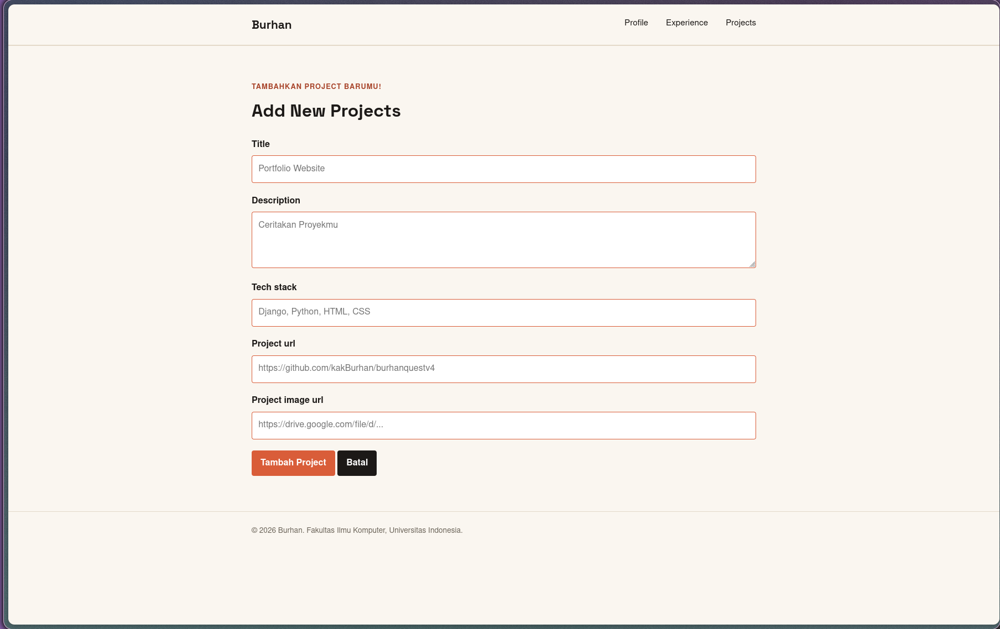
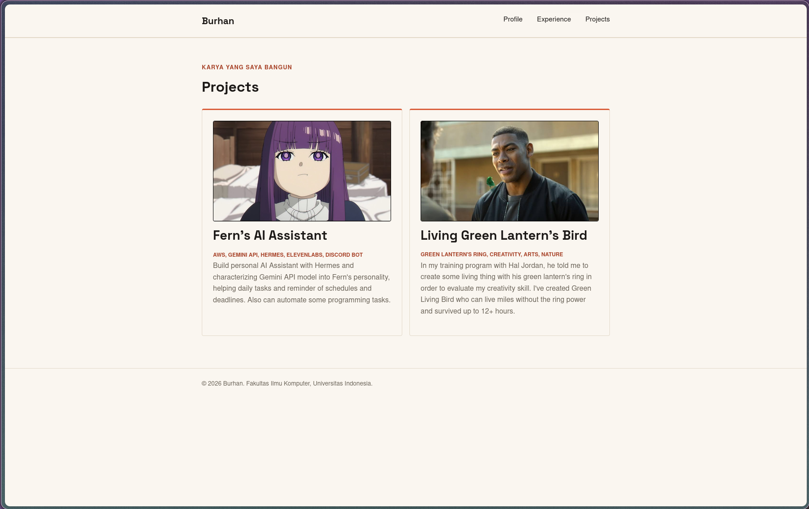
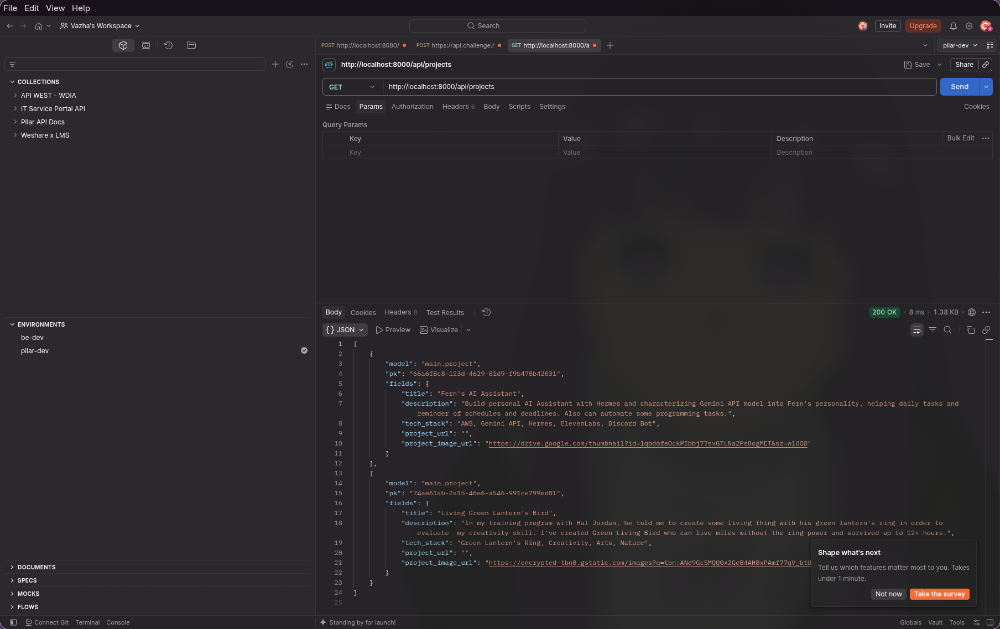
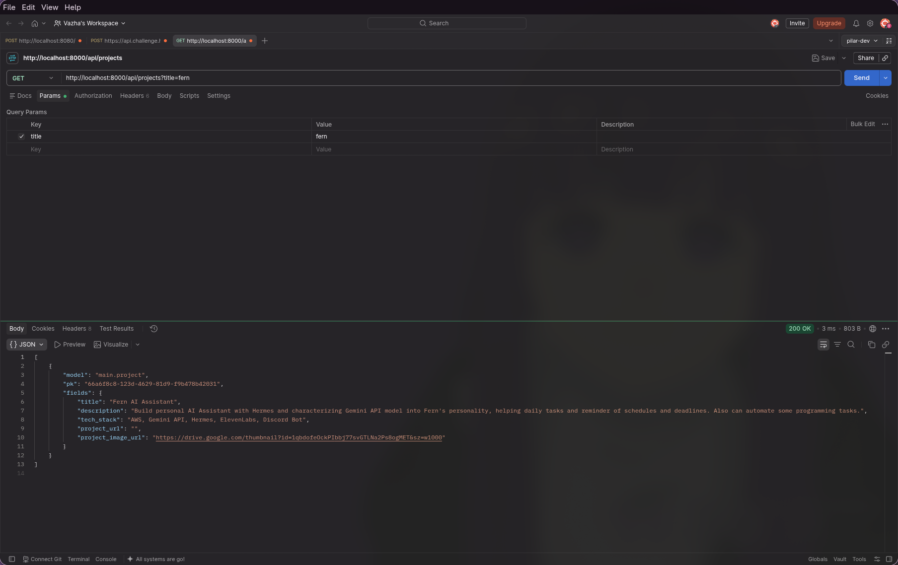
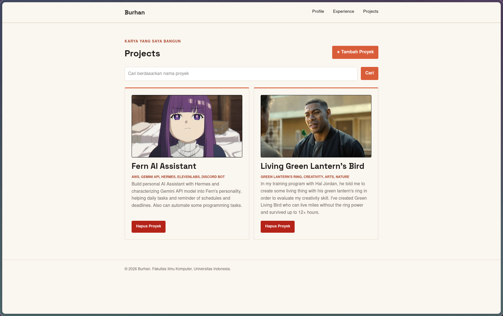

<!--
  Cara pakai template ini kalau mau bikin Tutorial minggu baru:

  Copy berkas ini ke tutorial/tutorial-N.qmd, ganti N dengan nomor minggunya
  (urutannya "Tutorial 01" sampai "Tutorial 10", cek jadwal di homepage kalau
  lupa), lalu sesuaikan judul di frontmatter dan output-file revealjs.

  Satu hal yang beda dari pola tutorial dulu: sekarang semua Tutorial
  membangun satu aplikasi tema yang sama secara berkelanjutan sepanjang
  semester, bukan latihan berdiri sendiri tiap minggu. Jadi section "Yang
  Sudah Kita Bangun" isinya ringkasan progres dari tutorial minggu
  sebelumnya - kecuali di Tutorial 01, kosongkan/hapus saja karena belum ada
  apa-apa untuk diringkas.

  Section "Menghubungkan ke Proyek Kamu" itu yang paling sering kelewat
  tapi justru paling penting - di situ jelaskan eksplisit bagian mana dari
  proyek pribadi mahasiswa (misalnya website portofolio) yang bisa memakai
  pola yang sama dengan yang baru dikerjakan di tutorial ini. Tanpa ini,
  mahasiswa gampang bingung kenapa tugasnya terasa "beda" dari tutorial,
  padahal seharusnya melanjutkan pola yang sama.

  Isi kedua blok bahasa ({.content-visible when-profile="id"} dan ="en") -
  jangan sampai ada yang kosong, karena keduanya yang membuat switch bahasa
  di navbar berfungsi. Ini juga sumber bug yang paling sering muncul:
  apapun yang tampil ke pembaca (link slide, baris "Pemrograman Berbasis
  Platform...", dst.) harus ada di dalam salah satu dari kedua blok itu,
  bukan di luar - kalau ditaruh di luar, teksnya tampil sama persis di
  kedua bahasa dan jadi terlihat seperti belum di-translate padahal isinya
  sudah bilingual.

  Soal judul: frontmatter title tidak bisa beda per bahasa (Quarto selalu
  pakai satu judul yang sama untuk tab browser dan sidebar), jadi supaya
  judul di halaman tetap bilingual, tulis heading `#` manual dengan
  atribut `{.pbp-page-title}` di baris pertama tiap blok bahasa (contohnya
  ada di bawah) - CSS di `styles.css` otomatis menyembunyikan judul
  frontmatter kalau atribut ini ada di halaman.

  Jangan lupa daftarkan file barunya di sidebar `contents:` di kedua
  `_quarto-id.yml` dan `_quarto-en.yml`, dengan `text:` eksplisit per
  bahasa (jangan biarkan Quarto menurunkan label sidebar dari frontmatter
  title, itu juga tidak ikut ter-translate). Contoh:
  ```yaml
  - text: "Tutorial 01: Setup Git Repository, ..."   # di _quarto-id.yml
    href: tutorial/tutorial-1.qmd
  - text: "Tutorial 01: Set Up Git Repository, ..."  # di _quarto-en.yml
    href: tutorial/tutorial-1.qmd
  ```

  Buat juga slides/tutorial-N.qmd dari _templates/slide-template.qmd.

  Section "Pengumpulan"/"Submission" di bagian bawah teksnya sudah baku
  dan sama di semua tutorial - biarkan apa adanya, tidak perlu disunting
  per minggu.

  Langkah terakhir sebelum selesai: render dua profile (`quarto render`,
  lalu `quarto render --profile en --no-clean`), buka halaman ID dan EN-nya
  berdampingan, dan cek tidak ada teks yang identik/belum ter-translate di
  keduanya (judul, sidebar, isi). Ini langkah regresi yang wajib dilakukan
  tiap kali selesai bikin tutorial/tugas baru.
-->

::: {.content-visible when-profile="id"}

# Tutorial 03: Form dan Data Delivery {.pbp-page-title}

Pemrograman Berbasis Platform (CSGE602022) - diselenggarakan oleh Fakultas Ilmu Komputer Universitas Indonesia, Semester Gasal 2026/2027

**Kontributor:** FERN - Vazha Khayri, EHW - Evan Haryo Widodo, DUH - Bermulya Anugrah Putra

***

### Tujuan Pembelajaran

Setelah menyelesaikan tutorial ini, mahasiswa diharapkan untuk dapat:

- Mengetahui konsep *data delivery* menggunakan XML dan JSON.
- Memahami struktur, perbedaan format, dan cara membaca data dalam bentuk XML dan JSON.

::: {.callout-warning}
**Tutorial ini adalah prasyarat wajib untuk Individual Assignment minggu ini** - jika Tutorial ini belum diselesaikan, Individual Assignment tersebut tidak akan dinilai. Deadline Tutorial 03 adalah **Rabu, 16 September 2026**; deadline Individual Assignment 3 adalah **Senin, 21 September 2026**. Lihat [halaman Jadwal](../index.qmd#jadwal-semester) untuk tanggal lengkap.
:::

Tutorial ini adalah **Tutorial 03**, lanjutan langsung dari [Tutorial 02](tutorial-2.qmd) - tutorial keempat dari proyek yang akan kamu bangun berkelanjutan sepanjang semester: sebuah **website portofolio pribadi**. Semua tutorial berikutnya akan melanjutkan langsung dari hasil tutorial ini, jadi pastikan proyekmu berjalan dengan baik sebelum lanjut ke tutorial berikutnya.

Sepanjang tutorial ini, contoh yang dipakai adalah portofolio milik **Burhan**, maskot mata kuliah PBP. Setiap kali ada bagian yang berisi data pribadi Burhan (nama, NPM, bio, foto), akan ada catatan eksplisit yang bilang "ganti ini dengan data kamu sendiri" - jangan sampai kelewat.

::: {.callout-tip}
**Yang Sudah Kita Bangun Sejauh Ini** - Di Tutorial 2, kamu memindahkan data profil yang masih ditulis langsung di HTML ke dalam *context* dan membuat halaman **Experience** yang mengambil data dari model. 
:::

Pada tutorial ini, kita akan mempelajari konsep *Data Delivery* menggunakan XML dan JSON, sebagai fondasi sebelum kita mengimplementasikannya pada proyek myportofolio.

## Pengenalan Data Delivery
Dalam mengembangkan suatu *platform* web atau perangkat lunak modern, ada kalanya kita perlu mengirimkan data dari satu *stack* ke *stack* lainnya (misalnya dari *backend server* ke *frontend client*, atau dari satu layanan web ke layanan web lainnya). 

Data yang dikirimkan bisa bermacam-macam bentuknya. Beberapa format penyajian data yang umum digunakan antara lain HTML, XML, dan JSON. Implementasi *data delivery* dalam bentuk HTML yang dirender oleh server sudah kamu pelajari pada tutorial sebelumnya. Pada bagian ini, kita akan berfokus pada dua format populer lainnya: **XML dan JSON**.

### XML (Extensible Markup Language)

**XML** (*eXtensible Markup Language*) adalah sebuah format teks yang dirancang agar mudah dimengerti hanya dengan membacanya, karena setiap elemen dalam XML mendeskripsikan dirinya sendiri (*self-descriptive*). XML banyak digunakan dalam berbagai aplikasi *web* dan *mobile* generasi terdahulu maupun sistem *enterprise* untuk tujuan penyimpanan dan pertukaran data. 

File XML hanya berisi data yang dikemas dalam *tag* tertentu. Untuk dapat mengirim, menerima, menyimpan, atau menampilkan informasi dari *file* tersebut, kita perlu membuat program yang dapat memproses strukturnya.

Contoh Format XML:

```xml
<?xml version="1.0" encoding="UTF-8"?>
<person>
    <name>Burhan</name>
    <age>25</age>
    <address>
        <street>Jl. PeBePe No.1</street>
        <city>Depok</city>
        <province>Jawa Barat</province>
        <zip>16424</zip>
    </address>
</person>
```

XML di atas sangatlah *self-descriptive*:
- Ada informasi nama (`name`)
- Ada informasi umur (`age`)
- Ada informasi alamat (`address`) yang bersarang (*nested*), mencakup:
  - jalan (`street`)
  - kota (`city`)
  - provinsi (`province`)
  - kode pos (`zip`)

Dokumen XML membentuk struktur hierarki seperti *tree* yang dimulai dari elemen *root*, lalu ke cabang (*branch*), hingga berakhir pada daun (*leaves*). Dokumen XML **harus mengandung sebuah *root element*** yang merupakan induk (*parent*) dari elemen lainnya. Pada contoh di atas, `<person>` adalah *root element*.

Baris `<?xml version="1.0" encoding="UTF-8"?>` disebut sebagai **XML Prolog**. Prolog ini bersifat opsional, tetapi jika ada, posisinya harus berada paling awal di dokumen. Pada dokumen XML, **semua elemen wajib memiliki *closing tag***. *Tag* pada XML juga bersifat ***case sensitive***, sehingga tag `<person>` dianggap **berbeda** dengan tag `<Person>`.

### JSON (JavaScript Object Notation)

**JSON** (*JavaScript Object Notation*) adalah sebuah format pertukaran data ringan yang sangat populer saat ini. Seperti XML, JSON dirancang agar mudah dimengerti manusia (karena juga bersifat *self-describing*) dan mudah di-*parsing* atau di-*generate* oleh mesin. 

Meskipun sintaks JSON berasal dari notasi objek bahasa pemrograman JavaScript, JSON sebenarnya adalah format teks murni yang independen terhadap bahasa. Hampir seluruh bahasa pemrograman modern memiliki dukungan bawaan (*built-in*) untuk membaca dan membuat struktur JSON.

Contoh format JSON:

```json
{
  "name": "Burhan",
  "age": 25,
  "address": {
    "street": "Jl. PeBePe No.1",
    "city": "Depok",
    "province": "Jawa Barat",
    "zip": "16424"
  }
}
```

Data pada JSON direpresentasikan dalam bentuk pasangan ***key*** dan ***value*** (kunci-nilai). Pada contoh di atas, yang menjadi *key* adalah `"name"`, `"age"`, dan `"address"`. *Value* pada JSON dapat berupa tipe data primitif (*string*, *number*, *boolean*, *null*), himpunan (*array*), ataupun sekumpulan pasangan *key-value* lain (berupa objek bersarang/ *nested object*). 

Saat ini, JSON lebih disukai dibandingkan XML pada aplikasi modern (terutama pada arsitektur *RESTful API*) karena ukurannya yang lebih ringkas, *parser* yang sangat cepat, dan integrasi yang sangat natural dengan JavaScript di sisi *frontend*.

::: {.callout-important}
**Menghubungkan ke Proyek Kamu** - Pemahaman mengenai XML dan JSON adalah langkah awal yang esensial agar aplikasi portofolio yang kamu bangun dapat berkomunikasi dengan sistem lain. Seiring dengan berkembangnya kompleksitas proyekmu, aplikasi tidak lagi sekadar mengembalikan dokumen HTML utuh. Kamu akan dihadapkan pada kebutuhan untuk menyediakan data mentah (seperti JSON) yang dapat diproses secara asinkronus, misalnya melalui AJAX, untuk meningkatkan interaktivitas pada sisi *frontend*.
:::

## Pre-Tutorial Notes
Sebelum melanjutkan tutorial 2 ini, kami mengharapkan kamu memastikan hal-hal berikut di bawah ini:

- **Jika tidak sengaja push file sensitif seperti `.env`, `.env.prod`, `db.sqlite3`, atau folder `env/`, hapus dari Git menggunakan:**

  ```bash
  git rm --cached .env .env.prod db.sqlite3
  git rm -r --cached env/
  ```

  **Catatan**: Perintah di atas menghapus file sensitif dari tracking Git ke depannya.

  Cek apakah `.gitignore` sudah berisi file sensitif tersebut:
  ```bash
  cat .gitignore
  ```

  Jika belum ada, tambahkan ke `.gitignore`:
  ```
  .env*
  db.sqlite3
  env/
  ```
  Kemudian buat commit clean up:

  ```bash
  git add .
  git commit -m "cleanup"
  ```

  Dengan demikian, kita dapat meminimalisasi risiko keamanan dari credential yang ter-expose di repository publik.


- **Struktur direktori myportofolio**

  ```
  myportofolio
  ├── env/
  ├── .git/
  ├── .gitignore
  ├── requirements.txt
  ├── db.sqlite3
  ├── manage.py
  ├── portofolio  
  │   ├── migrations
  │   ├── __init__.py
  │   ├── admin.py
  │   ├── apps.py
  │   ├── models.py
  │   ├── tests.py
  │   ├── urls.py
  │   ├── views.py
  ├── portofolio              # folder konfigurasi utama proyek
  │   ├── __init__.py
  │   ├── asgi.py
  │   ├── settings.py         # semua konfigurasi proyek ada di sini
  │   ├── urls.py             # daftar routing URL
  │   ├── views.py
  │   └── wsgi.py        
  ├── requirements.txt
  ├── static
  │   ├── css
  │   │   └── style.css
  │   └── img
  │       └── burhan.png
  └── templates
      └── index.html
      └── experience.html
  ```

::: {.callout-tip}
**Jika ada tambahan atau perubahan minor pada struktur folder** yang kamu lakukan pada tugas 1, tidak masalah, ya! Perubahan minor yang dimaksud adalah adanya penambahan file, seperti html, css, .png, atau sejenisnya yang digunakan untuk menyajikan informasi pada halaman web
:::

## Tutorial: Implementasi Skeleton Sebagai Kerangka Utama Tampilan Web

Sebelum kita masuk ke materi utama, yakni pembuatan form, kita perlu membuat suatu skeleton yang berfungsi sebagai kerangka utama tampilan halaman situs web kita. Pembuatan skeleton ini bertujuan untuk memastikan bahwa desain situs web kita selalu konsisten dan memperkecil kemungkinan terjadinya redundansi kode.
Cara pembuatan skeleton ini, adalah

  1. Buat berkas **base.html** pada direktori templates yang berada pada **direktori utama (root folder)**. Berkas **base.html** ini berfungsi sebagai template dasar yang digunakan sebagai kerangka umum untuk halaman web lainnya yang berada pada setiap aplikasi. 
  2. Di dalam **base.html**, letakkan `` di bagian paling atas untuk memuat setiap static files yang didefinisikan pada berkas html
    
      ```html
      
      <!DOCTYPE html>
      <html lang="en">
      <head>
          <meta charset="UTF-8" />
          <meta name="viewport" content="width=device-width, initial-scale=1.0" />
      </head>
      </html>
      ```
  3. Letakkan setiap package yang akan sering digunakan di dalam `<head>`. Lalu, tambahkan `` yang berguna untuk menambahkan metadata lainnya pada berkas html lain yang melakukan extend pada kerangka ini. Berikut contoh isinya:
  
      ```html
      <head>
          <meta charset="UTF-8" />
          <meta name="viewport" content="width=device-width, initial-scale=1.0" />
          <link rel="preconnect" href="https://fonts.googleapis.com">
          <link rel="preconnect" href="https://fonts.gstatic.com" crossorigin>
          <link href="https://fonts.googleapis.com/css2?family=Space+Grotesk:wght@500;700&display=swap" rel="stylesheet">
          <link rel="stylesheet" href="/static/css/style.css">
           
      </head>
      ```
  4. Pindahkan `<header>` yang berguna untuk pembuatan navbar dan `<footer>` yang berguna untuk pembuatan footer pada halaman web pada berkas **index.html**, lalu letakkan di dalam `<body>` pada berkas **base.html**. Setelah itu, pada `<body>` di berkas **base.html**, tambahkan `` pada tag body yang nantinya berguna untuk mengisi konten untuk halaman webnya.

      ```html
      <body>
        <header class="site-header">
          <div class="container">
              <a href="" class="brand">{{ name }}</a>
              <nav>
                  <a href="">Profile</a>
                  <a href="">Experience</a>
                  <a href="">Projects</a>
              </nav>
          </div>
        </header>
         

        <footer class="site-footer">
            <div class="container">
                <p>&copy; 2026 {{ name }}. Fakultas Ilmu Komputer, Universitas Indonesia.</p>
            </div>
        </footer>
      </body>
      ```
  5. Buka **settings.py** yang ada pada direktori proyek (portofolio) dan carilah variabel `TEMPLATES`. Sesuaikan kode yang ada dengan potongan kode berikut agar berkas base.html terdeteksi sebagai berkas template.
    
      ```python
        ...
        TEMPLATES = [
            {
                'BACKEND': 'django.template.backends.django.DjangoTemplates',
                'DIRS': [BASE_DIR / 'templates'], # Tambahkan konten baris ini
                'APP_DIRS': True,
                ...
            }
        ]
        ...
      ```

::: {.callout-note}
Dalam beberapa kasus, `APP_DIRS` pada konfigurasi `TEMPLATES` kamu dapat bernilai False. Apabila nilainya False, kamu wajib mengubahnya menjadi True. Hal ini dilakukan agar templates milik aplikasi (contohnya main) lebih diprioritaskan daripada **admin/base_site.html** milik django.contrib.admin. Untuk informasi lebih lanjut, kamu dapat mengakses halaman [ini](https://docs.djangoproject.com/en/6.1/ref/templates/api/#loading-templates).
:::
  6. Pada berkas **index.html** yang berada di direktori **templates**, ubahlah kode index.html dengan memasukkan setiap tag html pada body ke dalam block content. Contohnya sebagai berikut,
    
      ```html
        
        
          <main>
              <section class="hero" id="profile">
                  <div class="container hero-grid">
                      <div class="hero-identity">
                          <p class="hero-kicker">Computer Science &middot; Universitas Indonesia</p>
                          <h1>{{ name }}</h1>
                      </div>
                      <div class="hero-photo">
                          <div class="photo-block"></div>
                          
                      </div>
                      <div class="hero-details">
                          <p class="bio">{{ bio }}</p>
                          <dl class="meta-list">
                              <div class="meta-row">
                                  <dt>NPM</dt>
                                  <dd>{{ npm }}</dd>
                              </div>
                              <div class="meta-row">
                                  <dt>Program</dt>
                                  <dd>{{ study_program }}</dd>
                              </div>
                          </dl>
                          <ul class="skills">
                              <li>Programming Fundamentals</li>
                              <li>Java</li>
                              <li>Python</li>
                              <li>Data Structures</li>
                              <li>Teaching &amp; Mentoring</li>
                          </ul>
                          <div class="social-links">
                              <a href="https://github.com/" class="social-link">GitHub</a>
                              <a href="https://linkedin.com/" class="social-link">LinkedIn</a>
                              <a href="mailto:burhan@example.com" class="social-link">Email</a>
                          </div>
                      </div>
                  </div>
              </section>
            ...
          </main>
        
        ```
  Jika diperhatikan, berkas **index.html** yang sebelumnya melakukan pendefinisian html dari awal, sekarang hanya berisi kontennya saja. Hal ini dikarenakan berkas index.html melakukan extend terhadap **base.html** yang menjadi kerangka utama dari struktur html pada halaman web


::: {.callout-note}
Baris-baris yang dikurung dalam `` disebut dengan template tags Django. Baris-baris inilah yang akan berfungsi untuk memuat data secara dinamis dari Django ke HTML.

Pada contoh diatas, tag `` di Django digunakan untuk mendefinisikan area dalam template yang dapat diganti oleh template turunan. Template turunan akan extend template dasar, pada contoh ini **base.html** dan mengganti konten di dalam block tersebut sesuai kebutuhan.
:::

::: {.callout-tip}
Sekarang, kalian boleh menerapkan hal yang sama pada berkas html lainnya, seperti **index.html** yang melakukan extend base.html **(template utama)** agar meminimalisir terjadinya redundansi kode.
:::


## Tutorial: Implementasi Form & Data Delivery 
Data delivery melibatkan kebutuhan untuk berkomunikasi antar client yang biasanya merupakan antarmuka yang dilihat pengguna dan server yang biasanya adalah backend yang mengelola database, pada implementasi kali ini, kita akan memanfaatkan library Form yang telah disediakan oleh Django untuk mengirim data ke server atau biasanya disebut **request** dan menangkap balasan dari server atau biasanya disebut **response**. 


::: {.callout-important}
**Important Acknowledgment** - Kode dan implementasi yang akan saya jelaskan adalah contoh, sesuaikan object dan fields dengan hasil dari tugas 2 anda, jangan melakukan kopi paste secara langsung tanpa adjustment jika object dan fields yang anda buat pada tugas 2 berbeda!
:::


### Langkah 1: Implementasi Form 
Pada tugas 2, kamu diminta untuk membuat satu page untuk portfoliomu antara lain proyek, pendidikan, sertifikasi, atau bagian lain yang relevan. Kali ini, kita akan membuat konten tersebut dinamis. Pada tutorial ini saya akan menggunakan proyek sebagai contoh, tapi kalian bisa menyesuaikan dari apa yang telah dibaut di tutorial 2.

Pastikan kamu telah memiliki models untuk bagian baru dan sudah melakukan migration, disini  konteksnya adalah project, seperti berikut:
```py
class Project(models.Model):
    id = models.UUIDField(primary_key=True, default=uuid.uuid4, editable=False)
    title = models.CharField(max_length=255)
    description = models.TextField()
    tech_stack = models.CharField(max_length=255)
    project_url = models.URLField(blank=True)
    project_image_url = models.URLField(blank=True, max_length=500)

    def __str__(self):
        return self.title
```

Pada `main/` kita akan membuat file baru bernama `forms.py` dan buat class `ProjectForm`:
```py
from django.forms import ModelForm, TextInput, Textarea, URLInput

from main.models import Project

class ProjectForm(ModelForm):
    class Meta:
        model = Project
        fields = [
            "title",
            "description",
            "tech_stack",
            "project_url",
            "project_image_url",
        ]

        labels = {
            "title": "Nama Proyek",
            "description": "Deskripsi Proyek",
            "tech_stack": "Teknologi yang Digunakan",
            "project_url": "URL Proyek",
            "project_image_url": "URL Gambar Proyek",
        }

        widgets = {
            "title": TextInput(
                attrs={
                    "class": "form-input",
                    "placeholder": "Portfolio Website",
                    "maxlength": 255,
                }
            ),
            "description": Textarea(
                attrs={
                    "class": "form-input",
                    "placeholder": "Ceritakan Proyekmu",
                    "rows": 3,
                }
            ),
            "tech_stack": TextInput(
                attrs={
                    "class": "form-input",
                    "placeholder": "Django, Python, HTML, CSS",
                }
            ),
            "project_url": URLInput(
                attrs={
                    "class": "form-input",
                    "placeholder": "https://github.com/kakBurhan/burhanquestv4",
                }
            ),
            "project_image_url": URLInput(
                attrs={
                    "class": "form-input",
                    "placeholder": "https://drive.google.com/thumbnail?id=...&sz=w1000",
                }
            ),
        }
```


`ModelForm` adalah builtins library yang telah disediakan oleh Django untuk membuat boilerplate suatu form. Struktur dari form sendiri dapat dikustomasi menggunakan metadata atau class `Meta`. 

::: {.callout-note}
**Boilerplate** dalam dunia pemrogramman adalah istilah bagi kode standar yang sifatnya reusable dengan sedikit/tidak ada perubahan.
:::

**Penjelasan Kode**

- `model` digunakan untuk menentukan model Django yang menjadi sumber data dan struktur dari `ModelForm`. Field pada form akan dibuat berdasarkan field yang terdapat pada model tersebut.
- `fields` digunakan untuk menentukan field model yang ingin ditampilkan pada form. Field dapat ditulis secara eksplisit, seperti `["title", "description"]`, atau menggunakan `"__all__"` untuk menampilkan seluruh field yang tersedia.
- `widgets` digunakan untuk mengatur tampilan dan jenis elemen HTML yang digunakan oleh setiap field pada form. Pada kode di atas, `TextInput` digunakan untuk field teks satu baris, `Textarea` digunakan untuk field deskripsi yang membutuhkan area teks lebih besar, dan `URLInput` digunakan untuk field yang berisi URL. Atribut di dalam `attrs`, seperti `class`, `placeholder`, `maxlength`, dan `rows`, digunakan untuk mengatur styling, teks petunjuk, batas jumlah karakter, serta tinggi area input.

Setelah membuat Form, kita perlu membuat views untuk nantiya dapat menggunakan form tersebut. pergi ke `main/views.py` lalu buat fungsi berikut:
```py
def create_project(request):
    form = ProjectForm(request.POST or None)

    if request.method == "POST" and form.is_valid():
        form.save()
        messages.success(request, "Proyek baru berhasil ditambahkan!")
        return redirect("main:show_projects")

    context = {
        "name": "Burhan",
        "form": form,
    }
    return render(request, "projects_form.html", context)


```

**Penjelasan Kode**

- `ProjectForm(request.POST or None)` digunakan untuk mentrigger class `ProjectForm` dengan `request.POST` yang nantinya akan dikirim dengan tag HTML yaitu `<form method="post">`
- `form.save()` digunakan untuk menyimpan value yang telah dimasukkan pengguna lewat form ke database. 
- `messages.success(request, ...)` digunakan untuk mengirim pesan ke client untuk dapat ditampilkan.
- `redirect("main:show_projects")` akan berjalan setelah form berhasil disimpan, halaman website akan diarahkan ke halaman projects yang bisa dilihat.

Lalu, pergi ke `urls.py`, tambahkan hal berikut:
```py
from main.views import (
   ...
   create_project
)

urlpatterns = [
    ...
    path("projects/add/", create_project, name="create_project"),
]

```

Sekarang kita akan membuat tampilan dari halaman Project Form, buat file baru pada folder templates, yaitu `projects_form.html`, isi dengan kode berikut:

```html


    <title>Add Project - {{ name }}</title>


    <main>
        <section class="experience-section">
            <div class="container">
                <h1>Add New Projects</h1>
                <form method="post"
                      action=""
                      class="project-form">
                    
                    
                        <div class="form-group">
                            <label for="{{ field.id_for_label }}">{{ field.label }}</label>
                            {{ field }}
                            
                                <p class="form-error">{{ error }}</p>
                            
                        </div>
                    
                    <button type="submit" class="button">Tambah Project</button>
                    <a href="" class="button button-secondary">Batal</a>
                </form>
            </div>
        </section>
    </main>

```

Dan pada `style.css`:

```css
.project-form {
    width: 100%;
    max-width: 100%;
    margin-top: 1.5rem;
}

.form-group {
    margin-bottom: 1.25rem;
}

.form-group label {
    display: block;
    margin-bottom: 0.4rem;
    font-weight: 700;
}

.form-group input,
.form-group textarea {
    width: 100%;
    box-sizing: border-box;
    padding: 0.7rem;
    border: 1px solid var(--accent);
    border-radius: var(--radius);
    font: inherit;
    transition:
        border-color 0.2s ease,
        outline-color 0.2s ease;
}

.form-group input:focus,
.form-group textarea:focus {
    outline: 2px solid var(--accent);
    border-color: var(--accent);
}

.form-error {
    color: #b42318;
    font-size: 0.85rem;
    margin-top: 0.35rem;
}

.button {
    display: inline-block;
    height: fit-content;
    border: 0;
    border-radius: var(--radius);
    padding: 0.65rem 1rem;
    background: var(--accent);
    color: white;
    cursor: pointer;
    font: inherit;
    font-weight: 700;
    text-decoration: none;
}

.button-secondary {
    background: var(--ink);
}

```


Jika sudah, kalian dapat menjalankan django, dan masuk ke URL dengan route `/projects/add`. Tampilan jika berhasil akan seperti berikut:



::: {.callout-important}
**Google Drive Link**

Jika kamu ingin menambahkan gambar pada project, upload gambar tersebut ke Google Drive terlebih dahulu. Setelah itu, klik kanan pada gambar, pilih **Share**, lalu ubah aksesnya menjadi **Anyone with the link** sebagai **Viewer**.

Gunakan ID file dari link Google Drive tersebut untuk membuat URL thumbnail dengan format berikut:

```text
https://drive.google.com/thumbnail?id=FILE_ID&sz=w1000
```

Sebagai contoh, jika link Google Drive yang kamu miliki adalah:

```text
https://drive.google.com/file/d/1qbdofeOckPIbbj77svGTLNa2Ps8ogMET/view?usp=sharing
```

Maka URL gambar yang dimasukkan ke form adalah:

```text
https://drive.google.com/thumbnail?id=1qbdofeOckPIbbj77svGTLNa2Ps8ogMET&sz=w1000
```

Pastikan kamu memasukkan URL thumbnail tersebut ke field **Project image url** pada form.
:::


### Langkah 2: Menyesuaikan dengan Tugas 2 
Setelah tugas 2, kamu diharapkan memiliki page HTML baru, disini sebagai contoh, saya telah memiliki `project.html`, isi kodenya adalah sebagai berikut: 


```html
<!DOCTYPE html>
<html lang="en">
<head>
    <meta charset="UTF-8">
    <meta name="viewport" content="width=device-width, initial-scale=1.0">
    <title>Projects - {{ name }}</title>
    <link rel="preconnect" href="https://fonts.googleapis.com">
    <link rel="preconnect" href="https://fonts.gstatic.com" crossorigin>
    <link href="https://fonts.googleapis.com/css2?family=Space+Grotesk:wght@500;700&display=swap" rel="stylesheet">
    <link rel="stylesheet" href="/static/css/style.css">
</head>
<body>
    <header class="site-header">
        <div class="container">
        <a href="" class="brand">{{ name }}</a>
            <nav>
                <a href="">Profile</a>
                <a href="">Experience</a>
                <a href="">Projects</a>
            </nav>
        </div>
    </header>

    <main>
        <section class="experience-section" id="experience">
            <div class="container">
            <p class="section-kicker">Karya yang saya bangun</p>
            <h1>Projects</h1>

                <div class="experience-grid">
                    
                        <article class="experience-card">
                            <span class="experience-category">{{ project.tech_stack }}</span>
                            <h2>{{ project.title }}</h2>
                            <p class="experience-description">{{ project.description }}</p>

                            
                                <p class="experience-status">
                                    <a href="{{ project.project_url }}">Lihat proyek</a>
                                </p>
                            
                        </article>
                    
                        <p class="empty-state">
                            Belum ada proyek yang ditambahkan.
                        </p>
                    
                </div>
            </div>
        </section>
    </main>

    <footer class="site-footer">
        <div class="container">
            <p>&copy; 2026 {{ name }}. Fakultas Ilmu Komputer, Universitas Indonesia.</p>
        </div>
    </footer>
</body>
</html>
```

Karena kita sudah membuat kerangka pada `base.html`, sekarang kita tinggal extends base html tersebut dengan `project.html` agar elemen elemen seperti **Navbar** dan **Footer** dapat ditampilkan tanpa dibuat dua kali (redundant).
```html


    <title>Projects - {{ name }}</title>


<! -- Isi HTML kamu -- >

```

Isi konten dengan html dari `project.html` yang dimulai dari tag `<main>` dan keseluruhan isi konten pada tag tersebut. Tag diluar main tidak perlu kita tulis kembali karena telah diimplementasikan pada `base.html` dan kita hanya tinggal extend saja seperti inheritance.


Lalu pada `main/views.py` saya telah melakukan implementasi seperti ini:
```py
...
def show_projects(request):
    context = {
        "name": "Burhan",
        "project_list": Project.objects.all(),
    }
    return render(request, "project.html", context)
```

dan pada `main/urls.py` seperti ini:
```py
from django.urls import path

from main.views import show_main, show_experience, show_projects

app_name = "main"

urlpatterns = [
    path("", show_main, name="show_main"),
    path("experience/", show_experience, name="show_experience"),
    path("projects/", show_projects, name="show_projects"),
]
```

Cek kembali apakah kode pada portfolio kamu memiliki struktur yang serupa agar memudahkan dalam mengikuti implementasi berikutnya!

### Langkah 3: Implementasi Data Delivery dengan JSON

Jika kamu belum membuat project apapun, kamu bisa masuk ke `/projects/add` dan menambahkan project-project yang diinginkan. Atau mengikuti contoh project yang dibuat pada tutorial dengan input field content sebagai berikut:
```json
[
  {
      "title": "Fern AI Assistant",
      "description": "Build personal AI Assistant with Hermes and characterizing Gemini API model into Fern's personality, helping daily tasks and reminder of schedules and
      deadlines. Also can automate some programming tasks.",
      "tech_stack": "AWS, Gemini API, Hermes, ElevenLabs, Discord Bot",
      "project_url": "",
      "project_image_url": "https://drive.google.com/thumbnail?id=1qbdofeOckPIbbj77svGTLNa2Ps8ogMET&sz=w1000",
  },
  {
      "id": uuid.UUID("74ae61ab-2a15-46e6-a546-991ce799ed01"),
      "title": "Living Green Lantern's Bird",
      "description": "In my training program with Hal Jordan, he told me to create some living thing with his green lantern's ring in order to evaluate my creativity skill.
      I've created Green Living Bird who can live miles without the ring power and survived up to 12+ hours.",
      "tech_stack": "Green Lantern's Ring, Creativity, Arts, Nature",
      "project_url": "",
      "project_image_url": "https://encrypted-tbn0.gstatic.com/images?q=tbn:ANd9GcSMQQ0x2GeB4AH8xPAmf77qV_btUQyVb24Y56R4z2g3YA&s=10",
  }
]
```

Sebagai gambaran, tampilan awal dari halaman projects yang saya buat adalah sebagai berikut:





Sekarang kita akan merubah data delivery yang ada fungsi `show_projects` yang awalnya langsung mengambil dari database, menjadi menggunakan JSON. pada `main/views.py` buat fungsi `get_projects_json`:

```py
def get_projects_json(request):
    title_query = request.GET.get("title", "").strip()
    projects = Project.objects.all()

    if title_query:
        projects = projects.filter(title__icontains=title_query)

    projects_json = serializers.serialize("json", projects)
    return HttpResponse(projects_json, content_type="application/json")
```

**Penjelasan Kode**

- `request.GET.get("title", "").strip()` Mengambil query yang ditulis pada parameter, biasanya akan terlihat seperti `/example?title=HelloWorld`.
- `serializers.serialize("json", projects)` Mengubah object `projects` menjadi format JSON.
- `HttpResponse(projects_json, content_type="application/json")` mengembalikan output dari suatu fungsi sebagai respons HTTP untuk dikirim ke client.


::: {.callout-tip}
**Gimana Cara Melihat Implementasi Fungsi yang Dipanggil dari Library?**

- **Neovim**, kalian bisa mengarahkan kursor ke fungsi yang ingin diidentifikasi, lalu ketik `gd`, nanti akan diarahkan ke isi dari implementasi fungsi tersebut.
- **VScode**, kalian bisa menekan `Ctrl`, lalu klik fungsi yang ingin diidentifikasi
- **IDE Lain**, cari di google hehe.
:::

::: {.callout-note}
**FUNFACT: Kenapa Harus HttpResponse?** - Server memiliki cara untuk berkomunikasi dengan website, dan cara yang terstandarisasi dengan protokol HTTP, protokol HTTP merupakan protokol standar untuk berinteraksi (request and response) antara server dengan client (web browser), methode interaksinya biasanya menggunakan GET, POST, PUT, PATCH, & DELETE. Terdapat metode interaksi lain seperti Websocket, SMTP, dan lainnya yang akan kalian pelajari di jarkom :D.
:::

Pada `urls.py`, daftarkan fungsi `get_projects_json` yang telah dibuat pada urlpatterns. Saya menulis seperti ini `path("api/projects/", get_projects_json, name="get_projects_json")`, penggunaan `/api` sebagai notasi untuk membedakan mana endpoint yang digunakan oleh client, mana yang digunakan oleh server.

Setelah kamu mendaftarakn ke `urls.py`, kita dapat memanggilnya dalam bentuk API menggunakan Postman.





::: {.callout-note}
**Bagaimana Kalau Formatnya XML?** - Kontrak tidak harus JSON, salah satu contoh kontrak lainnya adalah XML, coba kalian ubah serializenya dari yang "json" ke "xml" dan `content_type="application/xml"` dan lihat response yang diberikan seperti apa 
:::

Setelah berhasil, kita coba ubah implementasi dari fungsi `show_projects` seolah olah menerima response berupa JSON dan di deserialize untuk menjadikan tipe data yang dikenali python
```py
def show_projects(request):
    json_response = get_projects_json(request)

    projects = serializers.deserialize(
        "json",
        json_response.content.decode("utf-8"),
    )
    projects = [project.object for project in projects]
    title_query = request.GET.get("title", "").strip()

    context = {
        "name": "Burhan",
        "project_list": projects,
        "title_query": title_query,
    }
    return render(request, "project.html", context)
```

Inti dari kode diatas adalah merubah implementasi yang awalnya langsung mengambil dari database, sekarang mengambil dari JSON terlebih dahulu, lalu di deserialize agar formatnya sesuai dengan tipedata python, lalu dikirim lagi ke halaman `project.html`. 

::: {.callout-note}
**Terlihat redundant? Memang!** - Karena ini adalah contoh implementasi yang seharusnya dilakukan ketika kalian ingin mengimplementasikan aplikasi yang memiliki client dan server dengan repository yang berbeda atau implementasi menggunakan `fetch()` javascript.
:::

Sebelum kita mengimplementasikan semua fungsi ini ke client, saya ingin membuat fungsi `delete_projects` terlebih dahulu untuk memudahkan nantinya untuk menghapus project. Implementasi pada `main/views.py` 
```py
def delete_project(request, project_id):
    project = get_object_or_404(Project, pk=project_id)

    if request.method == "POST":
        project.delete()
        messages.success(request, "Project berhasil dihapus!")
        return redirect("main:show_projects")

    return redirect("main:show_projects")
```

Tambahkan path ini pada `urlpatterns` di `main/urls.py` yaitu: 
```path("projects/<uuid:project_id>/delete/",delete_project,name="delete_project")```

Sekarang, pada folder templates, buat folder `components/` dan tambahkan file bernama `project_delete_modal.html`:
```html
<p class="experience-status">
    <button type="button"
            class="button button-danger"
            popovertarget="delete-project-{{ project.id }}"
            aria-label="Hapus {{ project.title }}"
            title="Hapus proyek">
        Hapus Proyek
    </button>
</p>
<div id="delete-project-{{ project.id }}"
     class="project-delete-modal"
     popover="auto"
     role="dialog"
     aria-modal="true"
     aria-labelledby="delete-project-title-{{ project.id }}">
    <button type="button"
            class="project-delete-modal__backdrop"
            popovertarget="delete-project-{{ project.id }}"
            popovertargetaction="hide"
            aria-label="Tutup konfirmasi hapus"></button>
    <div class="project-delete-modal__content">
        <button type="button"
                class="project-delete-modal__close"
                popovertarget="delete-project-{{ project.id }}"
                popovertargetaction="hide"
                aria-label="Tutup konfirmasi hapus">×</button>
        <h2 id="delete-project-title-{{ project.id }}">Hapus Projek?</h2>
        <p>
            Apakah Anda yakin ingin menghapus
            <strong>{{ project.title }}</strong>?
        </p>
        <div class="project-delete-modal__actions">
            <button type="button"
                    class="button button-secondary"
                    popovertarget="delete-project-{{ project.id }}"
                    popovertargetaction="hide">Batal</button>
            <form method="post" action="">
                
                <button type="submit" class="button button-danger">Ya, Hapus</button>
            </form>
        </div>
    </div>
</div>

```

Dan ubah isi dari `project.html` menjadi seperti berikut:
```html


    <title>Projects - {{ name }}</title>


    <main>
        <section class="experience-section" id="experience">
            <div class="container">
                <p class="section-kicker">Karya yang saya bangun</p>
                <div class="project-header">
                    <h1>Projects</h1>
                    <a href=""
                       class="button project-add-button">
                        <span aria-hidden="true">+</span>
                        Tambah Proyek
                    </a>
                </div>
                <form method="get"
                      action=""
                      class="project-search">
                    <input type="search"
                           name="title"
                           value="{{ title_query }}"
                           placeholder="Cari berdasarkan nama proyek"
                           class="project-search__input"
                           aria-label="Cari berdasarkan nama proyek">
                    <button type="submit" class="button">Cari</button>
                </form>
                <div class="experience-grid project-grid">
                    
                        <article class="experience-card">
                            
                                
                            
                            <h2>{{ project.title }}</h2>
                            <span class="experience-category">{{ project.tech_stack }}</span>
                            <p class="experience-description">{{ project.description }}</p>
                            <div class="project-card-actions">
                                <div class="project-actions">
                                    
                                        <a href="{{ project.project_url }}" class="button">Lihat Project</a>
                                    
                                    
                                </div>
                            </div>
                        </article>
                    
                        
                            <p class="empty-state">Tidak ada proyek dengan nama tersebut.</p>
                        
                            <p class="empty-state">Belum ada proyek yang ditambahkan.</p>
                        
                    
                </div>
            </div>
        </section>
    </main>

```

Serta perubahan pada `style.css` adalah sebagai berikut:
```css
...
/* projects */

.project-header {
    width: 100%;
    display: flex;
    justify-content: space-between;
    align-items: center;
    gap: 1rem;
    margin-bottom: 1.5rem;
}

.project-grid {
    grid-template-columns: repeat(2, minmax(0, 1fr));
}

.project-grid .experience-card {
    display: flex;
    flex-direction: column;
}

.project-image {
    display: block;
    width: 100%;
    height: auto;
    border: 1px solid black;
    border-radius: var(--radius);
}

.project-header h1 {
    margin-bottom: 0;
}

.project-add-button {
    display: inline-flex;
    align-items: center;
    gap: 0.45rem;
}

.project-add-button span {
    font-size: 1.25rem;
    line-height: 1;
}

.project-search {
    display: flex;
    gap: 0.75rem;
    margin-bottom: 1.5rem;
}

.project-search__input {
    width: 100%;
    min-width: 0;
    padding: 0.7rem;
    border: 1px solid var(--line);
    border-radius: var(--radius);
    background: #fff;
    color: var(--ink);
    font: inherit;
}

.project-search__input:focus {
    outline: 2px solid var(--accent);
    border-color: var(--accent);
}

.project-actions {
    display: flex;
    align-items: center;
    flex-wrap: wrap;
    gap: 20px;
    margin-top: 1rem;
}

.project-actions .button {
    font-size: 0.85rem;
    font-weight: 600;
}

.project-card-actions {
    display: flex;
    flex-direction: column;
    margin-top: auto;
}

.hide {
    display: none !important;
}

.project-actions .experience-status {
    margin-top: 0;
}

.project-delete-modal {
    display: none;
    position: fixed;
    inset: 0;
    width: 100%;
    height: 100%;
    max-width: none;
    max-height: none;
    margin: 0;
    padding: 1rem;
    border: 0;
    background: transparent;
    z-index: 10;
    align-items: center;
    justify-content: center;
}

.project-delete-modal:popover-open {
    display: flex;
}

.project-delete-modal__backdrop {
    position: absolute;
    inset: 0;
    width: 100%;
    height: 100%;
    border: 0;
    padding: 0;
    background: rgba(28, 25, 23, 0.58);
    cursor: default;
}

.project-delete-modal__content {
    position: relative;
    z-index: 1;
    width: min(100%, 480px);
    padding: 1.5rem;
    background: var(--paper);
    border: 1px solid var(--line);
    border-radius: var(--radius);
    box-shadow: 0 1rem 3rem rgba(28, 25, 23, 0.22);
}

.project-delete-modal__content h2 {
    margin: 0 0 0.75rem;
    font-family:
        "Space Grotesk",
        -apple-system,
        sans-serif;
    font-size: 1.5rem;
}

.project-delete-modal__close {
    position: absolute;
    top: 1rem;
    right: 1rem;
    border: 0;
    padding: 0;
    background: transparent;
    color: var(--text-muted);
    font-size: 1.8rem;
    line-height: 1;
    cursor: pointer;
}

.project-delete-modal__actions {
    display: flex;
    justify-content: flex-end;
    gap: 0.75rem;
    margin-top: 1.5rem;
}

@media (max-width: 600px) {
    .project-header {
        align-items: flex-start;
        flex-direction: column;
    }

    .project-add-button {
        width: 100%;
        justify-content: center;
    }

    .project-search {
        flex-direction: column;
    }

    .project-search .button {
        width: 100%;
    }

    .project-delete-modal {
        align-items: flex-end;
        padding: 0;
    }

    .project-delete-modal__content {
        width: 100%;
        padding: 1.25rem;
        border-radius: var(--radius) var(--radius) 0 0;
    }

    .project-delete-modal__actions {
        flex-direction: column-reverse;
    }

    .project-delete-modal__actions .button {
        width: 100%;
        text-align: center;
    }
}

```

Tampilan akhir dari page `/projects/` adalah sebagai berikut:



Coba tambahkan project-project kamu, jika berhasil **selamat!** Jika masih gagal, coba debug yaa.. :D


::: {.callout-tip}
**Orang Lain Bisa Edit Portfolio-mu!** - Karena kita belum mempelajari terkait Autentikasi, Session, & Cookies. Technically yes, semua orang bisa mengotak-atik portfolio kamu. Kalau kamu mau mengamankannya untuk sementara, coba implementasikan request header yang memiliki kode rahasia, hanya kamu yang bisa tahu.

**HINTS:**

- buat kode rahasia di .env dan cocokkan dengan header ketika melakukan request.
- Untuk form, karena tidak bisa membuat custom header tanpa javascript, tambahkan field password
:::

## Pengumpulan

Tutorial ini dikumpulkan lewat slot submisi yang disediakan di SCELE, dalam bentuk **tautan ke commit** (bukan sekadar tautan repositori) di GitHub yang menunjukkan hasil akhir Tutorial ini, di-*push* **sebelum tenggat waktu** di atas. Commit yang di-*push* setelah tenggat waktu tidak akan diterima, sehingga Tutorial ini dianggap belum selesai dan Individual Assignment minggu ini tidak akan dinilai. Pastikan juga repositori GitHub kamu bersifat **publik**, supaya asisten dosen bisa mengaksesnya.

## Referensi Tambahan

- [JSON Introduction (MDN Web Docs)](https://developer.mozilla.org/en-US/docs/Learn/JavaScript/Objects/JSON)
- [XML Tutorial (W3Schools)](https://www.w3schools.com/xml/)

:::

::: {.content-visible when-profile="en"}

# Tutorial 03: Form and Data Delivery {.pbp-page-title}

Platform-Based Programming (CSGE602022) - organized by the Faculty of Computer Science, Universitas Indonesia, Odd Semester 2026/2027

**Contributors:** FERN - Vazha Khayri, EHW - Evan Haryo Widodo, DUH - Bermulya Anugrah Putra

***

### Learning Objectives

After completing this tutorial, students are expected to be able to:

- Understand the concept of data delivery using XML and JSON.
- Understand the structural and formatting differences between XML and JSON forms.

::: {.callout-warning}
**This Tutorial is a mandatory prerequisite for this week's Individual Assignment** - if it has not been completed, that Individual Assignment will not be graded. Tutorial 03's deadline is **Wednesday, September 16, 2026**; Individual Assignment 3's deadline is **Monday, September 21, 2026**. See the [Schedule page](../index.qmd#semester-schedule) for exact dates.
:::

This is **Tutorial 03**, a direct continuation of [Tutorial 02](tutorial-2.qmd). It is the fourth tutorial in the personal portfolio project you will keep building throughout the semester. All subsequent tutorials will continue directly from the results of this tutorial, so ensure your project runs smoothly before proceeding.

The examples use **Burhan's** portfolio. Whenever you see Burhan's name, NPM, bio, or experience, replace it with your own information instead of leaving the sample data unchanged.

::: {.callout-tip}
**What We've Built So Far** - In Tutorial 2, you moved hard-coded profile data into a *context* and created an **Experience** page that retrieves model data. 

This week, we will learn the concept of *Data Delivery* using XML and JSON as a foundation before implementing it in your portfolio project.
:::

## Introduction to Data Delivery

In developing a web platform or modern software, there are times when we need to transfer data from one stack to another (e.g., from a backend server to a frontend client, or from one web service to another).

The data sent can be formatted in various ways. Several common presentation formats include HTML, XML, and JSON. You have learned about data delivery in the form of server-rendered HTML in previous tutorials. In this section, we will focus on two other popular formats: **XML and JSON**.

### XML (Extensible Markup Language)

**XML** (*eXtensible Markup Language*) is a text format designed to be easily understood just by reading it, because each element in XML describes itself (*self-descriptive*). XML is widely used in various older generation web and mobile applications as well as enterprise systems for data storage and exchange.

An XML file only contains data packaged within specific *tags*. To be able to send, receive, store, or display information from the file, we need to create a program that can process its structure.

Example of XML Format:

```xml
<?xml version="1.0" encoding="UTF-8"?>
<person>
    <name>Burhan</name>
    <age>25</age>
    <address>
        <street>Jl. PeBePe No.1</street>
        <city>Depok</city>
        <province>Jawa Barat</province>
        <zip>16424</zip>
    </address>
</person>
```

The XML above is very *self-descriptive*:
- There is name information (`name`)
- There is age information (`age`)
- There is nested address information (`address`), encompassing:
  - street (`street`)
  - city (`city`)
  - province (`province`)
  - postal code (`zip`)

XML documents form a tree-like hierarchical structure starting from the *root* element, then branching out (*branch*), and ending at the *leaves*. An XML document **must contain a *root element*** that acts as the parent of other elements. In the example above, `<person>` is the *root element*.

The line `<?xml version="1.0" encoding="UTF-8"?>` is called the **XML Prolog**. This prolog is optional, but if present, it must be positioned at the very beginning of the document. In an XML document, **all elements must have a *closing tag***. XML *tags* are also ***case sensitive***, so the tag `<person>` is considered **different** from the tag `<Person>`.

### JSON (JavaScript Object Notation)

**JSON** (*JavaScript Object Notation*) is a lightweight data interchange format that is highly popular today. Like XML, JSON is designed to be easily understood by humans (as it is also *self-describing*) and easy for machines to parse or generate.

Although JSON syntax is derived from object notation in the JavaScript programming language, JSON is actually a pure text format that is language-independent. Almost all modern programming languages have built-in support for reading (*parsing*) and creating JSON structures.

Example of JSON format:

```json
{
  "name": "Burhan",
  "age": 25,
  "address": {
    "street": "Jl. PeBePe No.1",
    "city": "Depok",
    "province": "Jawa Barat",
    "zip": "16424"
  }
}
```

Data in JSON is represented as ***key-value*** pairs. In the example above, the keys are `"name"`, `"age"`, and `"address"`. A JSON *value* can be a primitive data type (*string*, *number*, *boolean*, *null*), a collection (*array*), or another set of key-value pairs (as a *nested object*).

Currently, JSON is preferred over XML in modern applications (especially in *RESTful API* architectures) due to its more compact size, extremely fast parsers, and natural integration with JavaScript on the frontend.

::: {.callout-important}
**Connecting to Your Project** - Understanding XML and JSON is an essential first step in enabling your portfolio application to communicate with other systems. As your project grows in complexity, it will no longer suffice to merely return full HTML documents. You will eventually need to provide raw data (such as JSON) that can be processed asynchronously, for instance via AJAX, to enhance interactivity on the *frontend*.
:::

## Pre-Tutorial Notes
Before proceeding with Tutorial 2, we expect you to ensure the following:

- **If `.env`, `.env.prod`, `db.sqlite3`, or the `env/` directory was accidentally committed, stop tracking those files with Git:**

  ```bash
  git rm --cached .env .env.prod db.sqlite3
  git rm -r --cached env/
  ```

  These commands remove the files from future Git commits without deleting the local copies you still need.

  Check your `.gitignore`:

  ```bash
  cat .gitignore
  ```

  Make sure it contains:

  ```
  .env*
  db.sqlite3
  env/
  ```

  Then commit the cleanup:

  ```bash
  git add .
  git commit -m "cleanup"
  ```

  This keeps local credentials and development-only files out of your public repository.

- Directory structure of myportofolio

  ```
  myportofolio
  ├── env/
  ├── .git/
  ├── .gitignore
  ├── requirements.txt
  ├── db.sqlite3
  ├── manage.py
  ├── portofolio  
  │   ├── migrations
  │   ├── __init__.py
  │   ├── admin.py
  │   ├── apps.py
  │   ├── models.py
  │   ├── tests.py
  │   ├── urls.py
  │   ├── views.py
  ├── portofolio              # folder konfigurasi utama proyek
  │   ├── __init__.py
  │   ├── asgi.py
  │   ├── settings.py         # semua konfigurasi proyek ada di sini
  │   ├── urls.py             # daftar routing URL
  │   ├── views.py
  │   └── wsgi.py        
  ├── requirements.txt
  ├── static
  │   ├── css
  │   │   └── style.css
  │   └── img
  │       └── burhan.png
  └── templates
      └── index.html
      └── experience.html
  ```

::: {.callout-tip}
**If there are any minor additions or changes to the folder structure** that you made in task 1, that is completely fine! Minor changes mean the addition of files such as html, css, .png, or similar files used to present information on the web page.informasi pada halaman web
:::


## Tutorial: Implementing a Skeleton as the Main Web Layout Framework
Before we dive into the main topic, which is creating forms, we need to create a skeleton that functions as the main framework for our website's layout. This skeleton aims to ensure that our website design remains consistent and minimizes the possibility of code redundancy.
The steps to create this skeleton are:

  1. Create a **base.html** file in the templates directory located in the **root directory**. This **base.html** file serves as a base template used as a general framework for other web pages in every application.
  2. Inside **base.html**, place `` at the very top to load any static files defined in the html files.

      ```html
        
        <!DOCTYPE html>
        <html lang="en">
        <head>
            <meta charset="UTF-8" />
            <meta name="viewport" content="width=device-width, initial-scale=1.0" />
        </head>
        </html>
        ```
  3. Place any frequently used packages inside `<head>`. Then, add ``, which is useful for adding other metadata in other html files that extend this framework. Here is an example of the metadata contents:

      ```html
        <head>
            <meta charset="UTF-8" />
            <meta name="viewport" content="width=device-width, initial-scale=1.0" />
            <link rel="preconnect" href="https://fonts.googleapis.com">
            <link rel="preconnect" href="https://fonts.gstatic.com" crossorigin>
            <link href="https://fonts.googleapis.com/css2?family=Space+Grotesk:wght@500;700&display=swap" rel="stylesheet">
            <link rel="stylesheet" href="/static/css/style.css">
             
        </head>
      ``` 

  4. Move the `<header>` (used for the navbar) and `<footer>` (used for the footer) from the **index.html** file, and place them inside the `<body>` of the **base.html** file. After that, within the `<body>` of **base.html**, add `` to the body tag, which will later be used to fill the content for the web page.
    
      ```html
        <body>
          <header class="site-header">
            <div class="container">
                <a href="" class="brand">{{ name }}</a>
                <nav>
                    <a href="">Profile</a>
                    <a href="">Experience</a>
                    <a href="">Projects</a>
                </nav>
            </div>
          </header>
           

          <footer class="site-footer">
              <div class="container">
                  <p>&copy; 2026 {{ name }}. Fakultas Ilmu Komputer, Universitas Indonesia.</p>
              </div>
          </footer>
        </body>
        ```
  5. Open **settings.py** in the project directory (portofolio) and find the `TEMPLATES` variable. Adjust the existing code with the following code snippet so that the base.html file is detected as a template file.

      ```python
          ...
          TEMPLATES = [
              {
                  'BACKEND': 'django.template.backends.django.DjangoTemplates',
                  'DIRS': [BASE_DIR / 'templates'], # Tambahkan konten baris ini
                  'APP_DIRS': True,
                  ...
              }
          ]
          ...
      ```

::: {.callout-note}
In some cases, `APP_DIRS` in your `TEMPLATES` configuration might be set to False. If it is False, you must change it to True. This ensures that application templates (e.g., main) are prioritized over **admin/base_site.html** belonging to django.contrib.admin. For further information, you can access this page [here](https://docs.djangoproject.com/en/6.1/ref/templates/api/#loading-templates).
:::

  6. In the **index.html** file located in the **templates** directory, change the **index.html** code by wrapping every HTML tag inside the body within the content block. For example:
   
      ```html
          
          
            <main>
                <section class="hero" id="profile">
                    <div class="container hero-grid">
                        <div class="hero-identity">
                            <p class="hero-kicker">Computer Science &middot; Universitas Indonesia</p>
                            <h1>{{ name }}</h1>
                        </div>
                        <div class="hero-photo">
                            <div class="photo-block"></div>
                            
                        </div>
                        <div class="hero-details">
                            <p class="bio">{{ bio }}</p>
                            <dl class="meta-list">
                                <div class="meta-row">
                                    <dt>NPM</dt>
                                    <dd>{{ npm }}</dd>
                                </div>
                                <div class="meta-row">
                                    <dt>Program</dt>
                                    <dd>{{ study_program }}</dd>
                                </div>
                            </dl>
                            <ul class="skills">
                                <li>Programming Fundamentals</li>
                                <li>Java</li>
                                <li>Python</li>
                                <li>Data Structures</li>
                                <li>Teaching &amp; Mentoring</li>
                            </ul>
                            <div class="social-links">
                                <a href="https://github.com/" class="social-link">GitHub</a>
                                <a href="https://linkedin.com/" class="social-link">LinkedIn</a>
                                <a href="mailto:burhan@example.com" class="social-link">Email</a>
                            </div>
                        </div>
                    </div>
                </section>
              ...
            </main>
          
        ```
  If you take a look, the **index.html** file, which previously defined the html from scratch, now only contains the content. This is because index.html extends **base.html**, which serves as the main framework for the html structure of the web page.

::: {.callout-note}
The lines enclosed in `` are called Django template tags. These lines function to load data dynamically from Django into html.

In the example above, the `` tag in Django is used to define areas in a template that can be overridden by child templates. The child template will extend the base template—in this case, **base.html**—and replace the content inside the block as needed.
:::

::: {.callout-tip}
Now, you may apply the same thing to other html files, just like **index.html**, by extending **base.html** (the main template) to minimize code redundancy.
:::

## Tutorial: Implementing Forms & Data Delivery

Data delivery involves communication between the client, which is usually the interface viewed by the user, and the server, which is usually the backend that manages the database. In this implementation, we will use Django's built-in Form library to send data to the server, usually called a **request**, and receive a response from the server, usually called a **response**.


::: {.callout-important}
**Important Acknowledgment** - Code and Implementations below is an example, adjust object and fields with the result of Individual Assignment 2.  Don't blindy copy and pasting code directly without any adjustment if you have different object and fields created on 2nd Individual Assignment!
:::

### Step 1: Implementing the Form

In Tutorial 2, you were asked to create one page for your portfolio, such as projects, education, certifications, or another relevant section. This time, we will make the content dynamic. The example in this tutorial uses projects, but you can adapt it to the page you created in Tutorial 2.

Make sure that you already have a model for the new section and have run the migration. In this example, the model is `Project`:

```py
class Project(models.Model):
    id = models.UUIDField(primary_key=True, default=uuid.uuid4, editable=False)
    title = models.CharField(max_length=255)
    description = models.TextField()
    tech_stack = models.CharField(max_length=255)
    project_url = models.URLField(blank=True)
    project_image_url = models.URLField(blank=True, max_length=500)

    def __str__(self):
        return self.title
```

In `main/`, create a new file named `forms.py` and create the `ProjectForm` class:

```py
class ProjectForm(ModelForm):
    class Meta:
        model = Project
        fields = [
            "title",
            "description",
            "tech_stack",
            "project_url",
            "project_image_url",
        ]

        labels = {
            "title": "Nama Proyek",
            "description": "Deskripsi Proyek",
            "tech_stack": "Teknologi yang Digunakan",
            "project_url": "URL Proyek",
            "project_image_url": "URL Gambar Proyek",
        }

        widgets = {
            "title": TextInput(
                attrs={
                    "class": "form-input",
                    "placeholder": "Portfolio Website",
                    "maxlength": 255,
                }
            ),
            "description": Textarea(
                attrs={
                    "class": "form-input",
                    "placeholder": "Tell us about your project",
                    "rows": 3,
                }
            ),
            "tech_stack": TextInput(
                attrs={
                    "class": "form-input",
                    "placeholder": "Django, Python, HTML, CSS",
                }
            ),
            "project_url": URLInput(
                attrs={
                    "class": "form-input",
                    "placeholder": "https://github.com/kakBurhan/burhanquestv4",
                }
            ),
            "project_image_url": URLInput(
                attrs={
                    "class": "form-input",
                    "placeholder": "https://drive.google.com/thumbnail?id=...&sz=w1000",
                }
            ),
        }
```

`ModelForm` is a built-in library provided by Django to create the boilerplate for a form. The form structure can be customized using metadata or the `Meta` class.

::: {.callout-note}
**Boilerplate** is a term in programming for standard reusable code that requires little or no modification.
:::

**Code Explanation**

- `model` determines which Django model provides the source data and structure for the `ModelForm`. The form fields are generated based on the fields in that model.
- `fields` determines which model fields are displayed in the form. Fields can be written explicitly, such as `["title", "description"]`, or set to `"__all__"` to display all available fields.
- `widgets` controls the appearance and the HTML element used by each field. In the code above, `TextInput` is used for single-line text fields, `Textarea` is used for a description that needs a larger text area, and `URLInput` is used for URL fields. Attributes inside `attrs`, such as `class`, `placeholder`, `maxlength`, and `rows`, control styling, hint text, character limits, and the height of the text area.

After creating the form, we need to create a view that uses it. Open `main/views.py` and add the following function:

```py
def create_project(request):
    form = ProjectForm(request.POST or None)

    if request.method == "POST" and form.is_valid():
        form.save()
        messages.success(request, "Proyek baru berhasil ditambahkan!")
        return redirect("main:show_projects")

    context = {
        "name": "Burhan",
        "form": form,
    }
    return render(request, "projects_form.html", context)
```

**Code Explanation**

- `ProjectForm(request.POST or None)` initializes the `ProjectForm` with `request.POST`, which will later be sent by an HTML `<form method="post">` tag.
- `form.save()` saves the values entered by the user to the database.
- `messages.success(request, ...)` sends a success message that can be displayed to the client.
- `redirect("main:show_projects")` redirects the user to the projects page after the form is saved successfully.

Then, open `urls.py` and add the following:

```py
from main.views import (
   ...
   create_project
)

urlpatterns = [
    ...
    path("projects/add/", create_project, name="create_project"),
]
```

Next, create a new file named `projects_form.html` in the `templates` directory:

```html


    <title>Add Project - {{ name }}</title>


    <main>
        <section class="experience-section">
            <div class="container">
                <h1>Add New Projects</h1>
                <form method="post"
                      action=""
                      class="project-form">
                    
                    
                        <div class="form-group">
                            <label for="{{ field.id_for_label }}">{{ field.label }}</label>
                            {{ field }}
                            
                                <p class="form-error">{{ error }}</p>
                            
                        </div>
                    
                    <button type="submit" class="button">Tambah Project</button>
                    <a href="" class="button button-secondary">Batal</a>
                </form>
            </div>
        </section>
    </main>

```

Add the following styles to `style.css`:

```css
.project-form {
    width: 100%;
    max-width: 100%;
    margin-top: 1.5rem;
}

.form-group {
    margin-bottom: 1.25rem;
}

.form-group label {
    display: block;
    margin-bottom: 0.4rem;
    font-weight: 700;
}

.form-group input,
.form-group textarea {
    width: 100%;
    box-sizing: border-box;
    padding: 0.7rem;
    border: 1px solid var(--accent);
    border-radius: var(--radius);
    font: inherit;
    transition:
        border-color 0.2s ease,
        outline-color 0.2s ease;
}

.form-group input:focus,
.form-group textarea:focus {
    outline: 2px solid var(--accent);
    border-color: var(--accent);
}

.form-error {
    color: #b42318;
    font-size: 0.85rem;
    margin-top: 0.35rem;
}

.button {
    display: inline-block;
    height: fit-content;
    border: 0;
    border-radius: var(--radius);
    padding: 0.65rem 1rem;
    background: var(--accent);
    color: white;
    cursor: pointer;
    font: inherit;
    font-weight: 700;
    text-decoration: none;
}

.button-secondary {
    background: var(--ink);
}
```

Once you are done, run Django and open the `/projects/add` route. The result should look like the following:


::: {.callout-important}
**Google Drive Link**

If you want to add an image to your project, upload it to Google Drive first. Right-click the image, select **Share**, and change the access setting to **Anyone with the link** as **Viewer**.

Use the file ID from the Google Drive link to create a thumbnail URL with the following format:

```text
https://drive.google.com/thumbnail?id=FILE_ID&sz=w1000
```

For example, if your Google Drive link is:

```text
https://drive.google.com/file/d/1qbdofeOckPIbbj77svGTLNa2Ps8ogMET/view?usp=sharing
```

The image URL to enter in the form is:

```text
https://drive.google.com/thumbnail?id=1qbdofeOckPIbbj77svGTLNa2Ps8ogMET&sz=w1000
```

Make sure you enter this thumbnail URL in the **Project image url** field.
:::

### Step 2: Adapting the Page from Individual Assignment 2

After Individual Assignment 2, you should have a new HTML page. In this example, we already have `project.html`:


```html
<!DOCTYPE html>
<html lang="en">
<head>
    <meta charset="UTF-8">
    <meta name="viewport" content="width=device-width, initial-scale=1.0">
    <title>Projects - {{ name }}</title>
    <link rel="preconnect" href="https://fonts.googleapis.com">
    <link rel="preconnect" href="https://fonts.gstatic.com" crossorigin>
    <link href="https://fonts.googleapis.com/css2?family=Space+Grotesk:wght@500;700&display=swap" rel="stylesheet">
    <link rel="stylesheet" href="/static/css/style.css">
</head>
<body>
    <header class="site-header">
        <div class="container">
        <a href="" class="brand">{{ name }}</a>
            <nav>
                <a href="">Profile</a>
                <a href="">Experience</a>
                <a href="">Projects</a>
            </nav>
        </div>
    </header>

    <main>
        <section class="experience-section" id="experience">
            <div class="container">
            <p class="section-kicker">Karya yang saya bangun</p>
            <h1>Projects</h1>

                <div class="experience-grid">
                    
                        <article class="experience-card">
                            <span class="experience-category">{{ project.tech_stack }}</span>
                            <h2>{{ project.title }}</h2>
                            <p class="experience-description">{{ project.description }}</p>

                            
                                <p class="experience-status">
                                    <a href="{{ project.project_url }}">Lihat proyek</a>
                                </p>
                            
                        </article>
                    
                        <p class="empty-state">
                            Belum ada proyek yang ditambahkan.
                        </p>
                    
                </div>
            </div>
        </section>
    </main>

    <footer class="site-footer">
        <div class="container">
            <p>&copy; 2026 {{ name }}. Fakultas Ilmu Komputer, Universitas Indonesia.</p>
        </div>
    </footer>
</body>
</html>
```

Because we have already created the `base.html` skeleton, we can extend it from `project.html` so that elements such as the **Navbar** and **Footer** do not need to be written twice:

```html


    <title>Projects - {{ name }}</title>


<!-- Your HTML content goes here -->

```

Move the HTML content starting from the `<main>` tag into `project.html`. The tags outside `<main>` do not need to be written again because they are already implemented in `base.html` and can be reused through template inheritance.

In `main/views.py`, the implementation is:

```py
...
def show_projects(request):
    context = {
        "name": "Burhan",
        "project_list": Project.objects.all(),
    }
    return render(request, "project.html", context)
```

In `main/urls.py`:

```py
from django.urls import path

from main.views import show_main, show_experience, show_projects

app_name = "main"

urlpatterns = [
    path("", show_main, name="show_main"),
    path("experience/", show_experience, name="show_experience"),
    path("projects/", show_projects, name="show_projects"),
]
```

Check that your portfolio has a similar structure before continuing with the next implementation.

### Step 3: Implementing Data Delivery with JSON

If you haven't created any projects yet, you can go to `/projects/add` and add the projects you want. Alternatively, you can follow the example project created in the tutorial by going to `/projects/add` and filling in the fields with the following content:
```json
[
  {
      "title": "Fern AI Assistant",
      "description": "Build personal AI Assistant with Hermes and characterizing Gemini API model into Fern's personality, helping daily tasks and reminder of schedules and
      deadlines. Also can automate some programming tasks.",
      "tech_stack": "AWS, Gemini API, Hermes, ElevenLabs, Discord Bot",
      "project_url": "",
      "project_image_url": "https://drive.google.com/thumbnail?id=1qbdofeOckPIbbj77svGTLNa2Ps8ogMET&sz=w1000",
  },
  {
      "id": uuid.UUID("74ae61ab-2a15-46e6-a546-991ce799ed01"),
      "title": "Living Green Lantern's Bird",
      "description": "In my training program with Hal Jordan, he told me to create some living thing with his green lantern's ring in order to evaluate my creativity skill.
      I've created Green Living Bird who can live miles without the ring power and survived up to 12+ hours.",
      "tech_stack": "Green Lantern's Ring, Creativity, Arts, Nature",
      "project_url": "",
      "project_image_url": "https://encrypted-tbn0.gstatic.com/images?q=tbn:ANd9GcSMQQ0x2GeB4AH8xPAmf77qV_btUQyVb24Y56R4z2g3YA&s=10",
  }
]
```

The initial projects page looks like this:


Now we will change the data delivery in `show_projects`, which initially reads directly from the database, so that it uses JSON. In `main/views.py`, create the `get_projects_json` function:

```py
def get_projects_json(request):
    title_query = request.GET.get("title", "").strip()
    projects = Project.objects.all()

    if title_query:
        projects = projects.filter(title__icontains=title_query)

    projects_json = serializers.serialize("json", projects)
    return HttpResponse(projects_json, content_type="application/json")
```

**Code Explanation**

- `request.GET.get("title", "").strip()` retrieves the query written in a parameter, which usually looks like `/example?title=HelloWorld`.
- `serializers.serialize("json", projects)` converts the `projects` objects into JSON format.
- `HttpResponse(projects_json, content_type="application/json")` returns the function output as an HTTP response to be sent to the client.

::: {.callout-tip}
**How Can You Inspect the Implementation of a Library Function?**

- In **Neovim**, place the cursor on the function and press `gd` to open its implementation.
- In **VS Code**, hold `Ctrl` and click the function.
- In another IDE, search for the function's implementation online.
:::

::: {.callout-note}
**FUN FACT: Why Use HttpResponse?** - A server communicates with a website through the standardized HTTP protocol. HTTP defines the request and response interaction between a server and a client, such as a web browser. Common HTTP methods include GET, POST, PUT, PATCH, and DELETE. Other interaction methods, such as WebSocket and SMTP, will be covered in other courses.
:::

Register `get_projects_json` in `urlpatterns` in `urls.py`:

```py
path("api/projects/", get_projects_json, name="get_projects_json")
```

The `/api` prefix distinguishes an endpoint used to deliver data from a route used to render a page. After registering the route, you can call it as an API using Postman.


::: {.callout-note}
**What About XML?** - JSON is not the only possible data format. XML is another example of a data contract. Try changing the serializer from `"json"` to `"xml"` and changing `content_type` to `"application/xml"`. Then inspect the response.
:::

After that, change `show_projects` so that it receives the JSON response and deserializes it into data that Python can recognize:

```py
def show_projects(request):
    json_response = get_projects_json(request)

    projects = serializers.deserialize(
        "json",
        json_response.content.decode("utf-8"),
    )
    projects = [project.object for project in projects]
    title_query = request.GET.get("title", "").strip()

    context = {
        "name": "Burhan",
        "project_list": projects,
        "title_query": title_query,
    }
    return render(request, "project.html", context)
```

The main idea is that the implementation no longer reads directly from the database. It first receives the data as JSON, deserializes it into Python objects, and then sends it to `project.html`.

::: {.callout-note}
**Does this look redundant? It is!** - This demonstrates the pattern used when the client and server are separate repositories or when the client uses JavaScript `fetch()` to communicate with the server.
:::

Before connecting all of these functions to the client, we will create a delete function so that the project can be removed later:

```py
def delete_project(request, project_id):
    project = get_object_or_404(Project, pk=project_id)

    if request.method == "POST":
        project.delete()
        messages.success(request, "Project berhasil dihapus!")
        return redirect("main:show_projects")

    return redirect("main:show_projects")
```

Add this path to `urlpatterns` in `main/urls.py`:

```py
path("projects/<uuid:project_id>/delete/", delete_project, name="delete_project")
```

In the `templates/components/` directory, create `project_delete_modal.html`:

```html
<p class="experience-status">
    <button type="button"
            class="button button-danger"
            popovertarget="delete-project-{{ project.id }}"
            aria-label="Hapus {{ project.title }}"
            title="Hapus proyek">
        Hapus Proyek
    </button>
</p>
<div id="delete-project-{{ project.id }}"
     class="project-delete-modal"
     popover="auto"
     role="dialog"
     aria-modal="true"
     aria-labelledby="delete-project-title-{{ project.id }}">
    <button type="button"
            class="project-delete-modal__backdrop"
            popovertarget="delete-project-{{ project.id }}"
            popovertargetaction="hide"
            aria-label="Tutup konfirmasi hapus"></button>
    <div class="project-delete-modal__content">
        <button type="button"
                class="project-delete-modal__close"
                popovertarget="delete-project-{{ project.id }}"
                popovertargetaction="hide"
                aria-label="Tutup konfirmasi hapus">×</button>
        <h2 id="delete-project-title-{{ project.id }}">Hapus Projek?</h2>
        <p>
            Apakah Anda yakin ingin menghapus
            <strong>{{ project.title }}</strong>?
        </p>
        <div class="project-delete-modal__actions">
            <button type="button"
                    class="button button-secondary"
                    popovertarget="delete-project-{{ project.id }}"
                    popovertargetaction="hide">Batal</button>
            <form method="post" action="">
                
                <button type="submit" class="button button-danger">Ya, Hapus</button>
            </form>
        </div>
    </div>
</div>
```

Update `project.html` as follows:

```html


    <title>Projects - {{ name }}</title>


    <main>
        <section class="experience-section" id="experience">
            <div class="container">
                <p class="section-kicker">Karya yang saya bangun</p>
                <div class="project-header">
                    <h1>Projects</h1>
                    <a href=""
                       class="button project-add-button">
                        <span aria-hidden="true">+</span>
                        Tambah Proyek
                    </a>
                </div>
                <form method="get"
                      action=""
                      class="project-search">
                    <input type="search"
                           name="title"
                           value="{{ title_query }}"
                           placeholder="Cari berdasarkan nama proyek"
                           class="project-search__input"
                           aria-label="Cari berdasarkan nama proyek">
                    <button type="submit" class="button">Cari</button>
                </form>
                <div class="experience-grid project-grid">
                    
                        <article class="experience-card">
                            
                                
                            
                            <h2>{{ project.title }}</h2>
                            <span class="experience-category">{{ project.tech_stack }}</span>
                            <p class="experience-description">{{ project.description }}</p>
                            <div class="project-card-actions">
                                <div class="project-actions">
                                    
                                        <a href="{{ project.project_url }}" class="button">Lihat Project</a>
                                    
                                    
                                </div>
                            </div>
                        </article>
                    
                        
                            <p class="empty-state">Tidak ada proyek dengan nama tersebut.</p>
                        
                            <p class="empty-state">Belum ada proyek yang ditambahkan.</p>
                        
                    
                </div>
            </div>
        </section>
    </main>

```

Add the following project styles to `style.css`:

```css
.project-header {
    width: 100%;
    display: flex;
    justify-content: space-between;
    align-items: center;
    gap: 1rem;
    margin-bottom: 1.5rem;
}

.project-grid {
    grid-template-columns: repeat(2, minmax(0, 1fr));
}

.project-grid .experience-card {
    display: flex;
    flex-direction: column;
}

.project-image {
    display: block;
    width: 100%;
    height: auto;
    border: 1px solid black;
    border-radius: var(--radius);
}

.project-header h1 {
    margin-bottom: 0;
}

.project-add-button {
    display: inline-flex;
    align-items: center;
    gap: 0.45rem;
}

.project-add-button span {
    font-size: 1.25rem;
    line-height: 1;
}

.project-search {
    display: flex;
    gap: 0.75rem;
    margin-bottom: 1.5rem;
}

.project-search__input {
    width: 100%;
    min-width: 0;
    padding: 0.7rem;
    border: 1px solid var(--line);
    border-radius: var(--radius);
    background: #fff;
    color: var(--ink);
    font: inherit;
}

.project-search__input:focus {
    outline: 2px solid var(--accent);
    border-color: var(--accent);
}

.project-actions {
    display: flex;
    align-items: center;
    flex-wrap: wrap;
    gap: 20px;
    margin-top: 1rem;
}

.project-actions .button {
    font-size: 0.85rem;
    font-weight: 600;
}

.project-card-actions {
    display: flex;
    flex-direction: column;
    margin-top: auto;
}

.hide {
    display: none !important;
}

.project-actions .experience-status {
    margin-top: 0;
}

.project-delete-modal {
    display: none;
    position: fixed;
    inset: 0;
    width: 100%;
    height: 100%;
    max-width: none;
    max-height: none;
    margin: 0;
    padding: 1rem;
    border: 0;
    background: transparent;
    z-index: 10;
    align-items: center;
    justify-content: center;
}

.project-delete-modal:popover-open {
    display: flex;
}

.project-delete-modal__backdrop {
    position: absolute;
    inset: 0;
    width: 100%;
    height: 100%;
    border: 0;
    padding: 0;
    background: rgba(28, 25, 23, 0.58);
    cursor: default;
}

.project-delete-modal__content {
    position: relative;
    z-index: 1;
    width: min(100%, 480px);
    padding: 1.5rem;
    background: var(--paper);
    border: 1px solid var(--line);
    border-radius: var(--radius);
    box-shadow: 0 1rem 3rem rgba(28, 25, 23, 0.22);
}

.project-delete-modal__content h2 {
    margin: 0 0 0.75rem;
    font-family:
        "Space Grotesk",
        -apple-system,
        sans-serif;
    font-size: 1.5rem;
}

.project-delete-modal__close {
    position: absolute;
    top: 1rem;
    right: 1rem;
    border: 0;
    padding: 0;
    background: transparent;
    color: var(--text-muted);
    font-size: 1.8rem;
    line-height: 1;
    cursor: pointer;
}

.project-delete-modal__actions {
    display: flex;
    justify-content: flex-end;
    gap: 0.75rem;
    margin-top: 1.5rem;
}

@media (max-width: 600px) {
    .project-header {
        align-items: flex-start;
        flex-direction: column;
    }

    .project-add-button {
        width: 100%;
        justify-content: center;
    }

    .project-search {
        flex-direction: column;
    }

    .project-search .button {
        width: 100%;
    }

    .project-delete-modal {
        align-items: flex-end;
        padding: 0;
    }

    .project-delete-modal__content {
        width: 100%;
        padding: 1.25rem;
        border-radius: var(--radius) var(--radius) 0 0;
    }

    .project-delete-modal__actions {
        flex-direction: column-reverse;
    }

    .project-delete-modal__actions .button {
        width: 100%;
        text-align: center;
    }
}
```

The final `/projects/` page should look like this:


Try to add your projects, if succeded **congrats!** If not, try to kindly debug... :D


::: {.callout-tip}
**Other People Can Edit Your Portfolio!** — Since we haven't learned about Authentication, Sessions, & Cookies yet, technically, everyone can modify your portfolio. If you want to temporarily secure it, try implementing a request header containing a secret code that only you know.

**HINTS:**

- Create a secret code in `.env` and compare it with the header when handling the request.
- For forms, since you cannot add a custom header without JavaScript, add a password field instead.

:::

## Submission

This Tutorial is submitted through the SCELE submission slot, as a **link to the commit** (not just a repository link) on GitHub that shows this Tutorial's final result, pushed **before the deadline** above. Commits pushed after the deadline will not be accepted, so this Tutorial is considered incomplete and this week's Individual Assignment won't be graded. Also make sure your GitHub repository is **public**, so teaching assistants can access it.

## Additional References

- [JSON Introduction (MDN Web Docs)](https://developer.mozilla.org/en-US/docs/Learn/JavaScript/Objects/JSON)
- [XML Tutorial (W3Schools)](https://www.w3schools.com/xml/)

:::
